NETWORK DISPLAY BACKGROUNDS. .

Add Site

Colour Legend .

Terrain Database Performance Enhancements. .

Network Zoom Feature. .

ODYSSEY - UTM TERRAIN DATABASE. 6

UK ORDNANCE SURVEY NTF V2.0 DTM LEVEL 5 TERRAIN DATA . 6

ODYSSEY TERRAIN DATABASE - NEW ZEALAND GRID FORMAT

ODYSSEY TERRAIN DATABASE - LOAD INDEX FEATURE

RAIN ATTENUATION - ITU-R P.530-8 . 8

CSV SITE AND LINK LIST REPORTS. . 10

CSV Site List . 10

CSV Site List Options 10

Delimiter. . 10

Grid Units . . 10

Write headers . . 10

Coordinate format. . 10

CSV Link List. . 1

CSV Link List Options . . 12

Delimiter. . 12

Grid Units . . 12

Path length . . 12

Write headers . . 12

Coordinate format. . . 12

Lines per link . . 12

MAP GRID. 13

Overview 13

Backdrop Definition . . 13

Set Directory. . 13

Image File Index. . 13

Elevation File Index . 15

Datum - Ellipsoid Selection . . 16

Map Projection . . 17

Other Considerations . 18

Cursor Modes . . 18

Pan and Zoom Controls 18

Link Mode Cursor 19

Visibility Tests and Profile Generation . 19

Elevation Displays . 20

Add Site and Move Site . 20

Definitions - Glossary. . 21

References 22

INTERFERENCE AND DESIRED PATH FADE CORRELATION. . 22

Overview 22

Adjacent Channel Fade Correlation . . 23

ATPC Considerations. . 23

Default Program Settings . . . . 24

Editing Correlation . . 24

ITU-T G.826 ERROR PERFORMANCE OBJECTIVES . 25

SESR Bit Error Rate . . 25

Multipath 26

Rain. . . . 27

Unavailability - SESR Transition . . 27

Pathloss Program Data Requirements . 27

Radio Data File (RAF - MRS) Changes. . 28

Microwave Worksheet Radio Data Entry Forms . . . . 29

Radio Lookup Tables . . 29

PATHLOSS IMPLEMENTATION OF ITU-T RECOMMENDATION G.821 AND G.826. . . . . . . . 30

Error performance parameters and objectives . 30

Worksheet Formats. . 32

Radio Type . . . . 33

ITU P.530-8 SELECTIVE OUTAGE AND DIVERSITY IMPROVEMENT FACTORS. . . . . 33

Selective Fading Outage. . 33

Space Diversity Improvement . . 34

Frequency Diversity Improvement. . . 36

Quad Diversity Improvement . . . 36

COCHANNEL OPERATION . 37

XPD Degradation due to Multipath . 37

XPD Degradation due to Rain . 38

ITU-R P530-9. 38

Step 1 39

Step 2 39

Step 3 . 39

SECTION PERFORMANCE OBJECTIVES 40

SUB NETWORK OPERATIONS . 41

Sub Network Definition . . 41

Interference Calculations on a Sub Network . . . 42

Sub network intra system interference . . 42

Sub network against network interference . . . 42

Point to Point Profile Generation . . . 42

Edit Frequency Plan . . 43

Sub network Link Layer. . 43

Point to Multipoint . . . . 43

Step 1 - Entering Sites . . . . 43

Step 2 - Create Sectors . . 44

Step 4 - Create a Template . . . . 44

Step 5 - Profile Generation . . . 45

# NETWORK DISPLAY BACKGROUNDS

A terrain image can be used as a background in the network display. A terrain database must be configured for this option. Select Site Data - Create Background. The process is automatic. Elevations are read from the database for each pixel on the display. The network display should be maximized for the best results. The following points should be noted:

The network display uses a symmetrical projection based on the extents of the sites. This is accomplished by creating an arbitrary central meridian at the exact centre of

the display. The background is formatted for this projection. If the extents of the display are changed by adding a new site or by changing the map reference, the background projection will not be valid and it is automatically erased.

• If the display is zoomed, the background will be zoomed with a reduction in resolution. In this zoomed state, the resolution can be increased to the screen pixel size with the Zoom Background menu selection. The drawing on the right is a zoomed background for an ESRI GRIDASCII terrain database with embedded building data. In conjunction with the Add Site feature described below, the user can design a network of sites located on building tops. If the display is scrolled or the zoom is changed the display reverts to the original background.

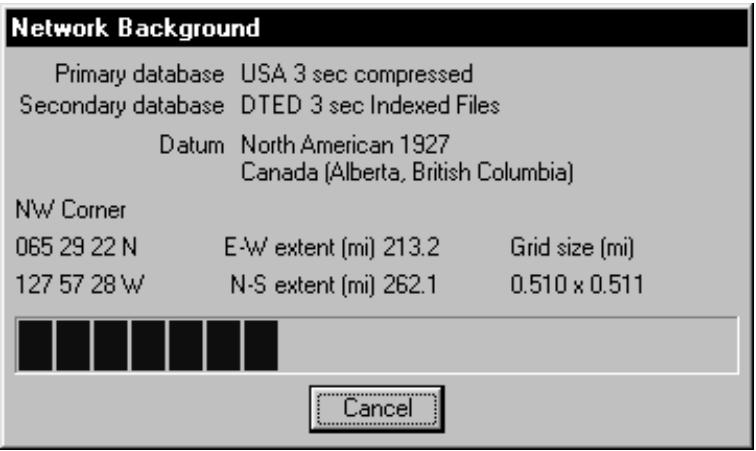

<details>
<summary>text_image</summary>

Network Background
Primary database USA 3 sec compressed
Secondary database DTED 3 sec Indexed Files
Datum North American 1927
Canada (Alberta, British Columbia)
NW Corner
065 29 22 N E-W extent (mi) 213.2 Grid size (mi)
127 57 28 W N-S extent (mi) 262.1 0.510 x 0.511
Cancel
</details>

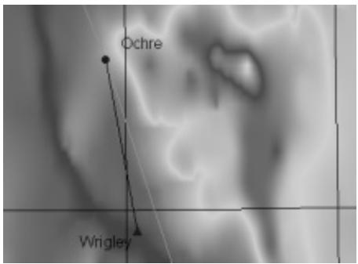

<details>
<summary>text_image</summary>

Ochre
Wrigley
</details>

# Add Site

Select Site Data - Add Site to add a new site directly on the network display. In conjunction with the network background, this feature will be useful in the initial planning stages. A site marker is shown on the display. Click the left mouse button on the display to move the marker to the cursor location, or hold the left button down and drag the marker to the desired location. The keyboard cursor keys can also be used to position the marker with a one pixel resolution. In many cases, it may be useful to zoom the display and background when adding a new site. When the marker is in position, click the Add Site button and enter the site name.

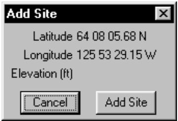

<details>
<summary>text_image</summary>

Add Site
Latitude 64 08 05.68 N
Longitude 125 53 29.15 W
Elevation (ft)
Cancel	Add Site
</details>

# Colour Legend

Select Site Data - Colour Legend to display the colours for the elevations use on the display.

The background display can be temporarily removed with the Show Background menu selection. The Create Background menu selection will be disabled under the following conditions:

• a terrain database has not been configured   
• the network file has not been saved

The create background feature will generate two files in the same directory as the network file using the network file name and the extensions bmp and bkg. The bmp file is a windows bitmap and the bkg file contains the elevations which appear when the Add Site dialogue is active.

# Terrain Database Performance Enhancements

Prior to the January 2000 program build, elevations were read from a terrain database using direct file read procedures. The current build uses memory mapping techniques to increase the overall speed. A significant improvement in terrain database access was realized with this change

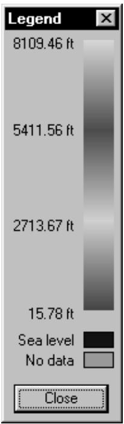

<details>
<summary>text_image</summary>

Legend
8109.46 ft
5411.56 ft
2713.67 ft
15.78 ft
Sea level
No data
Close
</details>

# Network Zoom Feature

A new scaling method has been added to the network Page Setup dialogue. Select Print - Page Setup to access this feature. The Constant Scale method maintains the site legends and the site name text at the same size independent of the zoom level. On a large network covering an area of several hundred kilometers, it is possible to separate sites 50 meters apart with this option.

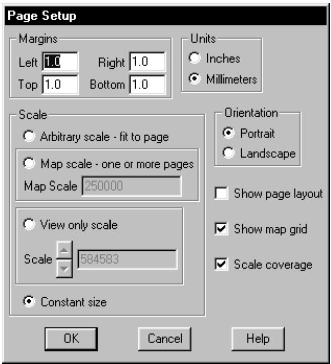

<details>
<summary>text_image</summary>

Page Setup
Margins
Left 1.0 Right 1.0
Top 1.0 Bottom 1.0
Units
Inches
Millimeters
Scale
Arbitrary scale - fit to page
Map scale - one or more pages
Map Scale 250000
View only scale
Scale 584583
Constant size
Orientation
Portrait
Landscape
Show page layout
Show map grid
Scale coverage
OK Cancel Help
</details>

# Odyssey - Utm Terrain Database

The Odyssey UTM terrain database uses an index to determine the required map files. The program starts with geographic latitude and longitudes and converts these to UTM coordinates (easting, northing and zone). The index is scanned using the UTM coordinates to find the correct file.

In some cases a single file is available which spans several UTM zones but all data is reference to one UTM zone. In this case the index will fail for coordinates which are not in the standard UTM zone definitions.

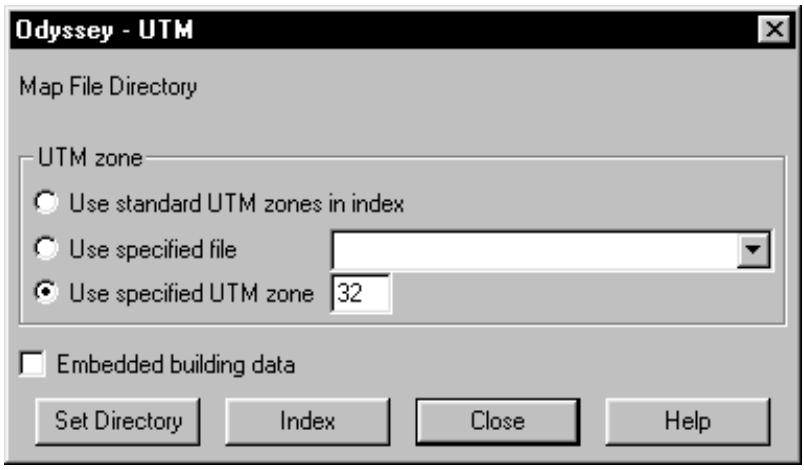

<details>
<summary>text_image</summary>

Odyssey - UTM
Map File Directory
UTM zone
Use standard UTM zones in index
Use specified file
Use specified UTM zone 32
Embedded building data
Set Directory	Index	Close	Help
</details>

Several options are provided to handle these situations:

• standard UTM zones are used throughout. The program calculates the required easting, northing and zone number and then scans the index for a match.   
• the UTM zone of a specified file is used. The program calculates the required easting and northing using the UTM zone of the specified file and then scans the index for a match.   
• a specified UTM zone is used. The program calculates the required easting and northing using the specified UTM zone and then scans the index for a match.

The last two options are similar in operation; the only difference is the method in which the UTM zone is determined.

# UK Ordnance Survey Ntf V2.0 DTM Level 5 Terrain Data

Support for the UK Ordnance Survey NTF v2.0 DTM level 5 terrain data is implemented under the Odyssey UK Grid. The NTF files must be converted to Odyssey binary format. Click the “Convert Ordnance Survey NTF file” button and select the files to be converted. A multi select file open dialog box is used for this purpose. If a single file is selected, the user is prompted for the name and location for the binary file. If several files are selected, the binary file name is the AS-

CII file name with the suffix “bin”. This will be saved in the same location as the ASCII file.

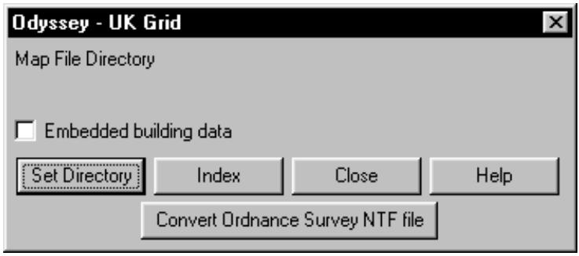

<details>
<summary>text_image</summary>

Odyssey - UK Grid
Map File Directory
Embedded building data
Set Directory	Index	Close	Help
Convert Ordnance Survey NTF file
</details>

The conversion procedure will automatically create an index entry. In addition the information is appended to a file NTF\_DATA.txt which is located in the Pathloss program directory. The file lists the binary file name and the west, south, east and north edges expressed in kilometers using the UK National grid format.

This file will be useful should it become necessary to construct the index manually. A sample listing is shown below.

NTF\_DATA.txt

Ss68.bin (W S E N)

259.9750 179.9750 280.0250 200.0250

The following file parameters are used:

Cell size (m) 50

Bytes / pixel 2

Bottom up False

Byte order INTEL

# Odyssey Terrain Database - New Zealand Grid Format

A new option has been added to the Odyssey terrain database reader for data reference to the New Zealand map grid system. Operation is identical to other grid formats. The index file is name ODY\_NZ.DAT and is saved in the same directory as the Pathloss program.

# Odyssey Terrain Database - Load Index Feature

A typical index contains the file name, the coordinates of the edges and the cell size as shown in the example line below:

pug\_t\_01\_01 990000.0 1020000.0 4440000.0 4470000.0 50

At present all index formats are space delimited.

A generalized index import feature has been added to convert text file lists into the Odyssey index format.

In the Index data display, select Files - Index.

The procedure defines the fields positions, and units in the file. The UTM zone can be interpreted as a field number in which case the UTM zone will be read from the index file. Alternately the UTM zone can be directly specified and this value will be used for all index entries.

The “byte order” and “bottom up” flags and the “bytes per pixel” entry are common for all index items.

Click OK and select the index file to load.

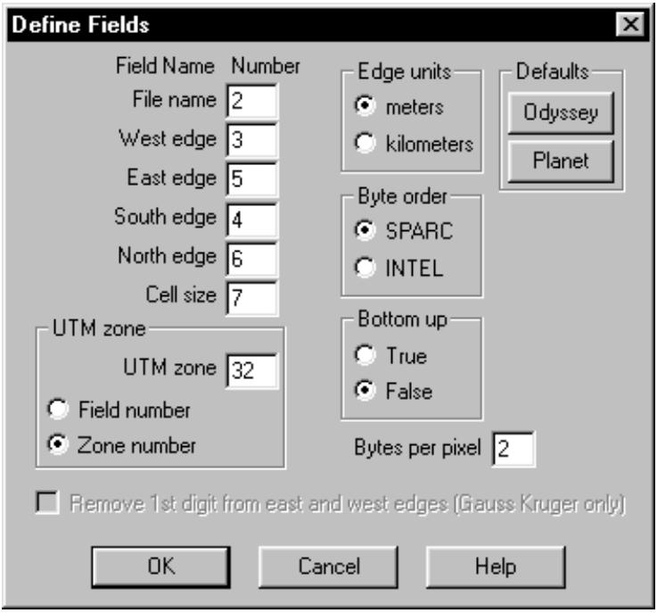

<details>
<summary>text_image</summary>

Define Fields
Field Name Number
File name 2
West edge 3
East edge 5
South edge 4
North edge 6
Cell size 7
UTM zone
UTM zone 32
Field number
Zone number
Edge units
meters
kilometers
Defaults
Odyssey
Planet
Byte order
SPARC
INTEL
Bottom up
True
False
Bytes per pixel 2
Remove 1st digit from east and west edges (Gauss Kruger only)
OK Cancel Help
</details>

# Rain Attenuation - ITU-R P.530-8

The rain calculation in ITU-R P.530-8 uses a modified algorithm for latitudes between 301 north and south. This has been implemented as a separate option by adding a latitude edit control to the rain dialog box. This algorithm will fail for short paths with large fade margins. It may be more realistic to stay with the ITU530-7 method in these cases.

If geographic coordinates are available, the latitude of the center or the path will be used; otherwise, the a default latitude will be used.

If the latitude field is blank, then the rain calculation will be made assuming that the latitude is greater than 30 degrees and the results will correspond to ITU-R P.530-7

The basic steps in the calculation are given below.

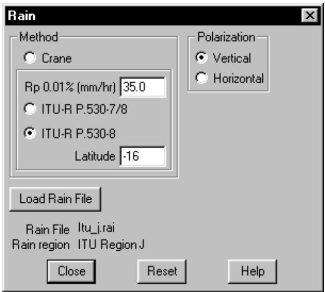

<details>
<summary>text_image</summary>

Rain
Method
Crane
Rp 0.01% (mm/hr) 35.0
ITU-R P.530-7/8
ITU-R P.530-8
Latitude -16
Polarization
Vertical
Horizontal
Load Rain File
Rain File Itu_i.rai
Rain region ITU Region J
Close Reset Help
</details>

Determine the rain rate, $\mathtt { R } _ { 0 . 0 1 }$ , exceeded for 0.01% of the time. This value will be interpolated from the rain statistics file or the user can manually enter this value.

• Calculate the specific attenuation, γ, as shown below:

$$
\gamma = \alpha \cdot R _ {0. 0 1} ^ {\beta} \tag {1}
$$

where α and β are the regression coefficients given in table 1 in the rain section of the Pathloss manual.

• Calculate the effective path length, $d _ { e } ,$ is calculated as:

$$
d _ {e} = \frac {d}{1 + \frac {d}{d _ {0}}} \tag {2}
$$

$$
\begin{array}{c} d \\ 0 = 3 5 \cdot e ^ {- (0. 0 1 5 \cdot R _ {0. 0 1})} \end{array}
$$

where d is the path length in kilometers.An upper limit of 100 mm/hr is set for $\mathtt { R } _ { 0 . 0 1 }$ in the above equation.

• The path attenuation, $\mathrm { A _ { 0 . 0 1 } }$ , exceeded for 0.01% of the time is given by:

$$
A _ {0. 0 1} = \gamma \cdot d _ {e} \tag {3}
$$

• Attenuations, A, exceeded for other percentages of time, P, are derived from the equations :

for latitudes equal to or greater than 30° north or south

$$
\frac {A}{A _ {0 . 0 1}} = 0. 1 2 \cdot P ^ {- (0. 5 4 6 + 0. 0 4 3 \cdot \log_ {1 0} P)} \tag {4}
$$

for latitudes less than 30° north or south

$$
\frac {A}{A _ {0 . 0 1}} = 0. 0 7 \cdot P ^ {- (0. 8 5 5 + 0. 1 3 9 \cdot \log_ {1 0} P)} \tag {5}
$$

• The attenuation A in the above equations, is set to the fade margin and the equation is solved for P using the following equations:

for latitudes equal to or greater than $3 0 ^ { \circ }$ north or south

$$
\log_ {1 0} (P) = 1 1. 6 2 8 \cdot \left(- 0. 5 4 6 + \sqrt {0 . 2 9 8 1 2 + 0 . 1 7 2 \cdot \log_ {1 0} \left(\frac {0 . 1 2 \cdot A _ {0 . 0 1}}{A}\right)}\right) \tag {6}
$$

for latitudes less than 30° north or south

$$
\log_ {1 0} (P) = 3. 5 9 7 1 2 \cdot \left(- 0. 8 5 5 + \sqrt {0 . 7 3 1 0 2 5 + 0 . 5 5 6 \cdot \log_ {1 0} \left(\frac {0 . 0 7 \cdot A _ {0 . 0 1}}{A}\right)}\right) \tag {7}
$$

ITU-530 clearly states that the equations are valid only in the range from 1% to 0.001%. On many practical links, this range will be exceeded especially on short links with high fade margins.

In the Pathloss program, the results will be reported if the argument of the square root is non negative; otherwise the error message “Rain error - lower limit exceeded - ITU-530” is posted. If the “ITU rain warning” option has been set has been set under the menu selection Operations - Options, the results will be shown in red in the worksheet calculation summary if they are outside the range 1% to 0.001%.

# CSV Site And Link List Reports

A site and link list report is available as a comma or tab delimited file (CSV) in the network module. The reports are displayed using a spreadsheet program such as Excel. All data for these two reports are taken directly from the PL4 files. The network data is not used. All of the fields and their order in the report are set by the user.

# CSV Site List

In the Network module, select Site Data - Site List. Then select Reports - CSV site list. A selection list is first presented to the user. Select items from the Available list box and transfer them to the Selected list box with the > button. The » button transfers all available items to the selected list.

To return items in the Selected list box, to the Available list, select the items and use the < button. The double left button moves all selections back to the Available list box. The order of the selected items is set with the ^ and buttons.

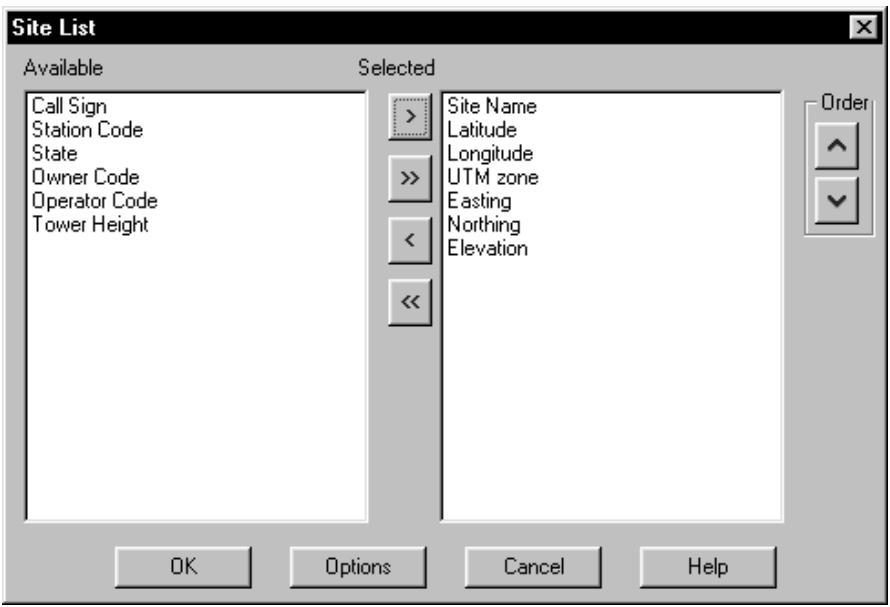

<details>
<summary>text_image</summary>

Site List
Available	Selected
Call Sign	Site Name
Station Code	Latitude
State	Longitude
Owner Code	UTM zone
Operator Code	Easting
Tower Height	Northing
<<	Nvertical
Order
OK	Options	Cancel	Help
</details>

# CSV Site List Options

Click the options button in the site list selection dialog to access the following settings:

# Delimiter

The delimiter can be a comma or tab. If you are using this report with Excel, a comma must be specified.

# Grid Units

If grid coordinates have been selected, these may be expressed in either kilometers or meters.

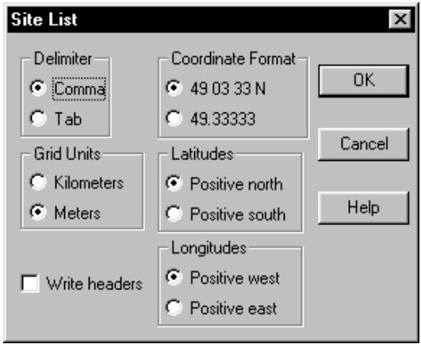

<details>
<summary>text_image</summary>

Site List
Delimiter
Comma
Tab
Coordinate Format
49.03 33 N
49.33333
Grid Units
Kilometers
Meters
Latitudes
Positive north
Positive south
Longitudes
Positive west
Positive east
Write headers
OK
Cancel
Help
</details>

# Write headers

The column headers will be written to the CSV file if this option is selected.

# Coordinate format

Geographic coordinates can be formatted in degrees minutes and seconds or as a floating point number. If the latter format is selected, the sign convention for the hemisphere must be defined.

When the options and field selections are complete, click the OK button to display the report. The standard grid control is used for this purpose.

<table><tr><td colspan="8">Site List</td></tr><tr><td colspan="8">Files Help</td></tr><tr><td></td><td>Site Name</td><td>Latitude</td><td>Longitude</td><td>UTM zone</td><td>Easting</td><td>Northing</td><td>Ele</td></tr><tr><td>1</td><td>Woking</td><td>55 28 47.00 N</td><td>118 44 50.00</td><td>11N</td><td>389572</td><td>6149349</td><td></td></tr><tr><td>2</td><td>Fairview</td><td>55 50 14.00 N</td><td>118 35 48.00</td><td>11N</td><td>400002</td><td>6188902</td><td></td></tr><tr><td>3</td><td>Brownvale</td><td>56 04 24.00 N</td><td>117 52 47.00</td><td>11N</td><td>445236</td><td>6214376</td><td></td></tr><tr><td>4</td><td>Grande Prairie</td><td>55 12 21.80 N</td><td>118 44 26.90</td><td>11N</td><td>389217</td><td>6118889</td><td></td></tr><tr><td>5</td><td>Beaverlodge</td><td>55 12 50.10 N</td><td>119 16 08.10</td><td>11N</td><td>355642</td><td>6120729</td><td></td></tr><tr><td>6</td><td>Demmit</td><td>55 27 43.00 N</td><td>119 53 22.00</td><td>11N</td><td>317317</td><td>6149779</td><td></td></tr><tr><td>7</td><td>Peace River</td><td>56 14 11.00 N</td><td>117 15 45.00</td><td>11N</td><td>483728</td><td>6232207</td><td></td></tr></table>

The data cannot be edited; however, the columns can be sorted. Click on a column header to sort the data using this field as the sort criteria. The first click sorts the data in an ascending order. The second click sorts in a descending order.

Select Files - Save to save the report.

# CSV Link List

In the Network module, select Site Data - Site List. Then select Reports - CSV link list. A selection list is first presented to the user. The report can be written using a single line or two lines for each link

Select items from the Available list box and transfer them to the Selected list box with the > button. The » button transfers all available items to the selected list box.

To return items in the Selected list box, to the Available list, select the items and use the < button.

The « button moves all selections back to the Available list box. The order of the selected items is set with the and • buttons.

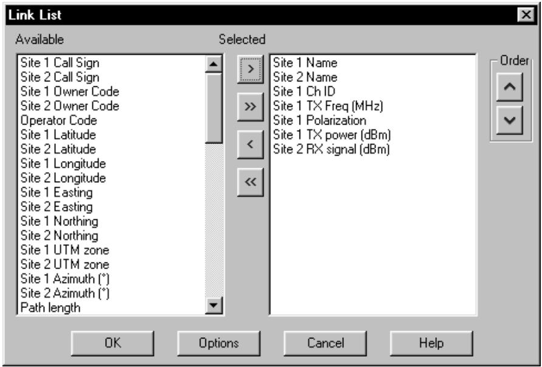

<details>
<summary>text_image</summary>

Link List
Available	Selected
Site 1 Call Sign		Site 1 Name
Site 2 Call Sign		Site 2 Name
Site 1 Owner Code		Site 1 Ch ID
Site 2 Owner Code		Site 1 TX Freq (MHz)
Operator Code		Site 1 Polarization
Site 1 Latitude		Site 1 TX power (dBm)
Site 2 Latitude		Site 2 RX signal (dBm)
Site 1 Longitude
Site 2 Longitude
Site 1 Easting
Site 2 Easting
Site 1 Northing
Site 2 Northing
Site 1 UTM zone
Site 2 UTM zone
Site 1 Azimuth (°)
Site 2 Azimuth (°)
Path length
OK	Options	Cancel	Help
</details>

# CSV Link List Options

Click the Options button in the Link List selection dialog to access the following link list report settings:

# Delimiter

The delimiter can be a comma or tab. If you are using this report with Excel, a comma must be specified.

# Grid Units

If grid coordinates have been selected, these may be expressed in either kilometers or meters.

# Path length

The path length will be in either miles or kilometers as determine by the global measurements setting. If the path length in meters is selected, then the path length will be written in feet or meters.

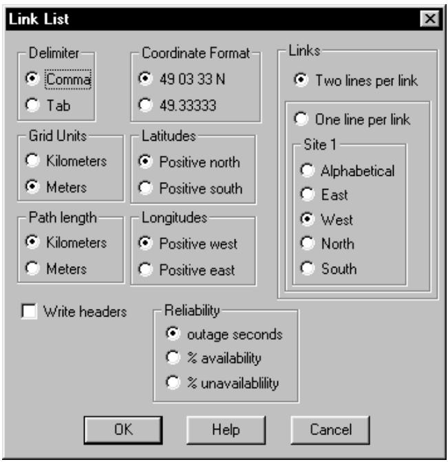

<details>
<summary>text_image</summary>

Link List
Delimiter
Comma
Tab
Coordinate Format
49.03 33 N
49.33333
Grid Units
Kilometers
Meters
Latitudes
Positive north
Positive south
Path length
Kilometers
Meters
Longitudes
Positive west
Positive east
Write headers
Reliability
outage seconds
% availability
% unavailability
Links
Two lines per link
One line per link
Site 1
Alphabetical
East
West
North
South
OK	Help	Cancel
</details>

# Write headers

The column headers will be written to the CSV file if this option is selected.

# Coordinate format

Geographic coordinates can be formatted in degrees minutes and seconds or as a floating point number. If the latter format is selected, the sign convention for the hemisphere must be defined.

# Lines per link

The report can be written as one or two lines per link. If the one line per link option is used, then the user must define a criteria to determine which of the two sites will be Site1 (the first site).

When the options and field selections are complete, click the OK button to display the report. The standard grid control is used for this purpose.

The data cannot be edited; however, the columns can be sorted. Click on a column header to sort the data using this field as the sort criteria. The first click sorts the data in an ascending order. The second click sorts in a descending order.

Select Files - Save to save the report.

<table><tr><td colspan="5">Link List</td></tr><tr><td colspan="5">Files Help</td></tr><tr><td></td><td>Site 1 Name</td><td>Site 2 Name</td><td>Site 1 Ch ID</td><td>Site 1 TX Freq (MHz)</td></tr><tr><td>1</td><td>Woking</td><td>Fairview</td><td>LL6-6L</td><td>5878.8750</td></tr><tr><td>2</td><td>Fairview</td><td>Woking</td><td>LL6-6H</td><td>5912.3750</td></tr><tr><td>3</td><td>Fairview</td><td>Brownvale</td><td>LL6-6H</td><td>5912.3750</td></tr><tr><td>4</td><td>Brownvale</td><td>Fairview</td><td>LL6-6L</td><td>5878.8750</td></tr><tr><td>5</td><td>Grande Prairie</td><td>Beaverlodge</td><td>LL6-6H</td><td>5912.3750</td></tr><tr><td>6</td><td>Beaverlodge</td><td>Grande Prairie</td><td>LL6-6L</td><td>5878.8750</td></tr><tr><td>7</td><td>Grande Prairie</td><td>Woking</td><td>LL6-6H</td><td>5912.3750</td></tr><tr><td>8</td><td>Woking</td><td>Grande Prairie</td><td>LL6-6L</td><td>5878.8750</td></tr><tr><td>9</td><td>Beaverlodge</td><td>Demmit</td><td>LL6-6L</td><td>5878.8750</td></tr></table>

# Map Grid

# Overview

An new site network display module named Map Grid has been added in the May 2001 program build. This operates in parallel with the existing network module. The network module uses a Transverse Mercator projection to display the sites. The longitude origin of this projection is set to the mid point of the east - west extents of the sites. This produces a display with symmetrical latitude and longitude lines. If a new site is added which changes the extents of the display, a new longitude origin is calculated. As such, this variable projection will not accommodate backdrops such as maps and ortho-photos.

The map grid module uses fixed projections to display the net-

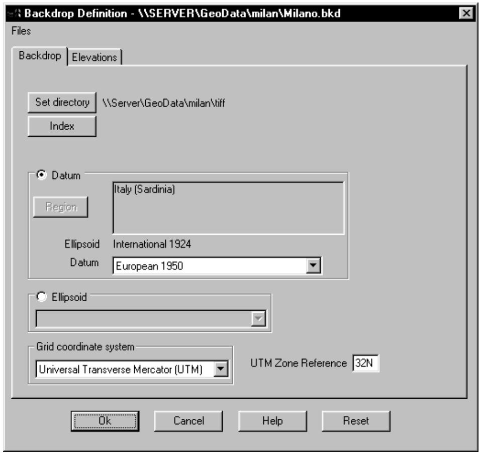

<details>
<summary>text_image</summary>

Backdrop Definition - \\SERVER\GeoData\milan\Milano.bkd
Files
Backdrop	Elevations
Set directory	\\Server\GeoData\milan\tiff
Index
Datum	Italy (Sardinia)
Region
Ellipsoid	International 1924
Datum	European 1950
Ellipsoid
Grid coordinate system
Universal Transverse Mercator (UTM)	UTM Zone Reference 32N
Ok	Cancel	Help	Reset
</details>

work sites with both backdrops and elevations. The backdrops can be in either a TIF or window bit map (BMP) format. The elevations must be in the Odyssey - Planet BIL format. The map grid elevation database setup is independent of the terrain database setup under Configure - Terrain data base. At this time, the same projection must be used for the both the backdrop and the elevations.

# Backdrop Definition

Select Site Data - Backdrop to access the backdrop definition dialog. A backdrop definition consists of the following steps for both the image and elevation files. The procedure is identical for each.

1. specify the directory containing the image /elevation files   
2. create an index for the image /elevation files   
3. specify the map projection used by the image /elevation files   
4. specify the datum or reference ellipsoid for the image /elevation files

# Set Directory

Click the set directory button and point to the directory containing the image files. All image files must be located in this directory.

# Image File Index

Click the Index button to access the grid data entry form. The following fields are available:

Image file name 95 characters maximum.

Show any image file can be temporarily switched off.

Type At this time only TIF and bitmap (bmp) image files are supported.

Edges West, south east and north edges. These are expressed in kilometers and must correspond to the selected map projection.

Cell size optional entry (not used).

The data can be manually entered using the procedures described in the General Program Operation or imported from a list or GeoTIF file.

# Import List

Select Files B Import List. Specify the locations of the fields in the file to be imported.

Two default options are provided for Planet and Odyssey image files.

Specify the units of the edges, click Ok and open the file containing the index information.

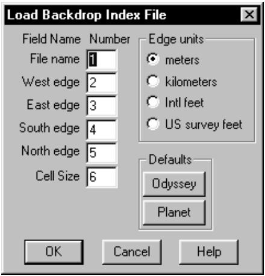

<details>
<summary>text_image</summary>

Load Backdrop Index File
Field Name Number
File name 1
West edge 2
East edge 3
South edge 4
North edge 5
Cell Size 6
Edge units
meters
kilometers
Intl feet
US survey feet
Defaults
Odyssey
Planet
OK Cancel Help
</details>

# GeoTIF File

GeoTIF files may contain the required information to create an index entry for the file. Select Files B GeoTIF File and open the file.

There must be sufficient information in the file to determine the edges, map projection and datum.

At present, only UTM projections and US State plane coordinates will automatically generate the index and set the datum.

# New List

The Import List and GeoTIF file procedures simply append the new entry to the existing index. Select Files B New List to erase the existing list.

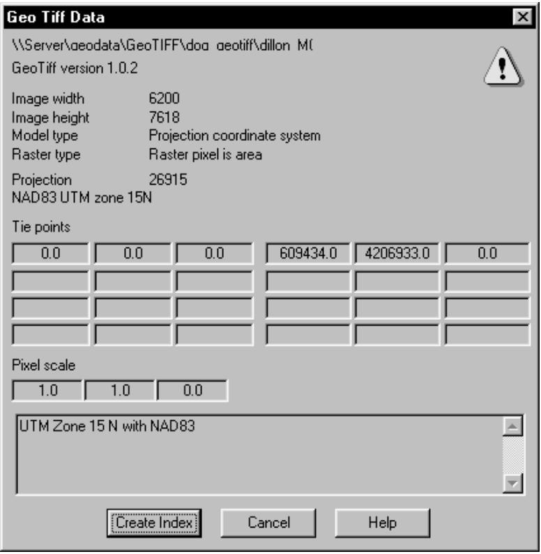

<details>
<summary>text_image</summary>

Geo Tiff Data
\\Server\geodata\GeoTIFF\doo geotiff\dillon M\
GeoTiff version 1.0.2
Image width 6200
Image height 7618
Model type Projection coordinate system
Raster type Raster pixel is area
Projection 26915
NAD83 UTM zone 15N
Tie points
0.0 0.0 0.0 609434.0 4206933.0 0.0
Pixel scale
1.0 1.0 0.0
UTM Zone 15 N with NAD83
Create Index Cancel Help
</details>

# TIFF to Bit Map Array

TIF files are sometimes supplied in large sizes in the range from150 to 200 megabytes or larger. A TIF file must first be converted to a bitmap. This can be very time consuming and places a strain on system resources. A provision has been made to convert a large TIF file into an array of bitmaps. The bitmaps will be saved in the same directory as the TIF file.

Select Files - Create bitmap array and enter the number of rows and columns. The index will be automatically updated with the bitmap data. Be sure to save the new backdrop file.

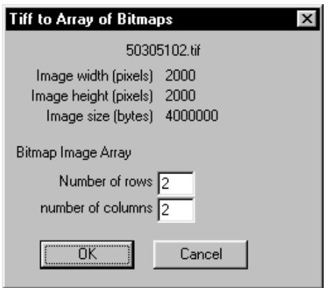

<details>
<summary>text_image</summary>

Tiff to Array of Bitmaps
50305102.tif
Image width (pixels) 2000
Image height (pixels) 2000
Image size (bytes) 4000000
Bitmap Image Array
Number of rows 2
number of columns 2
OK Cancel
</details>

Bitmaps are not loaded into memory. Instead the bit map files are opened as memory mapped files. Significant performance improvements can be realized by using a number of smaller bitmaps instead of a single large TIF file.

# Elevation File Index

Click the Index button to access the grid data entry form. The following fields are required for an elevation file entry:

<table><tr><td>Map name</td><td>95 characters maximum.</td></tr><tr><td>Bytes / pixel</td><td>Some file formats contain the elevation and additional information. The default is 2 bytes per pixel which corresponds to a 2 byte integer elevation.</td></tr><tr><td>Bottom up</td><td>This setting specifies if the rows of elevations start at the south west corner or the north west corner. If the elevation views are upside down, then change this setting.</td></tr><tr><td>Byte order</td><td>The elevations are expressed as two byte integers. This setting determines if the most significant byte is first (SPARC) or the least significant byte is first (INTEL). If the wrong setting is used, the resulting elevations will be very large positive and negative numbers. The program will interpret these as no data values and nothing will be displayed.</td></tr><tr><td>Cell size</td><td>The horizontal resolution of the database expressed in meters.</td></tr><tr><td>Edges</td><td>West, south east and north edges. These are expressed in kilometers and must correspond to the selected map projection.</td></tr><tr><td>Show</td><td>any elevation file can be temporarily switched off.</td></tr></table>

The data can be manually entered using the procedures described in the General Program Operation or imported from a list file.

# Import List

Select Files B Import List. Specify the locations of the fields in the file to be imported.

Two default options are provided for Planet and Odyssey image files.

Specify the units of the edges, click Ok and open the file containing the index information.

# Elevation File Conversion

The elevation files must be in the Odyssey - Planet BIL format. Several file conversion utilities are available to convert other format to the BIL format. Select Files - Convert in the Elevation index menu to access these conversions.

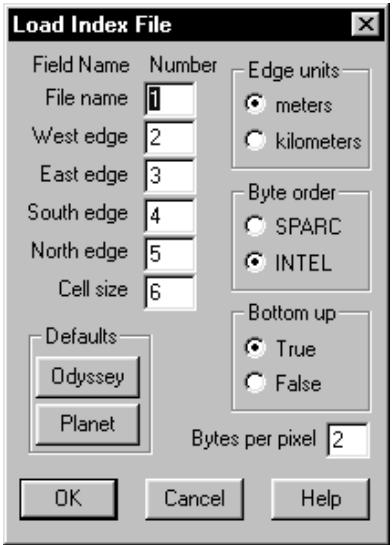

<details>
<summary>text_image</summary>

Load Index File
Field Name Number
File name 1
West edge 2
East edge 3
South edge 4
North edge 5
Cell size 6
Edge units
meters
kilometers
Byte order
SPARC
INTEL
Bottom up
True
False
Defaults
Odyssey
Planet
Bytes per pixel 2
OK Cancel Help
</details>

# Datum - Ellipsoid Selection

The shape of the earth is not spherical. Rather it is more nearly an oblate ellipsoid of revolution which is also called an oblate spheroid. This is an ellipse rotated about its minor axis.

The earth is not an exact ellipsoid. The geoid is the name given to the shape that the earth would assume if all measurements were reference to mean sea level. This is an undulating surface which is within 100 meters of a well fitting ellipsoid. Note that elevations and contour lines are referenced to the geoid. Latitude and longitude and all grid coordinate systems are referenced to the ellipsoid.

The ellipsoid is defined by the semi major and semi minor axis. Alternately this can be expressed as the semimajor axis and the flattening or eccentricity as defined by equation (8) below:

$$
B = A \cdot \frac {\operatorname{recf} 1}{\operatorname{recf}} \tag {8}
$$

where:

<table><tr><td>A</td><td>major axis</td></tr><tr><td>B</td><td>minor axis</td></tr><tr><td>recf</td><td>reciprocal flattening</td></tr></table>

# Local Datums

Initially ellipsoids were fitted to the mean sea level surface over a particular region or country. These were related to an initial point on the surface of the earth to produce a local datum. This initial point is assigned a latitude, longitude, an elevation above the ellipsoid and an azimuth to some point. This initial point becomes the triangulation station Principio to which all ground control measurements will be referenced. The latitude and longitude and elevation of all control points in the area are computed relative to this initial point and the ellipsoid.

An example of a local datum is the North American Datum of 1927 (NAD27) with the following parameters:

reference ellipsoid

Clark 1866

semi major axis 6378206.4 km

inverse flattening 294.9786982

origin Meades Ranch in Kansas

# Global Datums

Global datums use ellipsoids determined from satellite based survey methods and define a coordinate system used for the entire earth. The center of the reference ellipsoid is located at the mass center of the earth. An example of a global datum is the World Geodetic System of 1984 (WGS 84)

reference ellipsoid WGS 84

semi major axis 6378137.0 km

inverse flattening 298.257223563

origin mass center of the earth

In the Pathloss program, either a datum or ellipsoid can be selected. Selecting a datum indirectly defines the reference ellipsoid and since all conversions between geodetic and rectangular coordinates and the distance and azimuth calculations are based on the reference ellipsoid, the two choices may seem redundant.

A datum in the Pathloss program includes additional data to allow the transformation of geodetic coordinates between datums. In local datums, it is necessary to subdivide the area covered by the datum into smaller regions to improve the accuracy of the coordinate transformation.

Some local map projections do not have a corresponding datum. Several examples are:

Swiss National Grid - reference ellipsoid - Bessel 1841

Irish National grid - reference ellipsoid - modified airy

In these cases, an ellipse must be specified and there will be no provision to transform coordinates. For example geodetic coordinates in the WGS84 coordinates cannot be transformed to Swiss National grid coordinates; however the WG84 coordinates could be transformed to the European Datum of 1950

Note that in the current program build, the map projection and the datum / ellipsoid must be specified for both the image files and the elevation files. This generality will allow additional flexibility in a future build by allowing coordinate transformation between datums. The errors in these transformation will certainly be greater that the imagery / elevation data resolution and it will be necessary to provide procedures to match the imagery and elevation data.

The datum or reference ellipsoid selection must be the same for the site data, image, and elevation files. The same map projection must be used for the image and elevation files.

# Map Projection

Select one of the map projections in the drop down list. The following projections are currently supported:

• UTM - Universal Transverse Mercator - The UTM zone must be specified.

• Swiss National grid \*   
• UK Ordnance grid \*   
• Irish National grid \*   
• New Zealand grid \*   
• Gauss Kruger   
• US State Plane grid \*

The selection of any of the projections marked with an \*, will automatically select the correct datum or ellipsoid.

The default projection is the same as that used in the network module. This is a Transverse Mercator projection referenced to a central meridian located at the center of the east - west extents of the sites. This selection effectively inhibits all of the imagery and elevation procedures in the Map Grid module.

# Other Considerations

When the backdrop definition is complete, save the file using the file menu in this dialog box.

Click OK to close the backdrop definition dialog. The image files are loaded into memory and displayed. If the file loading is cancelled, then it will be necessary to recall the backdrop definition dialog and close it with the OK button again.

The current backdrop definition file will be automatically loaded again when the program is started again and the map grid module is entered.

If a network file whose extents are separated by 10 degrees from the extents of the imagery data, is loaded, then the map projection is automatically set to the default and the imagery and elevation features are inhibited.

# Cursor Modes

# Pan and Zoom Controls

Click the button to set the cursor to the pan mode. Hold the left mouse button down and drag the display to the new location. The display can also be moved with the cursor keys at any time.

Click the Q button to set the cursor to the zoom mode. A left button click magnifies the display a preset amount and centers the display at the cursor location. A right button click reduces and centers the display. To zoom a specific area, hold down the left mouse button and drag the mouse to define the desired area. Three additional buttons affect the display as follows:

The backdrop image is displayed from the upper left corner with the same resolution as the image file.   
The extents of the site data is displayed.   
The extents of the image files is displayed.   
The elevation view is switched off an on by clicking this button.

# Link Mode Cursor

Click the \$ button to set the cursor to the link mode. This is the default cursor mode in the network module and is used to access the design modules, create links between two sites, and selectively set the link and site attributes.

# Visibility Tests and Profile Generation

Click the button to begin the visibility tests. Place the cursor at one location, hold down the left mouse button and drag the mouse to the second location. The progress of the profile is dynamically shown on the

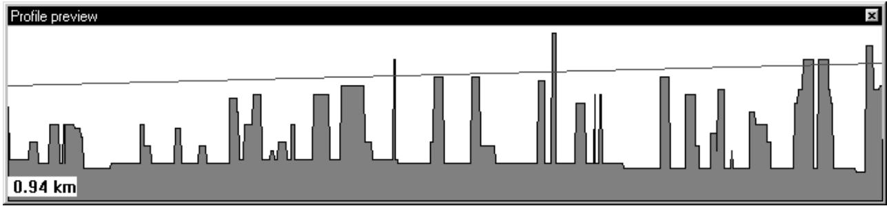

<details>
<summary>bar</summary>

| Time | Value |
|------|-------|
| 0    | 0.94  |
</details>

screen. To reset this display during the profile generation, click the right mouse button. When the left mouse button is released, a profile analysis display will appear. This display allows you to change antenna heights, earth radius factor K and test the clearance using Fresnel zone references of the clearance display.

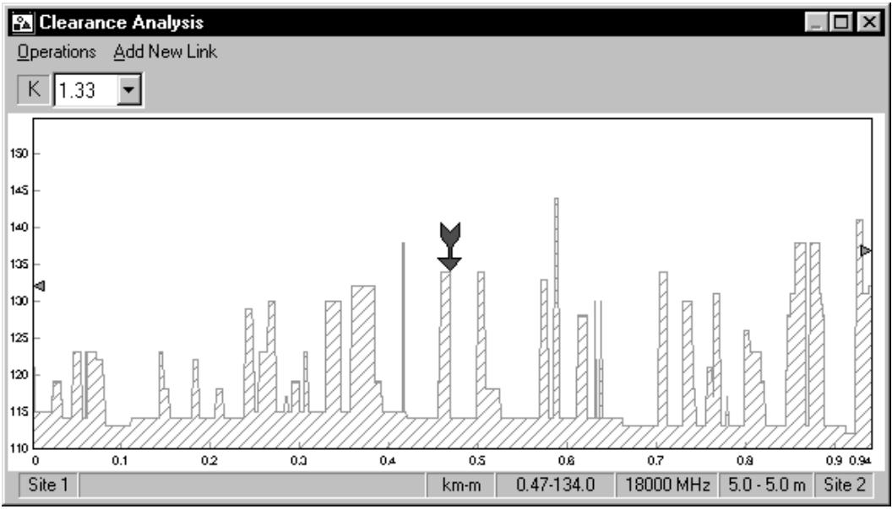

<details>
<summary>bar</summary>

| Frequency | Operation Count |
| --------- | --------------- |
| 0.0       | 115             |
| 0.1       | 120             |
| 0.2       | 115             |
| 0.3       | 125             |
| 0.4       | 135             |
| 0.5       | 135             |
| 0.6       | 125             |
| 0.7       | 135             |
| 0.8       | 145             |
| 0.9       | 135             |
| 0.94      | 140             |
</details>

You can add this link to the site data list and save the data as a Pathloss pl4 file. If the two end locations were not between existing sites, you should change the site names from the default Site 1 and Site 2 names. To exit the profile generation mode, close the profile preview display, click the button again or change the cursor mode to the pan, zoom or link modes.

# Elevation Displays

An elevation display can be generated at any zoom level which will overlay the image backdrop. The extents of the display always corresponds to the current display extents.

Select Site Data - Elevation view - Create.

The display is useful to resolve small elevation differences which may not be apparent from the image display.

An elevation legend is available under the same menu.

The elevation display will remain until it is reset.

Several display options are available. Select Elevation - View - Options.

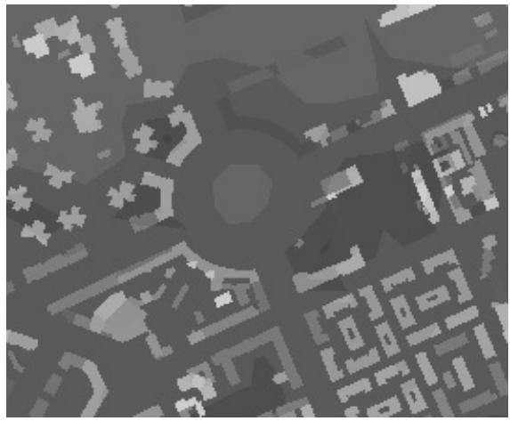

<details>
<summary>natural_image</summary>

Abstract geometric pattern with pixelated shapes and no visible text or symbols
</details>

The color can be either a graduated color ramp or a grey scale. The elevation display is overlaid on to the backdrop display. The raster operation code is SRCCOPY in the above drawing which hides the backdrop. The code ADSP-Dxax@ is a transparent copy which allows the backdrop to show through. If any code other than SRCCOPY, the elevation legend colors will not be correct.

# Add Site and Move Site

Two similar operations allow the user to visually add a new site or move an existing site. Select Site Data - Add Site or Move Site

In the add site case, use the mouse to position the marker at the desired location.

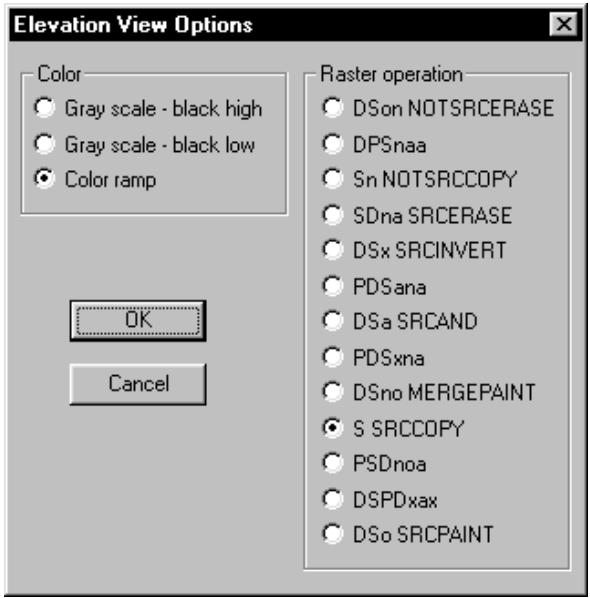

<details>
<summary>text_image</summary>

Elevation View Options
Color
Gray scale - black high
Gray scale - black low
Color ramp
Raster operation
DSon NOTSRCERASE
DPSnaa
Sn NOTSRCCOPY
SDna SRCERASE
DSx SRCINVERT
PDSana
DSa SRCAND
PDSxna
DSno MERGEPAINT
S SRCCOPY
PSDnoa
DSPDaxx
DSo SRCPAINT
OK
Cancel
</details>

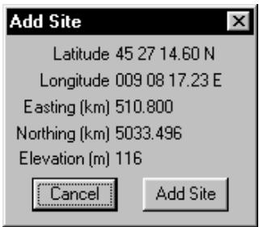

<details>
<summary>text_image</summary>

Add Site
Latitude 45 27 14.60 N
Longitude 009 08 17.23 E
Easting (km) 510.800
Northing (km) 5033.496
Elevation (m) 116
Cancel	Add Site
</details>

Click the Add site button and enter a name for the site.

In the move site case, first identify the site to be move by clicking the left mouse button on the site legend. Then move the site to the new location and click the OK button.

Both of the displays show the elevation.

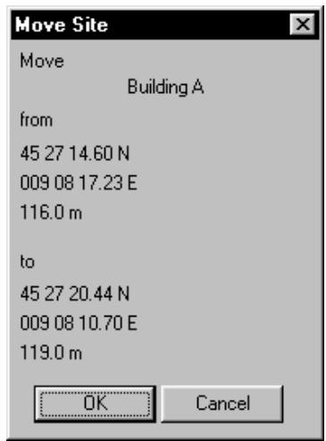

<details>
<summary>text_image</summary>

Move Site
Building A
from
45 27 14.60 N
009 08 17.23 E
116.0 m
to
45 27 20.44 N
009 08 10.70 E
119.0 m
OK Cancel
</details>

# Definitions - Glossary

Datum - Any numerical or geometrical quantity or set of such quantities specifying the reference coordinate system used for geodetic control in the calculation of coordinates of points on the earth. Datums may be either global or local in extent. A local datum defines a coordinate system that is used only over a region of limited extent. A global datum specifies the center of the reference ellipsoid to be located at the earth’s center of mass and defines a coordinate system used for the entire earth.

Ellipsoid - The surface generated by an ellipse rotating about one of its axes.

Geocentric Coordinates - Cartesian coordinates (X, Y, Z) that define the position of a point with respect to the center of mass of the earth.

Geodetic Coordinates - The quantities of latitude and longitude that define the position of a point on the surface of the earth with respect to the reference ellipsoid. Also, imprecisely called geographic coordinates.

Geodetic Height - The height above the reference ellipsoid, measured along the ellipsoidal normal through the point in question. The geodetic height is positive if the point is outside the ellipsoid. Also known as ellipsoidal height, h.

Geodetic Latitude - The angle between the plane of the equator and the normal to the ellipsoid through the computation point. Geodetic latitude is positive north of the equator and negative south of the equator.

Geodetic Longitude - The angle between the plane of a meridian and the plane of the prime meridian. A longitude can be measured from the angle formed between the local and prime meridians at the pole of rotation of the reference ellipsoid, or by the arc along the equator intercepted by these meridians.

Geoid - The equipotential surface of the earth’s gravity field approximated by undisturbed mean sea level of the oceans. The direction of gravity passing through a given point on the geoid is perpendicular to this equipotential surface.

Geoid Separation - The distance between the geoid and the mathematical reference ellipsoid as measured along the ellipsoidal normal. This distance is positive outside, or negative inside, the reference ellipsoid. Also called geoidal height; undulation of the geoid.

Horizontal Datum - A horizontal datum specifies the coordinate system in which latitude and longitude of points are located. The latitude and longitude of an initial point, the azimuth of a line from that point, and the semi-major axis and flattening of the ellipsoid that approximates the surface of the earth in the region of interest define a horizontal datum.

Reference Ellipsoid - An ellipsoid whose dimensions closely approach the dimensions of the geoid; the exact dimensions are determined by various considerations of the section of the earth’s surface concerned. Usually a bi-axial ellipsoid of revolution.

Vertical Datum - A vertical datum is the surface to which elevations are referred. A local vertical datum is a continuous surface, usually mean sea level, at which elevations are assumed to be zero throughout the area of interest.

WGS 72 - World Geodetic System 1972. WGS 72 was the previous DoD standard earth-centered, earthfixed world geodetic system. It was superceded by WGS 84.

WGS 84 - World Geodetic System 1984. A world geodetic system provides the basic reference frame, geometric figure and gravimetric model for the earth, and provides the means for relating positions on various local geodetic systems to an earth-centered, earth-fixed coordinate system. WGS 84 is the current DoD standard earth-centered, earth-fixed world geodetic system.

# References

(1) Topographic Engineering Center, TEC-SR-7,

Handbook for transformation of DATUMS, PROJECTIONS, GRIDS, AND COMMON COORDINATE SYSTEMS, January 1996.

(2) Department of Defense, MIL-HDBK-850, Military Handbook B Glossary of Mapping, Charting, and Geodetic Terms, 21 January 1994.

# Interference And Desired Path Fade Correlation

# Overview

If an interfering signal follows the same path as the desired signal, the two signals can be considered to be correlated to some degree. The interfering signal will experience fading at the same time as the desired signal; thereby reducing the effect of the interference.

This is the case for both rain and multipath fades; however, the degree of correlation for these two conditions will be different. In the case of a multipath fade, it is realistically assumed that only one fade will exist

at any instance in time in an area due to the characteristics of deep fading. Multipath fades are short in duration and highly localized in an area. Rain fades on the other hand are of longer duration, are relatively frequency independent in a given band and can extend over a wide area.

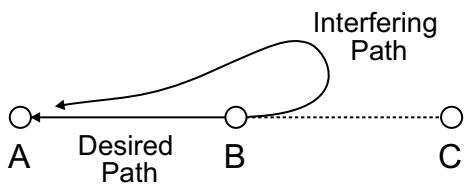

<details>
<summary>flowchart</summary>

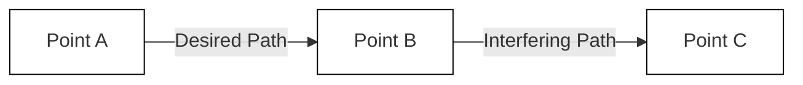
```mermaid
graph LR
    A["Point A"] -->|Desired Path| B["Point B"]
    B -->|Interfering Path| C["Point C"]
    style A fill:#fff,stroke:#000
    style B fill:#fff,stroke:#000
    style C fill:#fff,stroke:#000
```
</details>

Spatially Correlated

To handle this fade correlation, the May 2001 program build considers the interference fade margin and threshold degradation for both rain and multipath separately under the assumption that rain and multipath fading are mutually exclusive events. Provision is made to edit the rain - multipath fade correlation and to assign default values for this correlation at the start of an interference calculation.

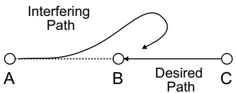

<details>
<summary>flowchart</summary>

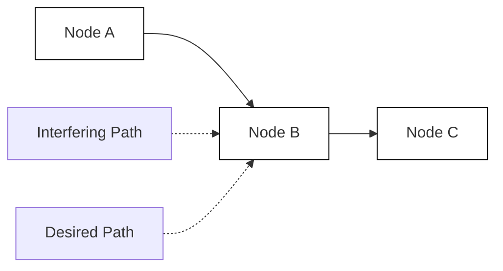
```mermaid
graph LR
    A["Node A"] --> B["Node B"]
    B --> C["Node C"]
    style A fill:#fff,stroke:#000
    style B fill:#fff,stroke:#000
    style C fill:#fff,stroke:#000
    note1["Interfering Path"] -.-> B
    note2["Desired Path"] -.-> B
```
</details>

Spatially Uncorrelated

The base interference calculation is always carried out and retained. The effect of rain and multipath correlation does not change the base calculation.

An example of a correlated fade would be a multi hop two frequency plan system with sites designated as A, B and C. The receiver at site A whose associated transmitter is located at site B, will be interfered by the transmitter also at site B transmitting to site C. The carrier to interference ratio is completely determined by the front to back ratio of the interfering transmit antenna. Since both the desired and interfering signals follow the path from B to A, the following considerations can be made.

• Rain will attenuate the desired and interfering signals equally if the polarizations are the same for both signals. The polarization of the interfering signal is indeterminate off boresight and can be considered to be circular at discrimination angles greater than 90 degrees.

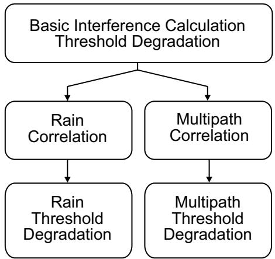

<details>
<summary>flowchart</summary>

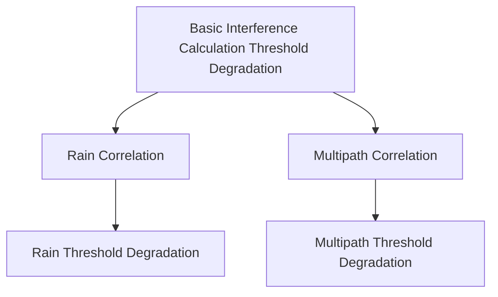
```mermaid
graph TD
    A["Basic Interference Calculation Threshold Degradation"] --> B["Rain Correlation"]
    A --> C["Multipath Correlation"]
    B --> D["Rain Threshold Degradation"]
    C --> E["Multipath Threshold Degradation"]
```
</details>

Therefore, the fading could be considered as completely correlated and the case could be ignored.

The degree of correlation between the desired and interfering signal fades due to multipath will depend on the antenna heights of the desired and interfering transmitters at site B. Polarization will affect the correlation to a lesser degree. For equal antenna heights, the fading can be considered to be correlated; otherwise a partial correlation situation exists.

# Adjacent Channel Fade Correlation

A one for N systems is a specialized case of correlation. From a multipath standpoint, the frequency difference between the desired signal and the adjacent channel interferer, is small enough to offer some multipath fading correlation. This correlation combined with the filter improvement is usually sufficient to clear the case. At frequency separations of two or more adjacent channels, the filter improvement is sufficient to ignore the interference.

From a rain fade standpoint, the interfering and desired paths are completely correlated and the interference can be ignored.

# ATPC Considerations

An interference detail report shows the carrier to interference ratio. Prior to the May 2001 build, the C/I was always calculated with the receive signal at the maximum power and the interfering signal at the minimum power when ATPC was specified. The C to I calculation now depends on the spatial correlation as follows

Uncorrelated minimum receive signal - minimum interfering signal

Correlated minimum receive signal - maximum interfering signal

# Default Program Settings

At the start of an interference calculation, default correlation values can be assigned to the calculation. In the Network module select - Interference - Calculate Intra to bring up the interference dialog box.

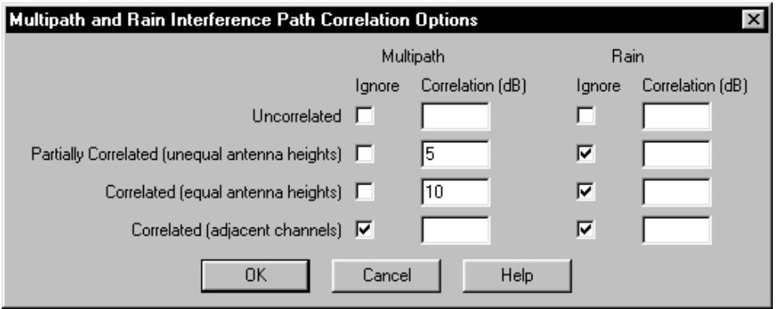

<details>
<summary>text_image</summary>

Multipath and Rain Interference Path Correlation Options
Multipath	Rain
Ignore	Correlation (dB)	Ignore	Correlation (dB)
Uncorrelated
Partially Correlated (unequal antenna heights)
Correlated (equal antenna heights)
Correlated (adjacent channels)
OK	Cancel	Help
</details>

Click the Correlation Options button to set the defaults. Four categories of correlation available including uncorrelated for both multipath and rain. The user can choose to ignore the interference or to specify a value for the correlation. Remember that any setting here does not affect the base calculation.

# Editing Correlation

The correlation can be edited on a case by case basis in the Modify Interference Parameters dialog. This can be accessed from the case detail report under the Modify menu selection.

The antenna heights are shown under the designations:

itx interfering transmitter

atx victim receiver adjacent site transmitter

The correlation can also be edited directly in the Network display. Select Interference - Edit Correlation. The organization is the same as that used in the case detail report. Each receiver is a case. Each interferer into that receiver is a sub case. The interference path is shown on the network display which helps to assign values to the correlation. The arrows on the left changes the receiver (case) and the arrows on the right change the interfering transmitter (sub case).

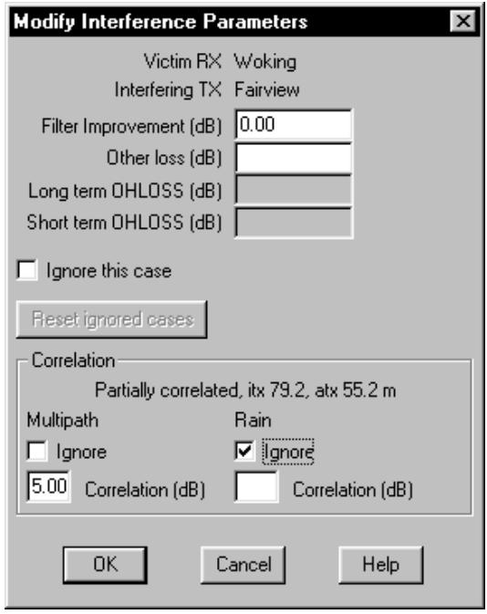

<details>
<summary>text_image</summary>

Modify Interference Parameters
Victim RX Woking
Interfering TX Fairview
Filter Improvement (dB) 0.00
Other loss (dB)
Long term OHLOSS (dB)
Short term OHLOSS (dB)
Ignore this case
Reset ignored cases
Correlation
Partially correlated, itx 79.2, atx 55.2 m
Multipath Rain
Ignore Ignore
5.00 Correlation (dB) Correlation (dB)
OK Cancel Help
</details>

The frequencies and polarization are shown along with the antenna heights using the same nomenclature as described above. In addition the following parameters are given:

v-i victim to interferer path length

ang the discrimination angle at the victim receiver

ifl interfering signal level

td threshold degradation

The button allows the user to go to a specific case number. The cross reference report can be used as an overall index.

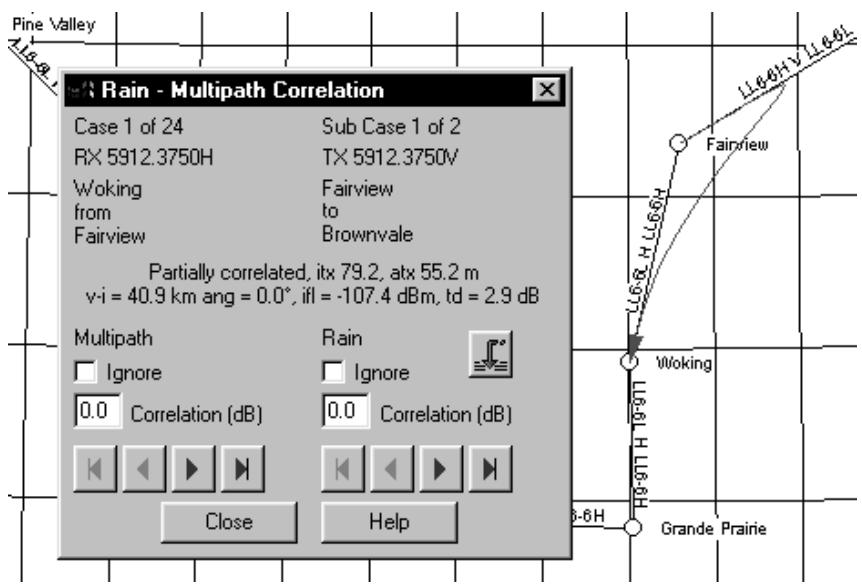

<details>
<summary>text_image</summary>

Pine Valley
Rain - Multipath Correlation
Case 1 of 24 Sub Case 1 of 2
RX 5912.3750H TX 5912.3750V
Woking Fairview
from to
Fairview Brownvale
Partially correlated, itx 79.2, atx 55.2 m
v-i = 40.9 km ang = 0.0°, ifl = -107.4 dBm, td = 2.9 dB
Multipath Rain
Ignore Ignore
0.0 Correlation (dB) 0.0 Correlation (dB)
Close Help
Grande Prairie
LL66H V LL66L
Fairview
Woking
3-6H
</details>

# ITU-T G.826 Error Performance Objectives

ITU-T G.826 defines performance of SDH radio systems in terms of the following parameters.

Severely Errored Seconds Radio (SESR)

Background Block Error Rate (BBER)

Errored Seconds Ratio (ESR)

This section describes the Pathloss implementation of this recommendation.

# SESR Bit Error Rate

A modified bit error rate is first determined as follows:

$$
B E R _ {S E S} = \frac {0 . 4 5 8 \cdot \alpha_ {1}}{\text { bits   per   block }} \tag {9}
$$

Table 1: BERses for various SDH paths and MS sections 

<table><tr><td>Path type</td><td>Bit rate</td><td> $BER_{ses}$ (Notes 1 and 2)</td><td>Block per second (Note 2)</td><td>Bits per Block (Note 2)</td></tr><tr><td>VC-11</td><td>1.5</td><td> $5.4 \times 10^{-4} \alpha$ </td><td>2000</td><td>832</td></tr><tr><td>VC-12</td><td>2</td><td> $4.0 \times 10^{-4} \alpha$ </td><td>2000</td><td>1120</td></tr><tr><td>VC-2</td><td>6</td><td> $1.3 \times 10^{-4} \alpha$ </td><td>2000</td><td>3424</td></tr></table>

Table 1: BERses for various SDH paths and MS sections 

<table><tr><td>Path type</td><td>Bit rate</td><td> $BER_{ses}$ (Notes 1 and 2)</td><td>Block per second(Note 2)</td><td>Bits per Block(Note 2)</td></tr><tr><td>VC-3</td><td>34</td><td> $6.5 \times 10^{-5} \alpha$ </td><td>8000</td><td>6120</td></tr><tr><td>VC-4</td><td>140</td><td> $2.1 \times 10^{-5} \alpha$ </td><td>8000</td><td>18792</td></tr><tr><td>STM-1</td><td>155</td><td> $2.3 \times 10^{-5} \alpha$  $1.3 \times 10^{-5} \alpha + 2.2$ </td><td>8000192000</td><td>19940801</td></tr></table>

NOTE 1 α = 1 indicates a Poisson distribution of errors.

NOTE 2 The block/s are defined in ITU-T G.826 for SDH path, in ITU-T G.829 for SDH sections. Some STM-1 equipment might be designed with 8000 blocks/s (19 940 bits/block), but ITU-T G.829 defines the block rate and size to be 192 000 blocks/s and 801 bits/block, respectively.

The value of the $B E R _ { S E S }$ will lie between the $1 0 ^ { - 3 }$ and $1 0 ^ { - 6 }$ BER. Determine the RX threshold level at the $B E R _ { S E S }$ as follows:

$$
m = \frac {R X t h r e s h o l d _ {B E R 1 0 ^ {- 3}} - R X t h r e s h o l d _ {B E R 1 0 ^ {- 6}}}{3} \tag {10}
$$

$$
R X t h r e s h o l d _ {B E R S E S} = R X t h r e s h o l d _ {B E R 1 0 ^ {- 6}} + m \cdot (\log_ {1 0} (B E R _ {s e s}) + 6)
$$

# Multipath

The severely errored seconds ratio is the worst month multipath fade probability at the $B E R _ { S E S }$ receiver threshold.

$$
S E S R = P _ {t S E S} = P _ {t} (B E R _ {S E S})
$$

Determine the fade probability in the worst month at the residual bit error rate receive threshold level. The residual BER (RBER) is in the range from 1×10-10 to 1×10-13 . $1 \times 1 0 ^ { - 1 0 }$ $1 \times 1 0 ^ { - 1 3 }$

$$
P _ {t R} = P _ {t} (R B E R)
$$

Calculate the slope of the BER distribution curve on a log - log scale for BER in the range $B E R _ { S E S }$ to RBER

$$
m = \left| \frac {\log_ {1 0} (R B E R) - \log_ {1 0} (B E R _ {S E S})}{\log_ {1 0} (P _ {t R}) - \log_ {1 0} (P _ {t S E S})} \right| \tag {11}
$$

The background bock error rate (BBER) is then given by:

$$
B B E R = S E S R \cdot \frac {\alpha_ {1}}{2 . 8 \cdot \alpha_ {2} \cdot (m - 1)} + \frac {N _ {B} \cdot R B E R}{\alpha_ {3}} \tag {12}
$$

where

${ \bf \alpha } _ { 1 }$ 10 to 30, number of errors per burst for the BER in the range from 1 \_ 10-3 to ${ \mathrm { B E R } } _ { \mathrm { S E S } }$

${ \mathfrak { a } } _ { 2 }$ 1 to 10, number of errors per burst for the BER in the range from ${ \mathrm { B E R } } _ { \mathrm { S E S } }$ to RBER.

${ \alpha } _ { 3 }$ 1, number of errors per burst for the BER lower than RBER.

$N _ { B }$ number of bits per block from the above table.

The errored second ratio (ESR) is given by:

$$
E S R = S E S R + \sqrt [ m ]{n} + \frac {n \cdot N _ {B} \cdot R B E R}{\alpha_ {3}} \tag {13}
$$

where

n number of blocks per second from the above table.

# Rain

Calculate the unavailability due to rain, PaR in the worst month at the ${ \mathrm { B E R } } _ { \mathrm { S E S } }$ receiver threshold level. The BBER and ESR values for rain are obtained by substituting PaR for SESR in the multipath calculation.

# Unavailability - SESR Transition

ITU-T G.826 considers unavailable time as the accumulation of all SES states lasting longer than 10 consecutive seconds. SESR time is the accumulation of all SES states lasting less than 10 consecutive seconds. It is assumed that rain fades will always last longer than 10 consecutive seconds and therefore rain fades are classed as unavailability. ITU-R P.530-8 states that multipath fades will always be less than 10 consecutive seconds and therefore will be classed as severely errored seconds. Under this definition rain fades are assigned to unavailability and multipath fades are assigned to SESR.

In the case of multipath fading, this is only true for large fade margins. In the Pathloss implementation of ITU G.821, the multipath fade duration statistics were considered and multipath fades lasting longer than 10 consecutive seconds were assigned to unavailability; the balance were assigned to severely errored seconds. This convention is used in the current implementation of G.826

# Pathloss Program Data Requirements

The following additional radio data is required to calculate G.826 error performance:

• residual bit error rate   
• RX threshold at the residual bit error rate   
• RX threshold at the 10-3 bit error rate   
• SES bit error rate (optional - can be program calculated)   
• RX threshold at the SES bit error rate (optional - can be program calculated)   
• ${ \bf \alpha } _ { 1 }$ - number of errors per burst for the BER in the range from $1 \times 1 0 ^ { - 3 }$ to $\mathrm { B E R } _ { \mathrm { S E S } }$

• $\alpha _ { 2 }$ - number of errors per burst for the BER in the range from BERSES to RBER   
• ${ \bf \alpha } \propto _ { 3 }$ - number of errors per burst for the BER lower than RBER   
• number of bits per block   
• number of blocks per second

The following additional radio data is required to calculate the selective fade probability using the equipment signature instead of the dispersive fade margin.

• signature delay (nanoseconds)   
• signature width (MHz)   
• signature depth - minimum phase (dB)   
• signature depth - non minimum phase (dB)

The following parameters have been added to handle the P.530-8 performance calculations for cochannel operation using XPIC devices and IF combining on space diversity systems:

• IF combiner gain (dB)   
• IF combiner selective fading improvement factor   
• XPIF - cross polarized improvement factor   
• XPDXPIC - cross polarized discrimination of the XPIC device.

# Radio Data File (RAF - MRS) Changes

To accommodate these new data requirements, the radio data file formats have been expanded with the following new entries and several equipment /calculation options.

```c
DIGRADIO_TYPE SDH // PDH, SDH or NB_DIGITAL narrow band digital
SD_OPERATION IFC // BBS or IFC baseband switch or IF combiner
COCHANNEL_OPERATION YES // YES or NO
USE_SIGNATURE YES // YES or NO use equipment signature

XPIF 17 // Cochannel XPD improvement factor
XPD_XPI 42 // XPD of the XPIC device

IF_COMB_GAIN 3 // IF combiner gain
LCOMB_FACTOR 10 // IF combiner selective fading improvement factor

BITS_BLOCK 19940 // bits per block (SDH only)
BLOCKS_SEC 8000 // blocks per second (SDH only)
ALPHA1 20 // (SDH only)
ALPHA2 5 // (SDH only)
ALPHA3 1 // (SDH only)

SIGNATURE_DELAY_10-3 6.3 // signature delay (ns) at BER 10-3
SIGNATURE_WIDTH_10-3 28 // signature width (MHz) at BER 10-3
SIGNATURE_MINPH_10-3 23.4 // signature depth - minimum phase (dB) at BER 10-3
SIGNATURE_NONMINPH_10-3 23.4 // signature depth - non minimum phase (dB) at BER 10-3 
```

```txt
SIGNATURE_DELAY_10-6 6.3 // signature delay (ns) at BER 10-6
SIGNATURE_WIDTH_10-6 21.7 // signature width (MHz) at BER 10-6
SIGNATURE_MINPH_10-6 21.7 // signature depth - minimum phase (dB) at BER 10-6
SIGNATURE_NONMINPH_10-6 28.3 // signature depth - non minimum phase (dB) at BER 10-6

SIGNATURE_DELAY_SES // signature delay (ns) at BER SES
SIGNATURE_WIDTH_SES // signature width (MHz) at BER SES
SIGNATURE_MINPH_SES // signature depth - minimum phase (dB) at BER SES
SIGNATURE_NONMINPH_SES // signature depth - non minimum phase (dB) at BER SES

RESIDUAL_BER 1.E-10 // residual bit error rate - scientific notation
RXTHRESH_RBER -66 // RX threshold at RBER (dBm)
SES_BER // SES bit error rate - scientific notation
RXTHRESH_SES_BER // RX threshold at BERses (dBm) 
```

The new mnemonics can be placed any where in the file following the header and before the curve data. Blank lines are allowed and comments starting with a double forward slash // can be used.

Several equipment / calculation options have been included:

DIGRADIO\_TYPE SDH - Permissible values are PDH, SDH or NB\_DIGITAL( narrow band digital). These options only affect the formatting of the data entry forms in the microwave worksheet. For example, signature data or the dispersive fade margin cannot be accessed with the NB\_DIGITAL radio type set.

SD\_OPERATION - Permissible values are IFC for IF combining and BBS for baseband switching. This option automatically set the space diversity improvement calculation to IF combining or baseband switching. The default value is baseband switching.

COCHANNEL\_OPERATION - Permissible values are YES or NO. This sets the Cochannel operation option in the Reliability Options dialog box. The default value is NO.

USE\_SIGNATURE - Permissible options are YES for selective fading calculations using the equipment signature or NO to use the dispersive fade margin and dispersive fade occurrence factor. Note that this options has the effect of calculating diversity improvement is strict accordance with P.530-8.

# Microwave Worksheet Radio Data Entry Forms

All of the new radio data can be accessed in the radio data entry forms in the microwave worksheet. The format of these forms have been modified to include all of the new data.

# Radio Lookup Tables

All of the radio data is included in a lookup entry; however, the following data items cannot be edited:

• residual bit error rate   
• RX threshold at the residual bit error rate   
• RX threshold at the 10-3 bit error rate   
• SES bit error rate (optional - can be program calculated)   
• RX threshold at the SES bit error rate (optional - can be program calculated)   
• $\alpha _ { 1 }$ - number of errors per burst for the BER in the range from $1 \times 1 0 ^ { - 3 }$ to BERSES

• $\alpha _ { 2 }$ - number of errors per burst for the BER in the range from ${ \mathrm { B E R } } _ { \mathrm { S E S } }$ to RBER   
• ${ \bf \alpha } \propto _ { 3 }$ - number of errors per burst for the BER lower than RBER   
• number of bits per block   
• number of blocks per second   
• IF combiner gain (dB)   
• IF combiner selective fading improvement factor   
• XPIF - cross polarized improvement factor   
• $\mathrm { X P D } _ { \mathrm { X P I C } }$ - cross polarized discrimination of the XPIC device

If a lookup table is to be used for G.826 operation, then the data must be imported from a radio data file. To create a new radio entry similar to an existing one, click the left on the similar entry on the left column. The item number will turn red. Then select Edit - Add and make the required changes to the visible portion of the data. The new entry will contain the same hidden data values.

# Pathloss Implementation of ITU-T Recommendation G.821 and G.826

# Error performance parameters and objectives

All multipath propagation models (e.g ITU-530) calculate the fade probability for the worst month in one direction of transmission. The fade probability is defined as the probability that the receive signal is below the specified receiver threshold. The fade probability considers the sum of all fades and does not take into account the duration of the individual fades.

G.821 and G.826 take this analysis one step further and classify fades lasting longer than 10 consecutive seconds as unavailability and all other fades as severely errored seconds (SES). The SES term is often referred to as performance. The duration of a multipath fade depends on the fade margin. The probability of a multipath fade lasting longer than 10 consecutive seconds increases with decreasing fade margin.The relationship is shown in the figure on the right.

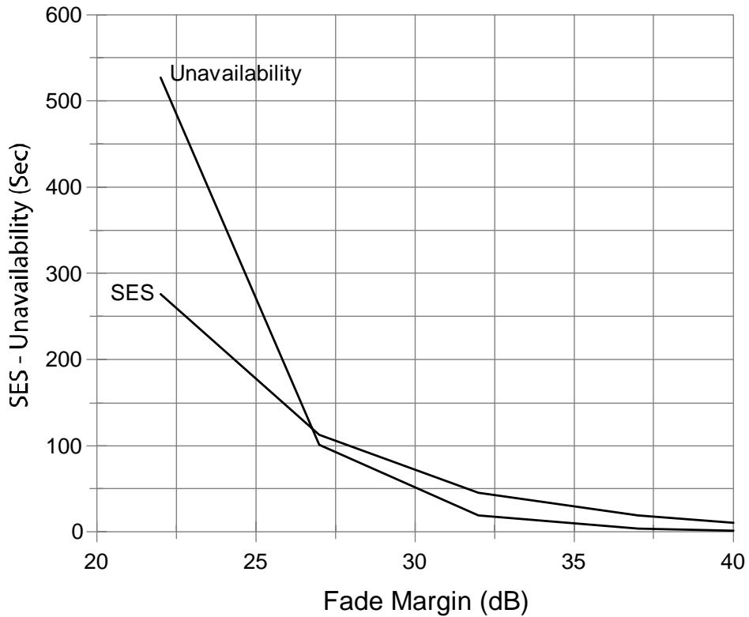

<details>
<summary>line</summary>

| Fade Margin (dB) | Unavailability (Sec) | SES (Sec) |
| ---------------- | ------------------ | --------- |
| 22               | 530                | 280       |
| 27               | 120                | 110       |
| 32               | 40                 | 20        |
| 37               | 15                 | 5         |
| 40               | 5                  | 2         |
</details>

In the case of rain fades, it is universally agreed that a rain fade will always last longer than 10 consecutive seconds and is classified as unavailability only.

G.821 and G.826 provide performance objectives in terms of SES and unavailability without stating the relationship between the two parameters

$$
\text { worst   month   time   below   level } = \text { unavailability } + S E S \tag {14}
$$

At very high frequencies, multipath fading becomes negligible compared to the rain fades.

At lower frequencies where rain is insignificant, two different approaches have been taken:

• Multipath is considered to affect the performance only and in this scenario the severely errored seconds ratio (SESR) is equal to multipath fade probability. This is usually justified by the companies high standards in the design of microwave links; however, in many cases the microwave link under review may have a fade margin in the 20 to 30 dB range. Objectives are more difficult to achieve as the allowance for unavailability cannot be used. The real reason for this approach is the lack of any published procedures to breakdown the total time below level into SES and unavailability.   
• Other companies have developed their own fade duration statistics to carry this out however, the formulas have not been published.

The Pathloss program has used these equations for G.821 performance calculations since version 3.0. The specific equations are shown below.

The probability of a non selective fade lasting longer than t consecutive seconds is given by:

$$
\rho_ {\text { non   selective }} (t) = 0. 5 \cdot \operatorname{erfc} \left(\frac {\ln \left(\frac {t}{T _ {d}}\right) + 0 . 6 7 3}{1 . 2 7 \cdot \sqrt {2}}\right) \tag {15}
$$

$$
T _ {d} = 1 6 3 \cdot k \cdot \sqrt {\frac {d}{f}} \cdot 1 0 ^ {- \frac {A _ {f l a t}}{1 0}}
$$

where:

<table><tr><td>erfc()</td><td>complementary error function</td></tr><tr><td> $T_{d}$ </td><td>average fade duration</td></tr><tr><td>k</td><td>0.5 for space diversity</td></tr><tr><td></td><td>0.5 for 1: 1 frequency diversity</td></tr><tr><td></td><td>0.75 for 1: N frequency diversity (N &gt; 1)</td></tr><tr><td></td><td>1.0 for non diversity</td></tr><tr><td>d</td><td>path length in kilometers</td></tr><tr><td>f</td><td>frequency in GHz</td></tr></table>

The probability of a selective fade lasting longer than t consecutive seconds is given by:

$$
\rho_ {\text {selective}} (t) = (1 + 0. 8 5 \cdot \sqrt {t} + 0. 3 6 \cdot t) \cdot e ^ {- 0. 8 5 \sqrt {t}} \tag {16}
$$

An option is now available to calculate the results in either format. In the microwave worksheet, select Operations - Reliability Methods and check the “Treat multipath as” selection for both SES and unavailability or for SES only. This option is applicable to both G.821 and G.826 options.

# Worksheet Formats

The following format conventions have been adopted:

• Rain calculations are carried now carried out in both directions. Previously only one calculation was made for the smallest of the two non selective fade margins for rain.   
• An annual unavailability in minutes is shown in both directions. If the multipath is treated as SES and unavailability, then the conversion from worst month to annual is given in ITU-R P.530-9 paragraph 2.3.4 - “Conversion from

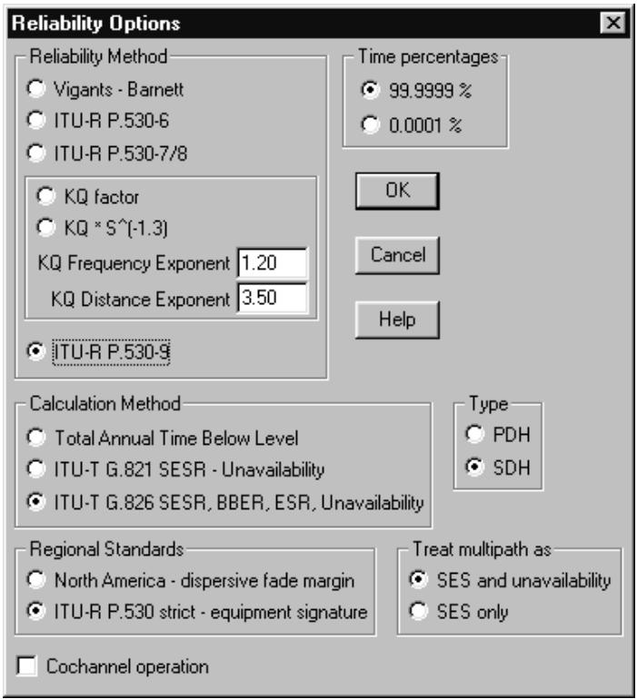

<details>
<summary>text_image</summary>

Reliability Options
Reliability Method
Vigants - Barnett
ITU-R P.530-6
ITU-R P.530-7/8
KQ factor
KQ * S^(-1.3)
KQ Frequency Exponent 1.20
KQ Distance Exponent 3.50
ITU-R P.530-9
Calculation Method
Total Annual Time Below Level
ITU-T G.821 SESR - Unavailability
ITU-T G.826 SESR, BBER, ESR, Unavailability
Regional Standards
North America - dispersive fade margin
ITU-R P.530 strict - equipment signature
Treat multipath as
SES and unavailability
SES only
Cochannel operation
Time percentages
99.9999 %
0.0001 %
OK
Cancel
Help
Type
PDH
SDH
</details>

average worst month to average annual distributions” as described below.

the logarithmic geoclimatic conversion factor ∆G is given by

$$
\begin{array}{l} \Delta G = 1 0. 5 - 5. 6 \cdot \log_ {1 0} (1. 1 \pm | \cos (2 \cdot \xi) | ^ {0. 7}) - 2. 7 \cdot \log_ {1 0} (d) + 1. 7 \cdot \log_ {1 0} (| \varepsilon_ {p} | + 1) \\ \Delta G \leq 1 0. 8 \tag {17} \\ \end{array}
$$

where

$$
\begin{array}{l} \xi \quad \text { latitude } (^ {\circ} \mathrm{N} \text { or } ^ {\circ} \mathrm{S}) \\ \mathrm{d} \quad \text {   path   length   (km)   } \\ \varepsilon_ {\mathrm{p}} \quad \text { magnitude   of   path   inclination   (milliradians) } \\ \end{array}
$$

The positive sign in equation (9) is employed for $\xi \le 4 5 ^ { \circ }$ and the negative sign for $\xi > 4 5 ^ { \circ }$

The annual fade probability ρ is related to the worst month $\rho _ { \mathrm { w } }$ by the equation:

$$
\rho = \rho_ {w} \cdot 1 0 ^ {\frac {- \Delta G}{1 0}} \% \tag{18}
$$

The following worksheet terminology is used:

<table><tr><td>SESR expressed as a worst month ratio</td><td>G.821 and G.826</td></tr><tr><td>SES expressed in seconds /month</td><td>G.821 and G.826</td></tr><tr><td>BER - multipath expressed as a worst month ratio</td><td>G.826</td></tr><tr><td>ESR - multipath expressed as a worst month ratio</td><td>G.826</td></tr><tr><td>multipath unavailability expressed as a worst month ratio</td><td>G.821 and G.826 (optional)</td></tr><tr><td>multipath unavailability in seconds /month</td><td>G.821 and G.826 (optional)</td></tr><tr><td>annual rain outage expressed in minutes</td><td>G.821 and G.826</td></tr><tr><td>BBER - rain expressed as a worst month ratio</td><td>G.826</td></tr><tr><td>ESR - rain expressed as a worst month ratio</td><td>G.826</td></tr><tr><td>BBER - multipath + rain expressed as a worst month ratio</td><td>G.826</td></tr><tr><td>ESR - multipath + rain expressed as a worst month ratio</td><td>G.826</td></tr><tr><td>Annual unavailability expressed as a ratio</td><td>G.821 and G.826</td></tr><tr><td>Annual unavailability expressed in minutes /year</td><td>G.821 and G.826</td></tr></table>

# Radio Type

Previous versions showed the radio classified as either Narrow Band Digital, PDH or SDH. The Narrow Band Digital option removed equipment signature and dispersive fade margin from the radio data entry forms. The narrow band digital option has been removed. Furthermore, the PDH/SDH options are for information only. If a G.826 calculation is to be made for a PDH radio, it is the users responsibility to ensure that the receiver threshold corresponds to $1 0 ^ { - 3 }$ BER. Similarly if a G.826 calculation is to be made for a SDH radio, the user must set the threshold to the SES BER.

# ITU P.530-8 Selective Outage And Diversity Improvement Factors

The Reliability options includes a selection to use the dispersive fade margin or the equipment signature for dispersive outage calculations.

If the equipment signature option is selected, all diversity improvement (space, frequency and quad) will be carried out in accordance with P.530-8.

This specifics of each calculation are given in the following sections.

# Selective Fading Outage

The outage probability is defined as the probability that the BER exceeds a given threshold as defined by the BER of the signature data.

Step 1: Calcuate the mean path delay $\tau _ { m }$ from equation (19):

$$
\tau_ {m} = 0. 7 \times \left(\frac {d}{5 0}\right) ^ {1. 3} \text { nanosec   o   n   d   s } \tag {19}
$$

where

d is the path length in kilometers

Step 2: Calculate the multipath activity factor from equation (20)η

$$
\eta = 1 - e ^ {- (0. 2 \cdot P _ {0} ^ {0. 7 5})} \tag {20}
$$

where

P0 $P _ { O }$ fade occurance factor

Step 3: Calculate the selective outage probability Ps from equation (21)

$$
P _ {s} = 2. 1 5 \cdot \eta \cdot W \cdot \frac {\tau_ {m} ^ {2}}{\tau_ {r}} \left(1 0 ^ {\frac {- B _ {M}}{2 0}} + 1 0 ^ {\frac {- B _ {N M}}{2 0}}\right) \tag {21}
$$

where

$W$ signature width in GHz

$B _ { M }$ minimum phase signaure depth in dB

$B _ { N M }$ non minimium phase signature depth in dB

$\tau _ { r }$ reference delay in nanoseconds used to obtain the signature

# Space Diversity Improvement

The non selective space diversity improvement factor is given by:

$$
I _ {s d n s} = \left[ 1 - \exp \left(- 3. 3 4 \cdot 1 0 ^ {- 4} \cdot S ^ {0. 8 7} \cdot f ^ {- 0. 1 2} \cdot d ^ {0. 4 8} \cdot P _ {0} ^ {- 1. 0 4}\right) \right] \cdot 1 0 ^ {\frac {A - d G + I _ {c o m b}}{1 0}} \tag {22}
$$

where

$P _ { O }$ fade occurrence factor

$d G$ absolute value of the difference of the main and diversity antenna gains

$A$ flat fade margin

$S$ vertical separation between main and diversity antennas (m center to center)

$d$ path length (km)

$I _ { c o m b }$ IF combiner gain dB (0 for baseband switching applications)

The corresponding Vigants space diversity improvement factor is given by:

$$
I _ {s d n s} = 1. 2 \cdot 1 0 ^ {- 3} \cdot \frac {f}{d} \cdot S ^ {2} \cdot v ^ {2} \cdot 1 0 ^ {\frac {A}{1 0}} \tag {23}
$$

It is always interesting to compare different methods:

Assuming equal main and diversity antenna gains dG = 0, v = 1 and $\mathrm { I } _ { \mathrm { c o m b } } = 0$ , a system with the following parameters:

<table><tr><td> $P_0$ </td><td>1.62524</td></tr><tr><td>path length</td><td>51.925 kilometers</td></tr><tr><td>frequency</td><td>5.8825 GHz</td></tr><tr><td>S</td><td>18 meters</td></tr><tr><td>A</td><td>34.5 dB</td></tr></table>

would produce a non selective space diversity improvement factor of 37 using the ITU method versus 124 for the Vigants method. Here the same value for P0 is used for both methods. The ITU fade occurrence factor tends to be much smaller than Vigants and this tends to offset the differences.

The selective outage probability is calculated as follows:

Calculate the square of the non selective correlation coefficient, $\mathrm { k _ { n s } }$

$$
k _ {n s} ^ {2} = 1 - \frac {I _ {n s} \cdot P _ {n s}}{n} \tag {24}
$$

where

<table><tr><td> $I_{ns}$ </td><td>non selective space diversity improvement factor</td></tr><tr><td> $P_{ns}$ </td><td>probability of a non selective outage</td></tr><tr><td>n</td><td>multipath activity factor</td></tr></table>

Calculate the square of the selective correlation coefficient, $\mathbf { k } _ { \mathrm { s } }$

$$
\begin{array}{l} k _ {s} ^ {2} = 0. 8 2 3 8 \text {   for   } r _ {w} \leq 0. 5 \\ k _ {s} ^ {2} = 1 - 0. 1 9 5 \cdot \left(1 - r _ {w}\right) ^ {0. 1 0 9 - 0. 1 3 \cdot \log_ {1 0} \left(1 - r _ {w}\right)} f o r 0. 5 <   r _ {w} \leq 0. 9 6 2 8 \\ k _ {s} ^ {2} = 1 - 0. 3 9 5 7 \cdot \left(1 - r _ {w}\right) ^ {0. 5 1 3 6} \text {for} r _ {w} > 0. 9 6 2 8 \tag {25} \\ r _ {w} = 1 - 0. 9 7 4 6 \cdot \left(1 - k _ {n s} ^ {2}\right) ^ {2. 1 7 0} f o r k _ {n s} ^ {2} \leq 0. 2 6 \\ r _ {w} = 1 - 0. 6 9 2 1 \cdot \left(1 - k _ {n s} ^ {2}\right) ^ {1. 0 3 4} \text { for } k _ {n s} ^ {2} \leq 0. 2 6 \\ \end{array}
$$

The non selective outage probability is given by:

$$
P _ {s d n s} = \frac {P _ {n s}}{I _ {s d n s}} \tag {26}
$$

The selective outage probability is given by:

$$
P _ {s d s} = \frac {\left(\frac {P _ {s}}{L _ {c o m b}}\right) ^ {2}}{n \cdot (1 - k _ {s} ^ {2})} \tag {27}
$$

where $\mathrm { L _ { c o m b } }$ is the selective improvement factor due to the combiner.

The total outage probability is then given by:

$$
P _ {s d} = \left(P _ {s d n s} ^ {0. 7 5} + P _ {s d s} ^ {0. 7 5}\right) ^ {1. 3 3} \tag {28}
$$

# Frequency Diversity Improvement

The non selective frequency diversity improvement is essentially the same as the Vigants formula:

$$
I _ {f d n s} = \frac {8 0}{f \cdot d} \cdot \frac {d f}{f} \cdot 1 0 ^ {\frac {A}{1 0}} \tag {29}
$$

The Vigants method assumes that this improvement factor is valid for non selective and selective fades. The ITU method calculates the selective outage exactly as in the case of space diversity above using $\mathrm { I _ { c o m b } }$ = 0 and $\mathrm { L _ { c o m b } = 1 }$ .

# Quad Diversity Improvement

The non selective quad diversity improvement factor is the sum of the space and frequency diversity factors:

$$
I _ {q d n s} = I _ {s d n s} + I _ {f d n s} \tag {30}
$$

The square of the non selective correlation coefficient is given by:

$$
K _ {n s} = K _ {n s s d} \times k _ {n s f d} \tag {31}
$$

The selective outage is calculated exactly as in the case of space diversity using

$$
I _ {c o m b} = 0 \text { and } L _ {c o m b} = 1 \tag {32}
$$

for baseband switching applications.

# Cochannel Operation

This paragraph describes the procedure to calculate the threshold degradation due to the cross polarized discrimination on radio links operating in a cochannel mode. The XPD will degrade under multipath fading and high intensity rain conditions. Cochannel operation is set by selecting Operations - Reliability and then checking the cochannel operation option.

The data is accessed by selecting Operations - Cochannel XPD Interference.

<table><tr><td colspan="3">Cochannel XPD Interference</td></tr><tr><td colspan="3">OK Cancel Help</td></tr><tr><td></td><td>Site 1</td><td>Site 2</td></tr><tr><td>Antenna XPD (dB)</td><td></td><td></td></tr><tr><td>TX antenna spacing (m)</td><td></td><td></td></tr><tr><td>XPIF (dB)</td><td></td><td></td></tr><tr><td>XPIC device XPD (dB)</td><td></td><td></td></tr><tr><td>XPD fade margin - multipath (dB)</td><td></td><td></td></tr><tr><td>XPD threshold degradation - multipath (dB)</td><td></td><td></td></tr><tr><td>XPD fade margin - rain (dB)</td><td></td><td></td></tr><tr><td>XPD threshold degradation - rain (dB)</td><td></td><td></td></tr><tr><td colspan="3">Site 1 Antenna XPD (dB): |</td></tr></table>

# XPD Degradation due to Multipath

# 1. Calculate

$$
X P D _ {0} = X P D _ {g} + 5 \text {   for   } X P D _ {g} \leq 3 5 \tag {33}
$$

$$
X P D _ {0} = 4 0 \text {for} X P D _ {g} > 3 5
$$

where XPDg is the minimum value of the transmit and receive antenna XPD=s measured on the boresight.

# 2. Calculate the multipath activity parameter

$$
\eta = 1 - e ^ {- 0. 2 \cdot P _ {0} ^ {0. 7 5}} \tag {34}
$$

where $P _ { O }$ is the multipath occurrence factor corresponding to the percentage of time that a fade greater than 0 dB occurs in the average worst month.

# 3. Calculate

$$
Q = - 1 0 \cdot \log_ {1 0} \left(\frac {K _ {x p} \cdot n}{P _ {0}}\right) \tag {35}
$$

where

$$
K _ {X P} = 0. 7 \text {   for   one   transmit   antenna   } \tag {36}
$$

$$
K _ {X P} = 1 - 0. 3 \cdot \exp \left[ - 4 \cdot 1 0 ^ {- 6} \cdot \left(\frac {s _ {t}}{\lambda}\right) ^ {2} \right] \text {   for   two   transmit   antennas } \tag {37}
$$

Calculate

$$
C = X P D _ {0} + Q \tag {38}
$$

The carrier to cochannel interference ratio is then given by:

$$
\frac {C _ {0}}{I _ {\text { coch   mpth }}} = - 1 0 \cdot \log_ {1 0} \left(1 0 ^ {- \frac {X P D _ {G T S}}{1 0}} + 1 0 ^ {- \frac {X P D _ {G R X}}{1 0}} + 1 0 ^ {- \frac {(C - A)}{1 0}}\right) + 2 \tag {39}
$$

for radios not equipped with an XPIC device and by the following equation for XPIC equipped radios.

$$
\frac {C _ {0}}{I _ {\text {coch mpth}}} = - 1 0 \cdot \log_ {1 0} \left(1 0 ^ {- \frac {X P D _ {x p i c}}{1 0}} + 1 0 ^ {- \frac {X P D _ {G T X} + X P I F}{1 0}} + 1 0 ^ {- \frac {X P D _ {G R X} + X P I F}{1 0}} + 1 0 ^ {- \frac {(C + X P I F - A)}{1 0}}\right) \tag {40}
$$

where

XPIF is the improvement due to the XPIC device

$X P D _ { G }$ is the coss polarized discrimination of the antennas

XPDxpic $X P D _ { x p i c }$ is the XPD of the XPIC device

A is the fade margin including the effects of interference due to other transmitters

The 2 dB improvement in the non XPIC case is due to the Gaussian properties of the interfering crosspolar signal. This figure is included in the XPIF for XPIC equipped radios.

# XPD Degradation due to Rain

The XPD reduction factor due to high intensity rain is given by the equation

$$
\begin{array}{l} X P D _ {R A I N} = 1 5 + 3 0 \cdot \log_ {1 0} \left(f _ {G H z}\right) - 1 2. 8 \cdot f _ {G H z} ^ {0. 1 9} \cdot \log_ {1 0} (A) \text {for} f _ {G H z} \leq 2 0 G H Z \\ X P D _ {R A I N} = 1 5 + 3 0 \cdot \log_ {1 0} \left(f _ {G H z}\right) - 2 2. 6 \cdot \log_ {1 0} (A) \text {for} f _ {G H z} = 2 0 G H Z \end{array} \tag {41}
$$

$$
X P D _ {R A I N} = 1 5 + 3 0 \cdot \log_ {1 0} (f _ {G H z}) - 2 2. 6 \cdot \log_ {1 0} (A) \text {for} f _ {G H z} > 2 0 G H z
$$

The corresponding carrier to cochannel interference ratio is then given by:

$$
\frac {C _ {0}}{I _ {\text {coch rain}}} = - 1 0 \cdot \log_ {1 0} \left(1 0 ^ {- \frac {X P D _ {G T X}}{1 0}} + 1 0 ^ {- \frac {X P D _ {G R X}}{1 0}} + 1 0 ^ {- \frac {X P D _ {R A I N}}{1 0}}\right) + 2 \tag {42}
$$

$$
\frac {C _ {0}}{I _ {\text {coch rain}}} = - 1 0 \cdot \log_ {1 0} \left(1 0 ^ {- \frac {X P _ {x p i c}}{1 0}} + 1 0 ^ {- \frac {X P _ {G T X} + X P I F}{1 0}} + 1 0 ^ {- \frac {X P D _ {G R X} + X P I F}{1 0}} + 1 0 ^ {- \frac {X P D _ {R A I N} + X P I F}{1 0}}\right) + 2
$$

where the parameters are the same as defined above.

# ITU-R P530-9

The ITU-R P.530-9 prediction for single frequency or narrow band fading distribution at large fade depths in the average worst month in any part of the world is defined in the following steps. Note that only the detailed link design method has been implemented in the Pathloss program

# Step 1

Calculate the geoclimatic factor K for the average worst month from equation (43) below

$$
K = 1 0 ^ {- 3. 9 - 0. 0 0 3 d N _ {1}} \times s _ {a} ^ {- 0. 4 2} \tag {43}
$$

where

$d N _ { 1 }$ is the point refractivity gradient in the lowest 65 m of the atmosphere not exceeded for 1% of an average year. Data for $d N _ { 1 }$ is provided on a 1.5 grid in latitude and longitude in Recommendation ITU-R P.453. This data has been incorporated into the Pathloss program. The value at the latitude and longitude of the centre of the path is determined by bilinear interpolation of the four closest grid points.

$s _ { a }$ is the area terrain roughness. This is defined as the standard deviation of terrain heights (m) within a 110 km Þ 110 km area with a 30 arc second resolution. The area is aligned about the center of the path.

# Step 2

Calculate the path inclination $\mathfrak { E } _ { p }$ using equation (44) below

$$
\varepsilon_ {p} = \left| \operatorname{atan} \frac {h _ {r} - h _ {e}}{d \times 1 0 0 0} \right| \tag {44}
$$

where

$h _ { e }$ and $h _ { r }$ are the antenna heights in meters above sea level

d is the path length in kilometers

# Step 3

For detailed link design applications, calculate the percentage of time $\mathtt { p _ { w } }$ that fade depth A (dB) is exceeded in the average worst month from equation (45)

$$
p _ {w} = K \cdot d ^ {3. 2} \cdot (1 + | \varepsilon_ {p} |) ^ {- 0. 9 7} \cdot 1 0 ^ {0. 0 3 2 f - 0. 0 0 0 8 5 h _ {L} - \frac {A}{1 0}} \tag {45}
$$

where

$f$ frequency in GHz

$h _ { L }$ altitude of the lower antenna (i.e. the smaller of $h _ { e }$ and $h _ { \mathrm { r } } )$

$K$ geoclimatic factor from (43)

# Section Performance Objectives

This feature is accessible in the network module. Select Sections - Objectives.

The procedure is as follows:

Define the links in the section. This definition consists of selecting the links, defining the order that they are arranged and defining the order of the sites in a link. The easiest way to do this is to minimize the Section Performance Dialog and select the individual links in the order that they will appear by clicking the left mouse button on the link. The first click selects a link - the second click removes the link from the section. You can reverse some of the links or change the order if required by returning to the Section Performance dialog box.

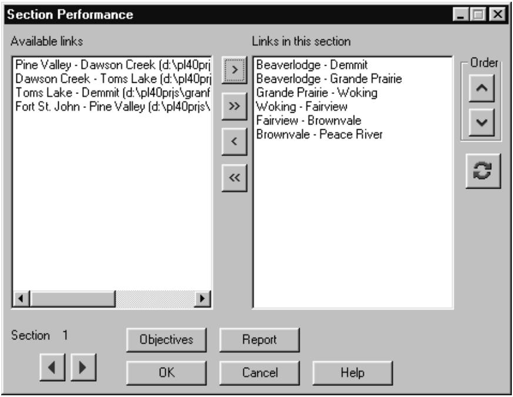

<details>
<summary>text_image</summary>

Section Performance
Available links
Pine Valley - Dawson Creek (d:\pl40pri
Dawson Creek - Toms Lake (d:\pl40pri
Toms Lake - Demmit (d:\pl40pri\granf
Fort St. John - Pine Valley (d:\pl40pri\s
Links in this section
Beaverlodge - Demmit
Beaverlodge - Grande Prairie
Grande Prairie - Woking
Woking - Fairview
Fairview - Brownvale
Brownvale - Peace River
Order
Section 1
Objectives
Report
OK
Cancel
Help
</details>

In the second method links are selected by moving them from the available links list box to the selected links list box. You can remove a selected link by hiliting the link and then moving the link back to the available links list.

Any number or sections with any combination of links in a section can be defined. The only restriction is that a link must have a valid pl4 file association. Each section definition will its own set of performance objectives.

Objectives will be reference to either the present section definition or a hypothetical reference path. The length of the HRP must be specified in kilometers.

Select the calculation method for the objectives (G.821, G.826 or Annual time below level). It is assumed that the associated pl4 files have been configured for the same option. If objectives are not specified, then the report will only contain the calculated performance.

# Sub Network Operations

The concept of a sub network was introduced into the Pathloss program in the September, 2001 build. This feature simplifies operations on a large network and automates certain routine task such as path profile generation and equipment data entry.

# Sub Network Definition

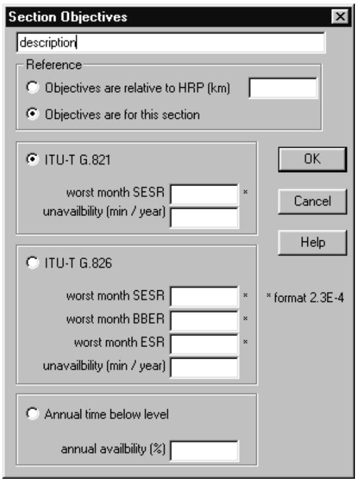

<details>
<summary>text_image</summary>

Section Objectives
description
Reference
Objectives are relative to HRP (km)
Objectives are for this section
ITU-T G.821
worst month SESR
unavailability (min / year)
ITU-T G.826
worst month SESR
worst month BBER
worst month ESR
unavailability (min / year)
annual time below level
annual availability (%)
</details>

In the network module, select Sections - Sub Network Operations. There are two methods to define a sub network.

Select the required links from the Available links list and move these to the Sub network links list.   
Click on the desired links in the network display. You can minimize the dialog box for this purpose.

Note that only links can be placed in a sub network. There is no provision to add individual sites. Once the link definition is complete, check the Activate sub network option and Click OK to close the dialog box. The sub network is always saved when OK is clicked.

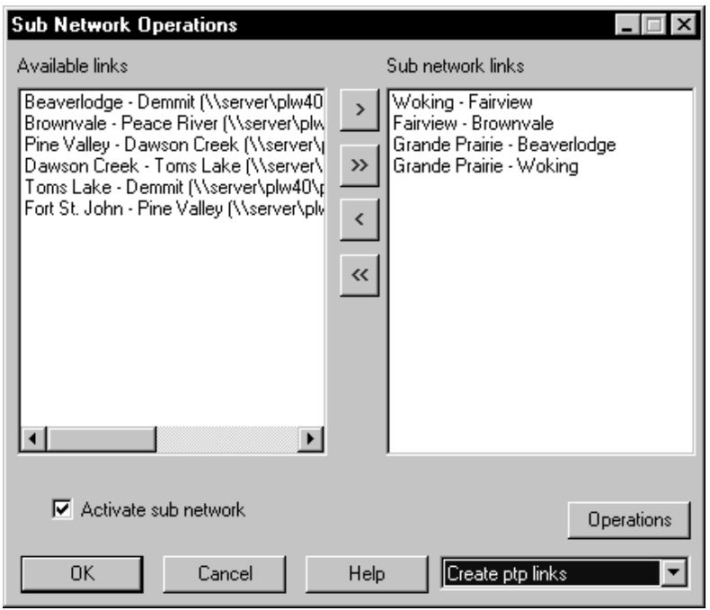

<details>
<summary>text_image</summary>

Sub Network Operations
Available links
Beaverlodge - Demmit (\server\plw40
Brownvale - Peace River (\server\plw
Pine Valley - Dawson Creek (\server\
Dawson Creek - Toms Lake (\server\
Toms Lake - Demmit (\server\plw40\p
Fort St. John - Pine Valley (\server\plw
Sub network links
Woking - Fairview
Fairview - Brownvale
Grande Prairie - Beaverlodge
Grande Prairie - Woking
Activate sub network
Operations
OK	Cancel	Help	Create ptp links
</details>

The network display is resized to show only the sub network links. All network operations are now limited to these links. You can return to the Sub Link Operations dialog at any time and deactivate the sub link.

# Interference Calculations on a Sub Network

An intra system interference calculation has two new options when a sub network has been defined and is activated.

# Sub network intra system interference

In this option, the interference calculation is carried out for only the sites in the sub network. All other sites are ignored.

# Sub network against network interference

Each interference case must involve one TX or RX in the sub network with one RX or TX in the remaining network display. All TX and RX combinations of the sub network are excluded. Similarly all TX and RX combinations in the remainder of the network are also excluded.

The Analyse current file option can be used in a sub network.

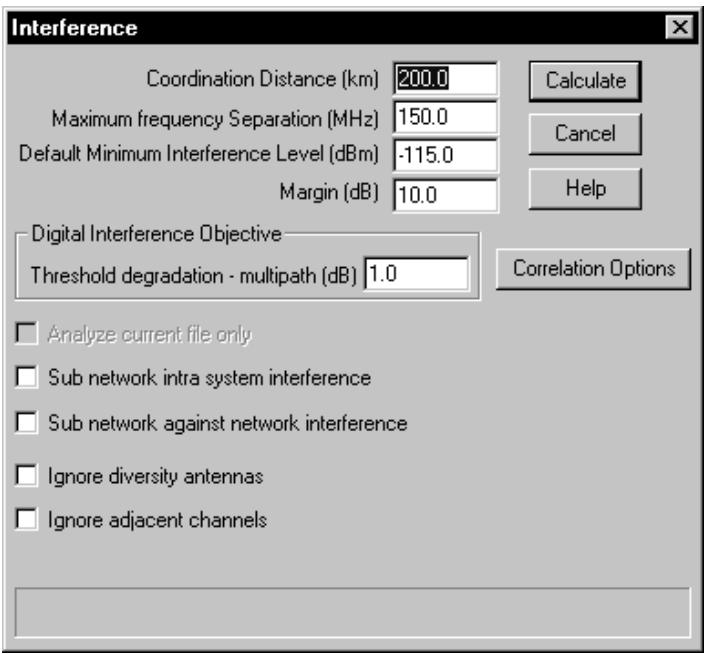

<details>
<summary>text_image</summary>

Interference
Coordination Distance (km) 200.0
Maximum frequency Separation (MHz) 150.0
Default Minimum Interference Level (dBm) -115.0
Margin (dB) 10.0
Digital Interference Objective
Threshold degradation - multipath (dB) 1.0
Calculate
Cancel
Help
Correlation Options
Analyze current file only
Sub network intra system interference
Sub network against network interference
Ignore diversity antennas
Ignore adjacent channels
</details>

# Point to Point Profile Generation

This function creates Pathloss data files (pl4) for all links defined in the sub network. Equipment data entry is based on a template Pathloss data file.

In the Sub network definition dialog, select “Create ptp links” and click the operations button.

Select the template file to be used to generate the new Pathloss data files. All equipment parameters, and calculation settings including the rain region will be use.

The template file can be a file on disk or the current file loaded in memory. If a disk file is to be used, Click the Browse button to load the file.

The Pathloss file names can be based on either the site names or the call signs.

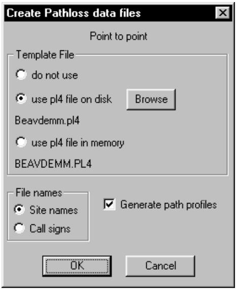

<details>
<summary>text_image</summary>

Create Pathloss data files
Point to point
Template File
do not use
use pl4 file on disk Browse
Beavdemm.pl4
use pl4 file in memory
BEAVDEMM.PL4
File names
Site names
Call signs
Generate path profiles
OK Cancel
</details>

Check the Generate path profile box to create path profiles. A terrain database must be configured.

Click the OK button to generate the Pathloss data files.

# Edit Frequency Plan

This operation is only applicable to microwave applications. Select the “Edit frequency plan” in the operations drop down list.

Hilite the desired links in the Sub network links list box.

Click the Operations button. The transmit channel data entry form will be brought up for each link in sequence. The changes will be automatically written to the associated Pathloss data files.

# Sub network Link Layer

This operation sets the drawing layer for all links in the network.

Select Link Layer in the operations dropdown list and click the operations button. Set the link layer number as required.

# Point to Multipoint

This operation will generate point to mulitpoint Pathloss data files for all links defined in the network.

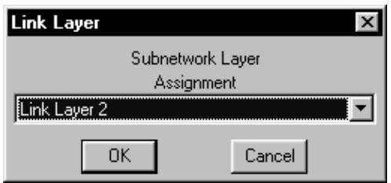

<details>
<summary>text_image</summary>

Link Layer
Subnetwork Layer
Assignment
Link Layer 2
OK	Cancel
</details>

One site must be designated as a point to multipoint site; all others must be designated as remotes. The same sector number must be used for all sites. The following steps illustrate the creation, layout and design of a Point to Multi point network.

# Step 1 - Entering Sites

Enter the site information into the Site List, this can either be entered as individual sites or you can import the data from a text file or existing Pathloss data files. Each site must be designated as either a PMP or a Remote site this is done by selecting and changing the value in the Type dropdown list.

<table><tr><td colspan="8">Site List</td></tr><tr><td colspan="8">Import Edit Update Files Reports Mark Site Transform Coords. Help</td></tr><tr><td></td><td>Layer</td><td>Site Name</td><td>Type</td><td>Sector num...</td><td>Call Sign</td><td>Latitude</td><td>Longil</td></tr><tr><td>1</td><td>Sector 1</td><td>Base Station</td><td>point to multipoint</td><td>1</td><td>BS1</td><td>47 15 23.00 N</td><td>119 22</td></tr><tr><td>2</td><td>Sector 2</td><td>Base Station</td><td>point to multipoint</td><td>2</td><td>BS1</td><td>47 15 23.00 N</td><td>119 22</td></tr><tr><td>3</td><td>Sector 1</td><td>N1</td><td>remote</td><td>1</td><td>N1</td><td>47 40 57.96 N</td><td>119 26</td></tr><tr><td>4</td><td>Sector 1</td><td>N2</td><td>remote</td><td>1</td><td>N2</td><td>47 39 11.08 N</td><td>119 01</td></tr><tr><td>5</td><td>Sector 1</td><td>N3</td><td>remote</td><td>1</td><td>N3</td><td>47 24 53.67 N</td><td>118 40</td></tr><tr><td>6</td><td>Sector 1</td><td>N4</td><td>remote</td><td>1</td><td>N4</td><td>47 20 11.48 N</td><td>119 42</td></tr><tr><td>7</td><td>Sector 2</td><td>S1</td><td>remote</td><td>2</td><td>S1</td><td>47 05 33.99 N</td><td>119 18</td></tr><tr><td>8</td><td>Sector 2</td><td>S2</td><td>remote</td><td>2</td><td>S2</td><td>47 06 12.96 N</td><td>119 48</td></tr><tr><td>9</td><td>Sector 2</td><td>S3</td><td>remote</td><td>2</td><td>S3</td><td>47 05 01.33 N</td><td>118 35</td></tr></table>

Assigning sector numbers and remote site identifiers can be simplified with the view menu selections in the site list. Select “show subnetwork only” and then select “reset site type”. Set the site type to remote, enter the sector number and click OK. Manually change the hub site identifier to point to mulitpoint.

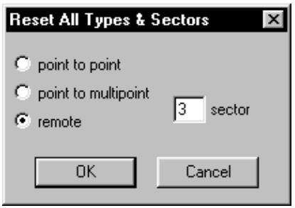

<details>
<summary>text_image</summary>

Reset All Types & Sectors
• point to point
• point to multipoint
• remote 3 sector
OK Cancel
</details>

# Step 2 - Create Sectors

After all of the sites have been entered you must create additional base station sites for each Sector in that site. Click on the line number of the base station site that you wish to add an additional sector to. The line number will turn red as shown in the above figure. Click Edit, Add or type Crtl A. The Add Item dialog will appear with all the information entered. Change the sector number and click OK.

# Step 3 - Create Links

You may now connect the sites together. Click and drag a line from the base station to the remote site and release the button. You will have to pick which base station sector you wish to join to.

<table><tr><td colspan="2">Add Item</td></tr><tr><td colspan="2">OK Cancel</td></tr><tr><td>Site Name</td><td>Base Station</td></tr><tr><td>Sector number</td><td>1</td></tr><tr><td>Call Sign</td><td>BS1</td></tr><tr><td>Latitude</td><td>47 15 23.00 N</td></tr><tr><td>Longitude</td><td>119 22 35.00 W</td></tr><tr><td>Elevation (m)</td><td>396.00</td></tr><tr><td>Structure Height (m AMSL)</td><td></td></tr><tr><td>Easting (km)</td><td>320.204</td></tr><tr><td>Northing (km)</td><td>5236.395</td></tr><tr><td>UTM zone</td><td>11N</td></tr></table>

By now you should have your Sites entered defined as either Remote or Base Station and the links defined. The next steps create a template file and generate the Pathloss profiles.

# Step 4 - Create a Template

Before we can create any profiles we need to first have a template that has all the values used in the profile creation. Click on one of the links and go to the Worksheets module. In the Worksheet module you should define all equipment and frequencies that will be used. You should also set the antenna heights for both sites. These values will be used in all of the Pathloss files generated.

Save this Pathloss file and return to the network module.

# Step 5 - Profile Generation

In the network module click Sections and Sub Network Operations. Select all the links for the first sector either by selecting the links from the list in the left pane or by minimizing the dialog and selecting the links graphically on the screen. Once all of the links for that sector have been selected, bring the dialog back up and click Activate sub network. The display will update in the background showing only the defined sub network highlited in pink. Click the drop down list under the Operations button and select “Create Ptmp Links”. Click Operations.

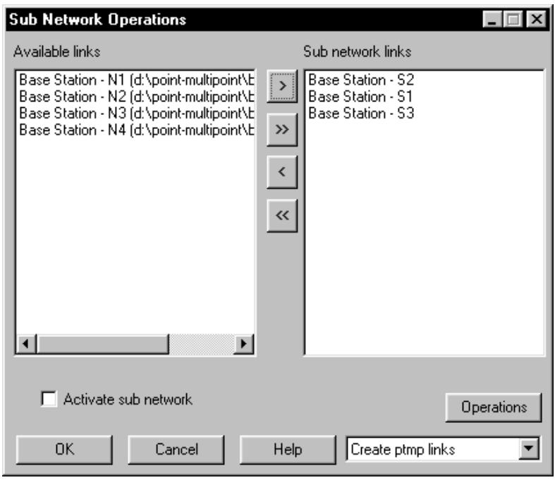

<details>
<summary>text_image</summary>

Sub Network Operations
Available links
Base Station - N1 (d:\point-multipoint\b
Base Station - N2 (d:\point-multipoint\b
Base Station - N3 (d:\point-multipoint\b
Base Station - N4 (d:\point-multipoint\b
Sub network links
Base Station - S2
Base Station - S1
Base Station - S3
>
>
>
>
<
<
<<
□ Activate sub network
Operations
OK	Cancel	Help	Create ptmp links
</details>

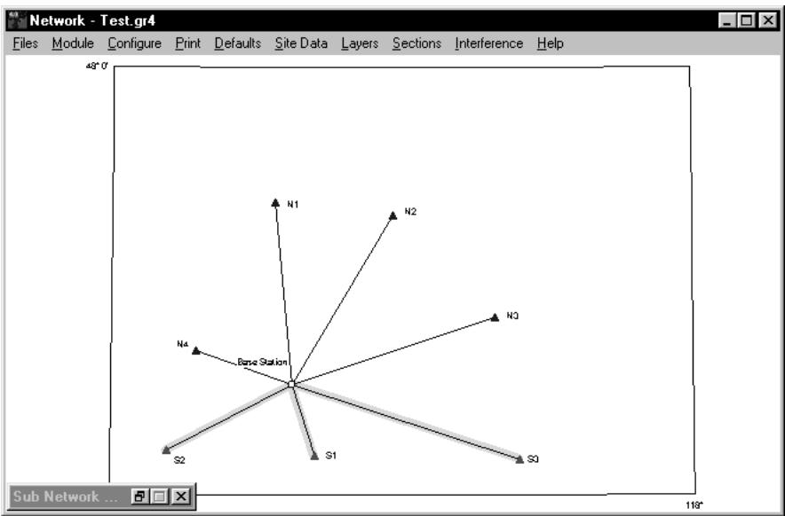

<details>
<summary>text_image</summary>

Network - Test.gr4
Files	Module	Configure	Print	Defaults	Site Data	Layers	Sections	Interference	Help
48° 0
N1
N2
N3
N4
Base Station
S1
S2
S3
Sub Network ...
</details>

The Create Pathloss data files dialogue box will appear. Select the template file to use for the creation of the Pathloss files. This file is the Pathloss file that was created and saved in Step 4 above. Decide how you want the files named, either Site1-Site2.pl4 or CallSign1- CallSign2.pl4. If you have a terrain database setup, select Generate path profiles. The program will ask to overwrite the Template file, Click Yes or the template file will not have a path profile. The rest of the files created will prompt to confirm the save name and location.

Once all of the profiles have been generated for a sector, you can click “Activate Sub Network” again and then unselect all of the links.

Repeat Step 5 for each sector at the site.

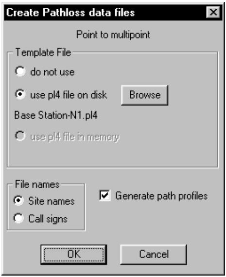

<details>
<summary>text_image</summary>

Create Pathloss data files
Point to multipoint
Template File
do not use
use pl4 file on disk Browse
Base Station-N1.pl4
use pl4 file in memory
File names
Site names
Call signs
Generate path profiles
OK Cancel
</details>