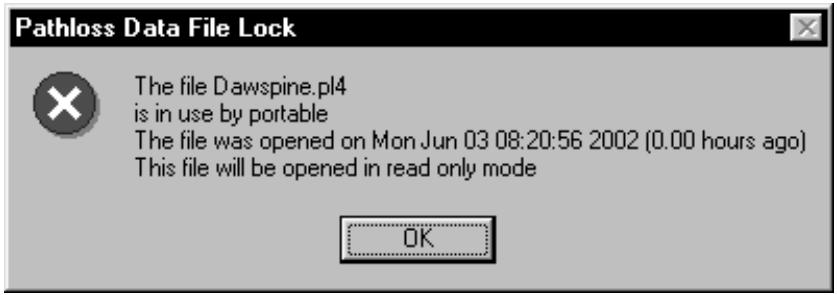
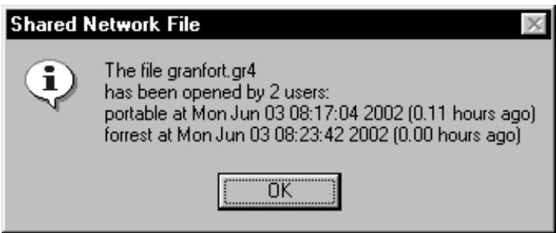
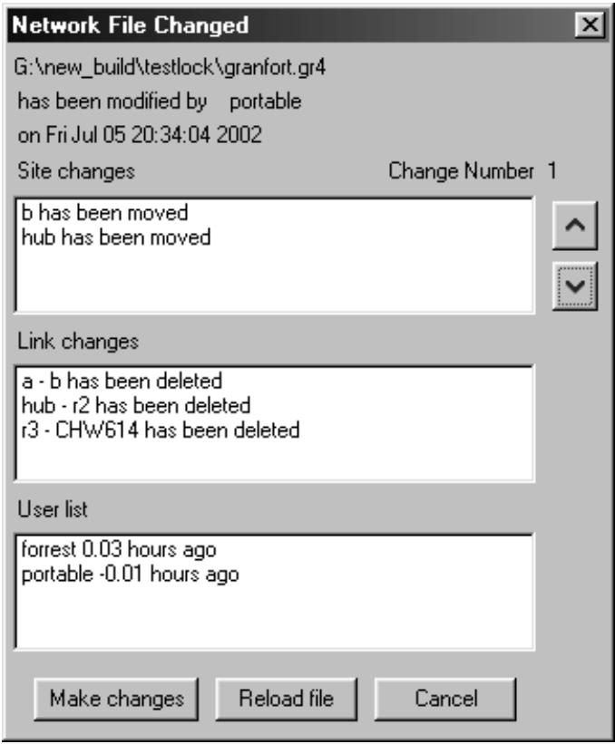
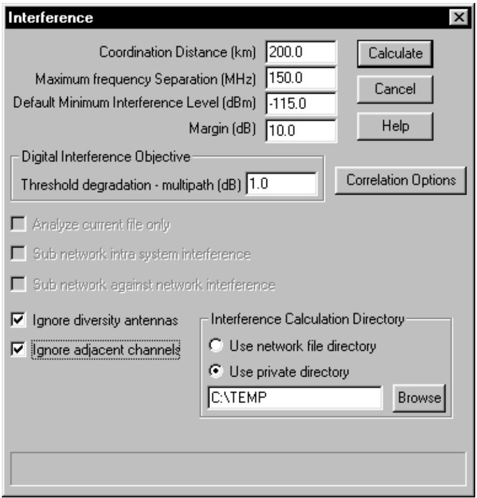

# Pathloss File Locking and Sharing

The June 03, 2002 Pathloss program build introduces pathloss data (pl4) file locking and network (gr4) file sharing when these files are located on a shared network drive. The locking and sharing is activated if the root drive containing the network or pathloss data file is a remote drive. Note that this can fail on a peer to peer network, if a drive is accessed as a local drive.

# Pathloss data (pl4) file locking

The locking mechanism, creates a new file with the same name as the Pathloss data files with the extension lck. When the user closes this file, the lock file is erased. If another user attempts to open the file, a prompt is issued that the file is in use and will be opened in read only mode. It is not possible to save the file under another name. The program does not check if the lock file has been (deleted)

text_image

Pathloss Data File Lock
The file Dawspine.pl4
is in use by portable
The file was opened on Mon Jun 03 08:20:56 2002 (0.00 hours ago)
This file will be opened in read only mode
OK

# Network (gr4) file sharing

To enable network (gr4) file sharing, select Files - Shared file operation on the network menu bar. This step must be carried out before loading a network file. To enable network file sharing after a file has been loaded, select Files - New and then select Files - Shared file operation. Then reload the file. The shared setting is saved in the program option file.

In this mode, a file cannot be saved if the following conditions are not met.

• Each site must have a unique call sign. This is a 15 character identifier and cannot be blank. The same call sign cannot be used at different sites. The call sign serves as a unique identifier to determine changes to the sites and links.   
• The revision date of the file on disk must be the same as the file in memory. Another users changes cannot be overwritten.

The sharing mechanism uses a file with the same name as the network file with the extension glk. This file will be referred to a glk file in the following descriptions and the file contains the following information:

• the revision date and change number   
• a list of all users who have opened the network file   
• a series of records containing the changes made to the file . These records are used to update the individual users files

The glk file is created when the first user opens the network file. At this point the file contains the name of the user and the revision date. The change number is set to zero. The program will then begin to monitor the glk file at 30 second intervals to determine if the revsion date has changed.

The glk file is deleted when the last user closes the network file.

Once the network file has been opened by the first user all other users opening the file will be presented with a list of users who have opened the file open. The new users are added to the user list and receive revision revision date at the time that they loaded the file.

Suppose a user makes some changes to the file and saves the changes. A change is defined as follows:

• a site has been added   
• a site has been deleted   
• a site has been moved   
• a link has been added   
• a link has been deleted   
• the Pathloss file associated with the link has been changed.

When the file is saved, a record of the changes is first created by comparing the file in memory with the file on disk. The glk file will be updated with the new revision date, and the record of changes will be appended to the file.

In this shared environment, the program checks the glk file every 30 seconds and if a change has occurred, the user is notified with the list of changes. Each change can be viewed.

# Make changes

The changes are made directly from the glk file. The display will not be reformated. All of the changes in the glk file will be made.

text_image

Shared Network File
The file granfort.gr4
has been opened by 2 users:
portable at Mon Jun 03 08:17:04 2002 (0.11 hours ago)
forrest at Mon Jun 03 08:23:42 2002 (0.00 hours ago)
OK

text_image

Network File Changed
G:\new_build\testlock\granfort.gr4
has been modified by portable
on Fri Jul 05 20:34:04 2002
Site changes	Change Number 1
b has been moved
hub has been moved
Link changes
a - b has been deleted
hub - r2 has been deleted
r3 - CHW614 has been deleted
User list
forrest 0.03 hours ago
portable -0.01 hours ago
Make changes	Reload file	Cancel

# Reload file

The complete file will be reloaded and the display will be reformatted. The reload file option is only available in the network and mapgrid modules

If the cancel button is clicked, the user can update the file by returning to the network or mapgrid module and reloading the file using Files - Open or selecting Files - Shared File Status. The latter produces the same display and options as a change notification in the network or mapgrid modules

Only one change notification is issued even if the user decides to not re-load the file. Once the file has been updated, the change notification will begin again.

# Interference Calculations on a shared Network file

The inherent table locking schemes used in the Borland database engine does not allow users to carry out simultaneous interference calculations. An interference calculation creates a set of tables which relate to the network gr4 file.

The June 02, 2002 program build allows the user to specify a private directory for interference calculations. The selection is made at the start of an interference calculation.

Operations such as specifying fade correlation will fail if the current network file does not match the database tables in the private directory.

text_image

Interference
Coordination Distance (km) 200.0
Maximum frequency Separation (MHz) 150.0
Default Minimum Interference Level (dBm) -115.0
Margin (dB) 10.0
Digital Interference Objective
Threshold degradation - multipath (dB) 1.0
Analyze current file only
Sub network intra system interference
Sub network against network interference
Ignore diversity antennas
Ignore adjacent channels
Interference Calculation Directory
Use network file directory
Use private directory
C:\TEMP Browse

