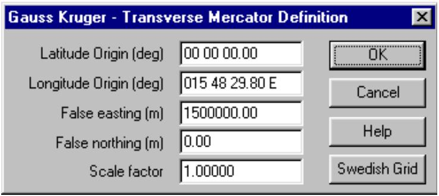
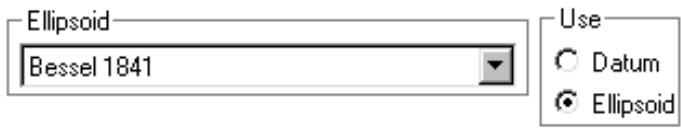

# Gauss Kruger Projection

The Gauss Kruger coordinate system is implemented as a generalized Transverse Mercator projection. The specific parameters are set in the Geographic Defaults dialog box. Select Configure - Geographic defaults. Set the grid coordinate

text_image

Gauss Kruger - Transverse Mercator Definition
Latitude Origin (deg) 00 00 00.00
Longitude Origin (deg) 015 48 29.80 E
False easting (m) 1500000.00
False northing (m) 0.00
Scale factor 1.00000
OK
Cancel
Help
Swedish Grid

system to Gauss Kruger. The Gauss Kruger parameter definition button becomes active once the grid coordinates selection is made.

<table><tr><td>Latitude Origin (deg)</td><td>The latitude origin is entered in decimal degrees and is positive in the northern hemisphere. This is usually zero which means that the equator is the origin.</td></tr><tr><td>Longitude Origin (deg)</td><td>The longitude origin is entered in decimal degrees and is positive in the eastern hemisphere. Eastings are measured from the longitude origin which is also called the central meridian.In some Gauss Kruger implementations, the first digit in the easting is referred to the zone number. The longitude origin is equal to the zone number multiplied by 3.</td></tr><tr><td>False Easting (m)</td><td>A false easting eliminates negative numbers by assigning a sufficiently large positive number to the central meridian. See the specific tables below for common values.</td></tr><tr><td>False Northing (m)</td><td>A false northing eliminates negative values in the same manner as the false easting. The false northing and latitude origin are usually set to zero which means that the northing will be the distance from the equator.</td></tr><tr><td>Scale factor</td><td>This is the scale factor along the central meridian and is usually equal to 1.0 for Gauss Kruger projections. The scale factor for the Universal Transverse Mercator projection is 0.9996.</td></tr></table>

The latitude and longitude origins can be entered as decimal degrees or as degrees minutes and seconds with a space separating the values.

The Swedish Grid button sets the parameters to the Swedish grid coordinate system.

When the definitions are complete, close the dialog with the OK button. The parameters will be saved in a file named gauskrug.bin in the pathloss program directory. All conversions between geographic and easting - northings will use these definitions.

# Ellipsoid - Datum

In addition to the specified Transverse Mercator parameters, the conversion between geographic coordinates and easting - northings are based on the ellipsoid definition. Both the Bessel and Krassovsky ellipsoids are used. Therefore, you must select an ellipsoid and check the Use Ellipsoid button in the Geographic defaults dialog.

Note that there is no datum cooresponding to these two ellipsoids.

text_image

Ellipsoid
Bessel 1841
Use
○ Datum
● Ellipsoid

# Terrain Database

The Odyssey - Gauss Kruger terrain data base option has been implemented for this projection. This can be used with any terrain database with elevations arranged in west to east rows such as MSI Planet. The Gauss Kruger definitions can also be set as part of the database configuration. This is same as setting the parameters in the Geographic defaults.

A problem can occur when creating an index for a Gauss Kruger database from a text file. The east and west edges specification can include the zone number as the first digit of the value. The conversion process checks the value of the east and west edges. If the value is greater than 1000, the first digit is removed. In most cases the results will be correct; however a value greater than 1000 could also be an actual easting.

# Parameters

The parameters used for the Gauss Kruger Projection in Baden-Wuerttemberg are:

<table><tr><td>spheroid</td><td>Bessel 1841</td></tr><tr><td>latitude origin</td><td>0.0</td></tr><tr><td>longitude origin</td><td>9 degrees E (zone 3)</td></tr><tr><td>false easting (m)</td><td>3500000</td></tr><tr><td>false northing</td><td>0.0</td></tr><tr><td>scale factor</td><td>1.</td></tr></table>

In Germany, there are 5 zones using the Gauss-Kruger / Transverse Mercator projection.

<table><tr><td>zone</td><td>latitude origin degrees</td><td>longitude origin degrees</td><td>scale factor</td><td>false easting meters</td><td>false northing meters</td><td>spheroid</td></tr><tr><td>1</td><td>0</td><td>3E</td><td>1.0</td><td>150,000</td><td>0</td><td></td></tr><tr><td>2</td><td>0</td><td>6E</td><td>1.0</td><td>250,000</td><td>0</td><td></td></tr><tr><td>3</td><td>0</td><td>9E</td><td>1.0</td><td>350,000</td><td>0</td><td></td></tr><tr><td>4</td><td>0</td><td>12E</td><td>1.0</td><td>450,000</td><td>0</td><td></td></tr><tr><td>5</td><td>0</td><td>15E</td><td>1.0</td><td>550,000</td><td>0</td><td></td></tr></table>

# Swedish Grid System

The Swedish grid system uses the following parameters

spheroid Bessel 1841

latitude origin 0.0

longitude origin 15º 48' 29.8" E (15.80827778 degrees E)

false easting (m) 1500000.00

false northing 0.00

scale factor 1.00

# Slovakia

In Slovakia the following projections are used:

spheroid Krassovsky

latitude origin 0.0

longitude origin 15 degrees E

false easting (m) 3500000

false northing 0.0

scale factor 1.

spheroid Krassovsky

latitude origin 0.0

longitude origin 21 degrees E

false easting (m) 3500000

false northing 0.0

scale factor 1.