# PATHLOSS VERSION 4.0 - MAY 2001 PROGRAM BUILD

The following new features are incorporated in the May 2001 program build:

# MAP GRID

A new map grid module has been introduced. This operates in parallel with the existing network module and is functionally identical. The display supports backdrops in TIF or windows BMP format and dynamic on screen profile generation. The map grid module is available as part of the microwave interference option.

# MULTIPATH AND RAIN FADE CORRELATION

The interference fade margin / threshold degradation has been split into two separate components for rain and multipath. Default correlation values can be assigned for cases where the main and interference paths are spatially correlated. A correlation editor is provided which graphically displays each interference case in the network module. This feature is available as part of the microwave interference option.

# ITU-T G.826

SESR, BBER and ESR performance calculations for SDH radio links is implemented. To accommodate the additional radio data required for G.826 calculations. The format of the following files has been changed.

Pathloss data files (pl4)   
Microwave radio data files (raf and mrs)   
• Microwave radio lookup tables (mrd)

The May 2001 build program can read these data files and all previous versions. Pathloss programs prior to the May 2001 build will not be able to read the new files.

# ITU-R P.530-8 EQUIPMENT SIGNATURE - DIVERSITY IMPROVEMENT

Selective outage calculations using the equipment signature parameters and the space and frequency diversity improvement factors in strict accordance with P.530-8 have been implemented

# ITU-R P.530-8 COCHANNEL OPERATION

Performance degradation due to cochannel operation for radios equipped with XPIC devices has been implemented.

# MAP GRID

# OVERVIEW

# BACKDROP DEFINITION a

Set Directory

Image File Index

Import List . 4

GeoTIF File 5

New List . . 5

TIF to Bit Map Array

Elevation File Index . . 6

Import List . 6

Elevation File Conversion

Datum – Ellipsoid Selection

Local Datums

Global Datums

Map Projection . . . 8

Other Considerations 8

# CURSOR MODES

Pan and Zoom Controls . .

Link Mode Cursor

# VISIBILITY TESTS and PROFILE GENERATION 10

# ELEVATION DISPLAYS 10

# ADD SITE and MOVE SITE .

# DEFINITIONS – GLOSSARY . 12

# REFERENCES 13

# INTERFERENCE AND DESIRED PATH FADE CORRELATION 14

# OVERVIEW 14

# ADJACENT CHANNEL FADE CORRELATION 14

# ATPC CONSIDERATIONS 15

# DEFAULT PROGRAM SETTINGS 15

EDITING CORRELATION 16

ITU-T G.826 ERROR PERFORMANCE OBJECTIVES

SESR BIT ERROR RATE

MULTIPATH . 18

RAIN 18

UNAVAILABILITY - SESR TRANSITION. 18

PATHLOSS PROGRAM DATA REQUIREMENTS . 19

Radio Data File (RAF - MRS) Changes 19

Microwave Worksheet Radio Data Entry Forms . . . 21

Radio Lookup Tables . 21

ITU P.530-8 SELECTIVE OUTAGE AND DIVERSITY IMPROVEMENT FACTORS . 21

SELECTIVE FADING OUTAGE 22

SPACE DIVERSITY IMPROVEMENT 23

FREQUENCY DIVERSITY IMPROVEMENT 24

QUAD DIVERSITY IMPROVEMENT 24

COCHANNEL OPERATION 25

XPD DEGRADATION DUE TO MULTIPATH 25

# MAP GRID

# OVERVIEW

An new site network display module named “Map Grid” has been added in the May 2001 program build. This operates in parallel with the existing network module. The network module uses a Transverse Mercator projection to display the sites. The longitude origin of this projection is set to the mid point of the east - west extents of the sites. This produces a display with symmetrical latitude and longitude lines.. If a new site is added which changes the extents of the display, a new longitude origin is calculated. As such, this variable projection will not accommodate backdrops such as maps and ortho-photos.

The map grid module uses fixed projections to display the network sites with both backdrops and elevations. The backdrops can be in either a TIF or window bit map (BMP) format. The elevations must be in the Odyssey - Planet BIL format. The map grid elevation database setup is independent of the terrain database setup under Configure - Terrain data base. At this time, the same projection must be used for the both the backdrop and the elevations.

# BACKDROP DEFINITION

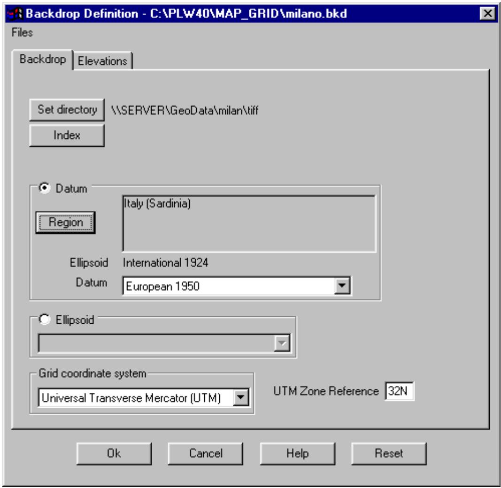

<details>
<summary>text_image</summary>

Backdrop Definition - C:\PLW40\MAP_GRID\milano.bkd
Files
Backdrop	Elevations
Set directory	\\SERVER\GeoData\milan\tiff
Index
Datum
Region	Italy (Sardinia)
Ellipsoid	International 1924
Datum	European 1950
Ellipsoid
Grid coordinate system
Universal Transverse Mercator (UTM)	UTM Zone Reference 32N
Ok	Cancel	Help	Reset
</details>

Select Site Data - Backdrop to access the backdrop definition dialog. A backdrop definition consists of the

following steps for both the image and elevation files. The procedure is identical for each.

specify the directory containing the image /elevation files   
create an index for the image /elevation files   
specify the map projection used by the image /elevation files   
• specify the datum or reference ellipsoid for the image /elevation files

# Set Directory

Click the set directory button and point to the directory containing the image files. All image files must be located in this directory.

# Image File Index

Click the Index button to access the grid data entry form. The following fields are available:

Image file name 95 characters maximum

Show any image file can be temporarily switched off

Type At this time only TIF and bitmap (bmp) image files are supported.

West, south east and north edges – These are expressed in kilometers and must correspond to the selected map projection.

Cell size optional entry (not used)

The data can be manually entered using the procedures described in the General Program Operation or imported from a list or GeoTIF file.

# Import List

Select Files – Import List. Specify the locations of the fields in the file to be imported.

Two default options are provided for Planet and Odyssey image files.

Specify the units of the edges, click Ok and open the file containing the index information.

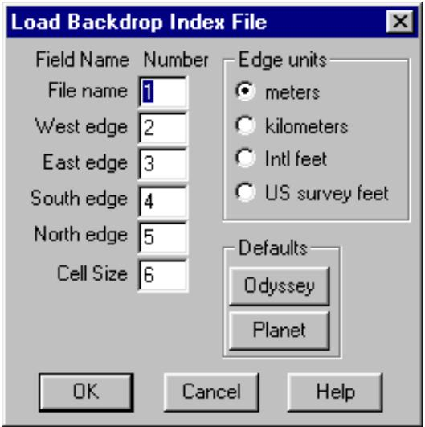

<details>
<summary>text_image</summary>

Load Backdrop Index File
Field Name Number
File name 1
West edge 2
East edge 3
South edge 4
North edge 5
Cell Size 6
Edge units
meters
kilometers
Intl feet
US survey feet
Defaults
Odyssey
Planet
OK Cancel Help
</details>

# GeoTIF File

GeoTIF files may contain the required information to create an index entry for the file. Select Files – GeoTIF File and open the file.

There must be sufficient information in the file to determine the edges, map projection and datum.

At present, only UTM projections and US State plane coordinates will automatically generate the index and set the datum.

# New List

The Import List and GeoTIF file procedures simply append the new entry to the existing index. Select Files – New List to erase the existing list.

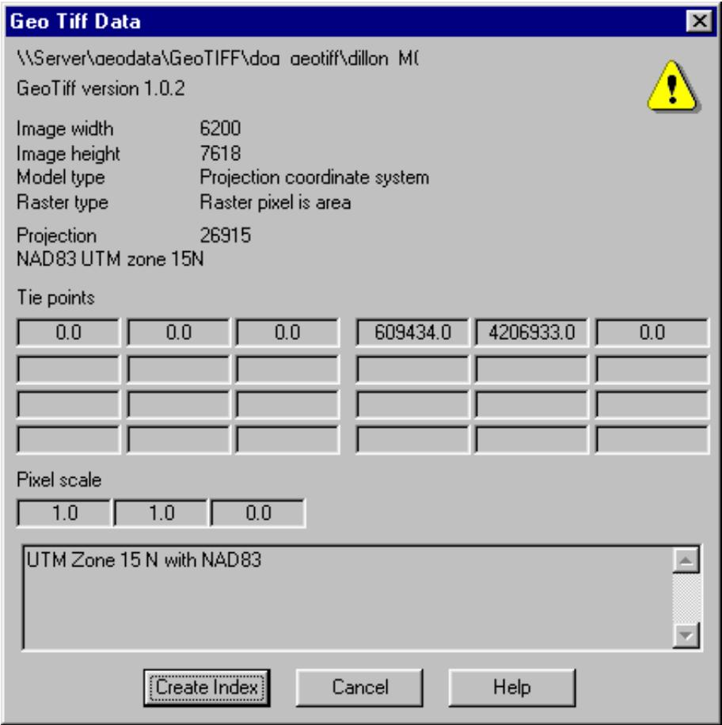

<details>
<summary>text_image</summary>

Geo Tiff Data
\\Server\geodata\GeoTIFF\dog geotiff\dillon M\
GeoTiff version 1.0.2
Image width 6200
Image height 7618
Model type Projection coordinate system
Raster type Raster pixel is area
Projection 26915
NAD83 UTM zone 15N
Tie points
0.0 0.0 0.0 609434.0 4206933.0 0.0
Pixel scale
1.0 1.0 0.0
UTM Zone 15 N with NAD83
Create Index Cancel Help
</details>

# TIF to Bit Map Array

TIF files are sometimes supplied in large sizes in the range from150 to 200 megabytes or larger. A TIF file must first be converted to a bitmap. This can be very time consuming and places a strain on system resources. A provision has been made to convert a large TIF file into an array of bitmaps. The bitmaps will be saved in the same directory as the TIF file.

Select Files - Create bitmap array and enter the number of rows and columns. The index will be automatically updated with the bitmap data. Be sure to save the new backdrop file.

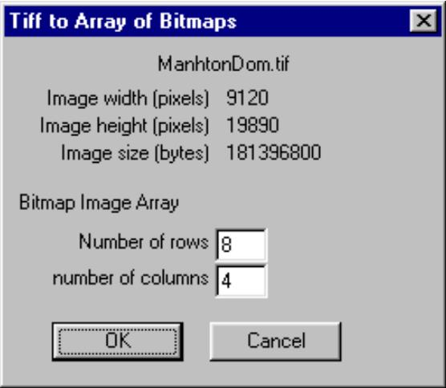

<details>
<summary>text_image</summary>

Tiff to Array of Bitmaps
ManhtonDom.tif
Image width (pixels) 9120
Image height (pixels) 19890
Image size (bytes) 181396800
Bitmap Image Array
Number of rows 8
number of columns 4
OK Cancel
</details>

Bitmaps are not loaded into memory. Instead the bit map files are opened as memory mapped files. Significant performance improvements can be realized by using a number of smaller bitmaps instead of a single large TIF file.

# Elevation File Index

Click the Index button to access the grid data entry form. The following fields are required for an elevation file entry:

Map name 95 characters maximum

Bytes / pixel Some file formats contain the elevation and additional information. The default is 2 bytes per pixel which corresponds to a 2 byte integer elevation.

Bottom up This setting specifies if the rows of elevations start at the south west corner or the north west corner. If the elevation views are upside down, then change this setting

Byte order The elevations are expressed as two byte integers. This setting determines if the most significant byte is first (SPARC) or the least significant byte is first (INTEL). If the wrong setting is used, the resulting elevations will be very large positive and negative numbers. The program will interpret these as no data values and nothing will be displayed.

Cell size The horizontal resolution of the database expressed in meters.

Edges West, south east and north edges. These are expressed in kilometers and must correspond to the selected map projection.

Show any elevation file can be temporarily switched off

The data can be manually entered using the procedures described in the General Program Operation or imported from a list file.

# Import List

Select Files – Import List. Specify the locations of the fields in the file to be imported.

Two default options are provided for Planet and Odyssey image files.

Specify the units of the edges, click Ok and open the file containing the index information.

# Elevation File Conversion

The elevation files must be in the Odyssey - Planet BIL format. Several file conversion utilities are available to convert other format to the BIL

format. Select Files - Convert in the Elevation index menu to access these conversions.

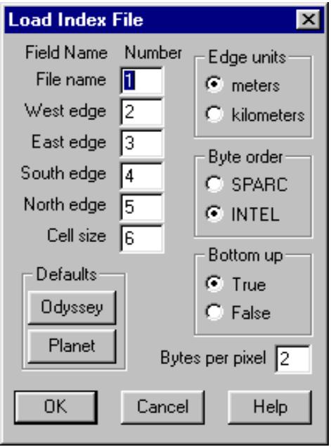

<details>
<summary>text_image</summary>

Load Index File
Field Name Number
File name 1
West edge 2
East edge 3
South edge 4
North edge 5
Cell size 6
Edge units
meters
kilometers
Byte order
SPARC
INTEL
Bottom up
True
False
Defaults
Odyssey
Planet
Bytes per pixel 2
OK Cancel Help
</details>

# Datum – Ellipsoid Selection

The shape of the earth is not spherical. Rather it is more nearly an oblate ellipsoid of revolution which is also called an oblate spheroid. This is an ellipse rotated about its minor axis.

The earth is not an exact ellipsoid. The geoid is the name given to the shape that the earth would assume if all measurements were reference to mean sea level. This is an undulating surface which is within ±100 meters of a well fitting ellipsoid. Note that elevations and contour lines are referenced to the geoid. Latitude and

longitude and all grid coordinate systems are referenced to the ellipsoid.

The ellipsoid is defined by the semi major and semi minor axis. Alternately this can be expressed as the semimajor axis and the flattening or eccentricity as defined by the equation below:

$$
B ^ {\prime} A @ \frac {r e c f \& 1}{r e c f}
$$

where

A major axis

B minor axis

recf reciprocal flattening

# Local Datums

Initially ellipsoids were fitted to the mean sea level surface over a particular region or country. These were related to an initial point on the surface of the earth to produce a local datum. This initial point is assigned a latitude, longitude, an elevation above the ellipsoid and an azimuth to some point. This initial point becomes the triangulation station Principio to which all ground control measurements will be referenced. The latitude and longitude and elevation of all control points in the area are computed relative to this initial point and the ellipsoid.

An example of a local datum is the North American Datum of 1927 (NAD27) with the following parameters:

reference ellipsoid Clark 1866

semi major axis 6378206.4 km

inverse flattening 294.9786982

origin Meades Ranch in Kansas

# Global Datums

Global datums use ellipsoids determined from satellite based survey methods and define a coordinate system used for the entire earth.. The center of the reference ellipsoid is located at the mass center of the earth. An example of a global datum is the World Geodetic System of 1984 (WGS 84)

reference ellipsoid WGS 84

semi major axis 6378137.0 km

inverse flattening 298.257223563

origin mass center of the earth

In the Pathloss program, either a datum or ellipsoid can be selected. Selecting a datum indirectly defines the reference ellipsoid and since all conversions between geodetic and rectangular coordinates and the distance and azimuth calculations are based on the reference ellipsoid, the two choices may seem redundant.

A datum in the Pathloss program includes additional data to allow the transformation of geodetic coordinates between datums. In local datums, it is necessary to subdivide the area covered by the datum into smaller regions to improve the accuracy of the coordinate transformation.

Some local map projections do not have a corresponding datum. Several examples are:

Swiss National Grid - reference ellipsoid - Bessel 1841

Irish National grid - reference ellipsoid - modified airy.

In these cases, an ellipse must be specified and there will be no provision to transform coordinates. For example geodetic coordinates in the WGS84 coordinates cannot be transformed to Swiss National grid coordinates; however the WG84 coordinates could be transformed to the European Datum of 1950 Note that in the current program build, the map projection and the datum / ellipsoid must be specified for both the image files and the elevation files. This generality will allow additional flexibility in a future build by allowing coordinate transformation between datums. The errors in these transformation will certainly be greater that the imagery / elevation data resolution and it will be necessary to provide procedures to match the imagery and elevation data.

The datum or reference ellipsoid selection must be the same for the site data, image , and elevation files.

The same map projection must be used for the image and elevation files

# Map Projection

Select one of the map projections in the drop down list. The following projections are currently supported:

UTM - Universal Transverse Mercator - The UTM zone must be specified.

Swiss National grid 1 \*

UK Ordnance grid \*

Irish National grid \*

New Zealand grid \*

Gauss Kruger

US State Plane grid \*

The selection of any of the projections marked with an \*, will automatically select the correct datum or ellipsoid.

The default projection is the same as that used in the network module. This is a Transverse Mercator projection referenced to a central meridian located at the center of the east - west extents of the sites. This selection effectively inhibits all of the imagery and elevation procedures in the Map Grid module.

# Other Considerations

When the backdrop definition is complete, save the file using the file menu in this dialog box.

Click OK to close the backdrop definition dialog. The image files are loaded into memory and displayed. If the file loading is cancelled, then it will be necessary to recall the backdrop definition dialog and close it with the OK button again.

The current backdrop definition file will be automatically loaded again when the program is started again and

the map grid module is entered.

If a network file whose extents are separated by 10 degrees from the extents of the imagery data, is loaded, then the map projection is automatically set to the default and the imagery and elevation features are inhibited.

# CURSOR MODES

# Pan and Zoom Controls

Click the button to set the cursor to the pan mode. Hold the left mouse button down and drag the display to the new location. The display can also be moved with the cursor keys at any time.

Click the button to set the cursor to the zoom mode. A left button click magnifies the display a preset amount and centers the display at the cursor location. A right button click reduces and centers the display. To zoom a specific area, hold down the left mouse button and drag the mouse to define the desired area. Three additional buttons affect the display as follows:

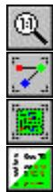

the backdrop image is displayed from the upper left corner with the same resolution as the image file.

the extents of the site data is displayed

the extents of the image files is displayed.

the elevation view is switched off an on by clicking this button

# Link Mode Cursor

Click the button to set the cursor to the link mode. This is the default cursor mode in the network module and is used to access the design modules, create links between two sites, and selectively set the link and site attributes.

# VISIBILITY TESTS and PROFILE GENERATION

Click the button to begin the visibility tests. Place the cursor at one location, hold down the left mouse button and drag the mouse to the second location. The progress of the profile is dynamically shown on the

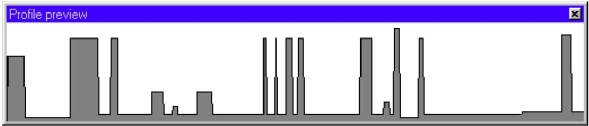

<details>
<summary>bar</summary>

Profile preview
| Category | Value |
|---|---|
| 1 | 35 |
| 2 | 0 |
| 3 | 45 |
| 4 | 45 |
| 5 | 0 |
| 6 | 15 |
| 7 | 5 |
| 8 | 0 |
| 9 | 25 |
| 10 | 0 |
| 11 | 0 |
| 12 | 0 |
| 13 | 0 |
| 14 | 0 |
| 15 | 0 |
| 16 | 0 |
| 17 | 0 |
| 18 | 0 |
| 19 | 0 |
| 20 | 0 |
| 21 | 0 |
| 22 | 0 |
| 23 | 0 |
| 24 | 0 |
| 25 | 0 |
| 26 | 0 |
| 27 | 0 |
| 28 | 0 |
| 29 | 0 |
| 30 | 0 |
| 31 | 0 |
| 32 | 0 |
| 33 | 0 |
| 34 | 0 |
| 35 | 0 |
| 36 | 0 |
| 37 | 0 |
| 38 | 0 |
| 39 | 0 |
| 40 | 0 |
| 41 | 0 |
| 42 | 0 |
| 43 | 0 |
| 44 | 0 |
| 45 | 0 |
| 46 | 0 |
| 47 | 0 |
| 48 | 0 |
| 49 | 0 |
| 50 | 0 |
| 51 | 0 |
| 52 | 0 |
| 53 | 0 |
| 54 | 0 |
| 55 | 0 |
| 56 | 0 |
| 57 | 0 |
| 58 | 0 |
| 59 | 0 |
| 60 | 0 |
| 61 | 0 |
| 62 | 0 |
| 63 | 0 |
| 64 | 0 |
| 65 | 0 |
| 66 | 0 |
| 67 | 0 |
| 68 | 0 |
| 69 | 0 |
| 70 | 0 |
| 71 | 0 |
| 72 | 0 |
| 73 | 0 |
| 74 | 0 |
| 75 | 0 |
| 76 | 0 |
| 77 | 0 |
| 78 | 0 |
| 79 | 0 |
| 80 | 0 |
| 81 | 0 |
| 82 | 0 |
| 83 | 0 |
| 84 | 0 |
| 85 | 0 |
| 86 | 0 |
| 87 | 0 |
| 88 | 0 |
| 89 | 0 |
| 90 | 0 |
| 91 | 0 |
| 92 | 0 |
| 93 | 0 |
| 94 | 0 |
| 95 | 0 |
| 96 | 0 |
| 97 | 0 |
| 98 | 0 |
| 99 | 0 |
| Note: The values in the 'Value' column are estimated based on the provided code. The 'Profile preview' label is not used in the chart.
</details>

screen. To reset this display during the profile generation, click the right mouse button. When the left mouse button is released, a profile analysis display will appear. This display allows you to change antenna heights, earth radius factor K and test the clearance using Fresnel zone references of the clearance display.

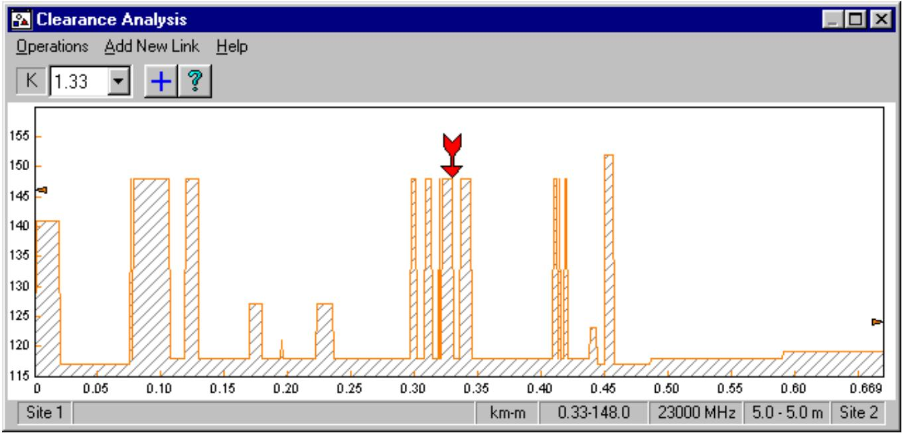

<details>
<summary>bar</summary>

| x_value | y_value |
| ------- | ------- |
| 0.00    | 140     |
| 0.05    | 115     |
| 0.10    | 148     |
| 0.15    | 115     |
| 0.20    | 127     |
| 0.25    | 115     |
| 0.30    | 148     |
| 0.35    | 148     |
| 0.40    | 133     |
| 0.45    | 152     |
| 0.50    | 115     |
| 0.55    | 115     |
| 0.60    | 115     |
| 0.669   | 115     |
</details>

You can add this link to the site data list and save the data as a Pathloss pl4 file. If the two end locations were not between existing sites, you should change the site names from the default Site 1 and Site 2 names. To exit the profile generation mode, close the profile preview display, click the button again or change the cursor mode to the pan, zoom or link modes.

# ELEVATION DISPLAYS

An elevation display can be generated at any zoom level which will overlay the image backdrop. The extents of the display always corresponds to the current display extents.

Select Site Data – Elevation view - Create

The display is useful to resolve small elevation differences which may not be apparent from the image display.

An elevation legend is available under the same menu.

The elevation display will remain until it is reset

Several display options are available. Select Elevation - View - Options

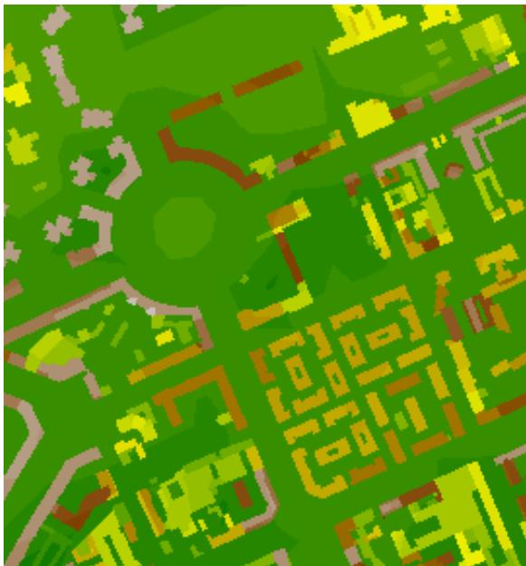

<details>
<summary>natural_image</summary>

Abstract pixelated pattern with green and yellow blocks, no text or symbols present
</details>

The color can be either a graduated color ramp or a grey scale. The elevation display is overlaid on to the backdrop display. The raster operation code is SRCCOPY in the above drawing which hides the backdrop. The code “DSPDxax” is a transparent copy which allows the backdrop to show through. If any code other than SRCCOPY, the elevation legend colors will not be correct.

# ADD SITE and MOVE SITE

Two similar operations allow the user to visually add a new site or move an existing site. Select Site Data – Add Site or Move Site

In the add site case, use the mouse to position the marker at the desired location.

Click the Add site button and enter a name for the site.

In the move site case, first identify the site to be move by clicking the left mouse button on the site legend. Then move the site to the new location and click the Ok button.

Both of the displays show the elevation.

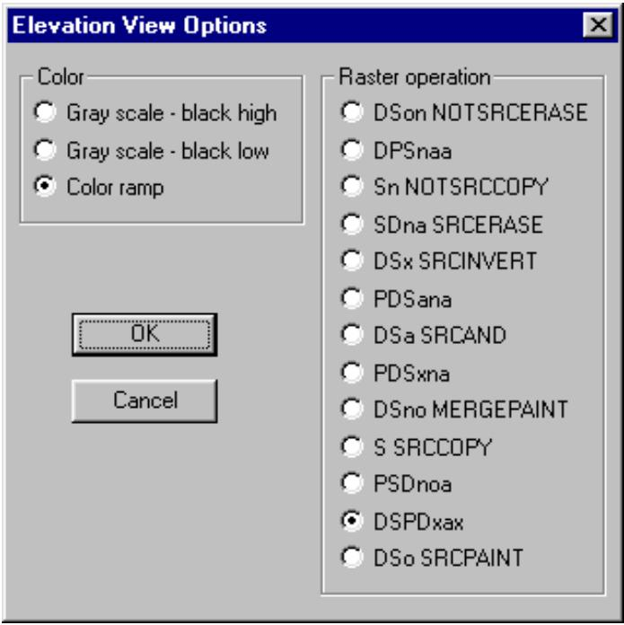

<details>
<summary>text_image</summary>

Elevation View Options
Color
Gray scale - black high
Gray scale - black low
Color ramp
Raster operation
DSon NOTSRCERASE
DPSnaa
Sn NOTSRCCOPY
SDna SRCERASE
DSx SRCINVERT
PDSana
DSa SRCAND
PDSxna
DSno MERGEPAINT
S SRCCOPY
PSDnoa
DSPDxax
DSo SRCPAINT
OK
Cancel
</details>

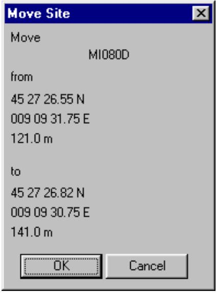

<details>
<summary>text_image</summary>

Move Site
Move
MI080D
from
45 27 26.55 N
009 09 31.75 E
121.0 m
to
45 27 26.82 N
009 09 30.75 E
141.0 m
OK Cancel
</details>

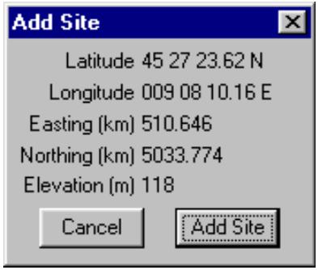

<details>
<summary>text_image</summary>

Add Site
Latitude 45 27 23.62 N
Longitude 009 08 10.16 E
Easting (km) 510.646
Northing (km) 5033.774
Elevation (m) 118
Cancel Add Site
</details>

# DEFINITIONS – GLOSSARY

Datum – Any numerical or geometrical quantity or set of such quantities specifying the reference coordinate system used for geodetic control in the calculation of coordinates of points on the earth. Datums may be either global or local in extent. A local datum defines a coordinate system that is used only over a region of limited extent. A global datum specifies the center of the reference ellipsoid to be located at the earth’s center of mass and defines a coordinate system used for the entire earth.

Ellipsoid – The surface generated by an ellipse rotating about one of its axes.

Geocentric Coordinates – Cartesian coordinates (X, Y, Z) that define the position of a point with respect to the center of mass of the earth.

Geodetic Coordinates – The quantities of latitude and longitude that define the position of a point on the surface of the earth with respect to the reference ellipsoid. Also, imprecisely called geographic coordinates.

Geodetic Height – The height above the reference ellipsoid, measured along the ellipsoidal normal through the point in question. The geodetic height is positive if the point is outside the ellipsoid. Also known as ellipsoidal height, h.

Geodetic Latitude – The angle between the plane of the equator and the normal to the ellipsoid through the computation point. Geodetic latitude is positive north of the equator and negative south of the equator.

Geodetic Longitude – The angle between the plane of a meridian and the plane of the prime meridian. A longitude can be measured from the angle formed between the local and prime meridians at the pole of rotation of the reference ellipsoid, or by the arc along the equator intercepted by these meridians.

Geoid – The equipotential surface of the earth’s gravity field approximated by undisturbed mean sea level fo the oceans. The direction of gravity passing through a given point on the geoid is perpendicular to this equipotential surface.

Geoid Separation – The distance between the geoid and the mathematical reference ellipsoid as measured along the ellipsoidal normal. This distance is positive outside, or negative inside, the reference ellipsoid. Also called geoidal height; undulation of the geoid.

Horizontal Datum – A horizontal datum specifies the coordinate system in which latitude and longitude of points are located. The latitude and longitude of an initial point, the azimuth of a line from that point, and the semi-major axis and flattening of the ellipsoid that approximates the surface of the earth in the region of interest define a horizontal datum.

Reference Ellipsoid – An ellipsoid whose dimensions closely approach the dimensions of the geoid; the exact dimensions are determined by various considerations of the section of the earth’s surface concerned. Usually a bi-axial ellipsoid of revolution.

Vertical Datum – A vertical datum is the surface to which elevations are referred. A local vertical datum is a continuous surface, usually mean sea level, at which elevations are assumed to be zero throughout the area of

interest.

WGS 72 – World Geodetic System 1972. WGS 72 was the previous DoD standard earth-centered, earth-fixed world geodetic system. It was superceded by WGS 84

WGS 84 – World Geodetic System 1984. A world geodetic system provides the basic reference frame, geometric figure and gravimetric model for the earth, and provides the means for relating positions on various local geodetic systems to an earth-centered, earth-fixed coordinate system. WGS 84 is the current DoD standard earth-centered, earth-fixed world geodetic system.

# REFERENCES

(1) Topographic Engineering Center, TEC-SR-7, Handbook for transformation of DATUMS, PROJECTIONS, GRIDS, AND COMMON COORDINATE SYSTEMS, January 1996.   
(2) Department of Defense, MIL-HDBK-850, Military Handbook – Glossary of Mapping, Charting, and Geodetic Terms, 21 January 1994.

# INTERFERENCE AND DESIRED PATH FADE CORRELATION

# OVERVIEW

If an interfering signal follows the same path as the desired signal, the two signals can be considered to be correlated to some degree. The interfering signal will experience fading at the same time as the desired signal; thereby reducing the effect of the interference.

This is the case for both rain and multipath fades; however, the degree of correlation for these two conditions will be different. In the case of a multipath fade, it is realistically assumed that only one fade will exist at any instance in time in an area due to the characteristics of deep fading. Multipath fades are short in duration and highly localized in an area. Rain fades on the other hand are of longer duration, are relatively frequency independent in a given band and can extend over a wide area.

To handle this fade correlation, the May 2001 program build considers the Spatially Uncor interference fade margin and threshold degradation for both rain and multipath separately under the assumption that rain and multipath fading are mutually exclusive events.

Provision is made to edit the rain - multipath fade correlation and to assign default values for this correlation at the start of an interference calculation.

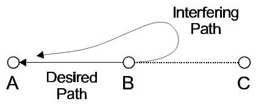

<details>
<summary>flowchart</summary>


</details>

Spatially Correlated

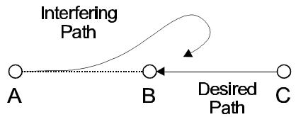

<details>
<summary>flowchart</summary>

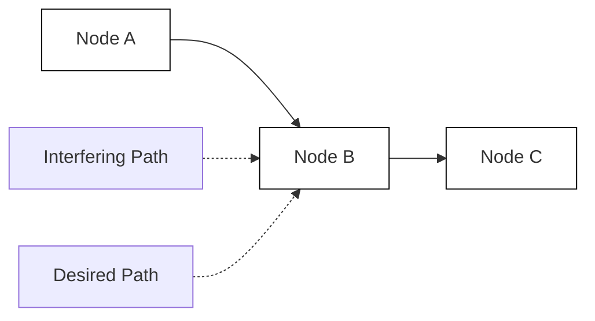
</details>

Spatially Uncorrelated

The base interference calculation is always carried out and retained. The effect of rain and multipath correlation does not change the base calculation.

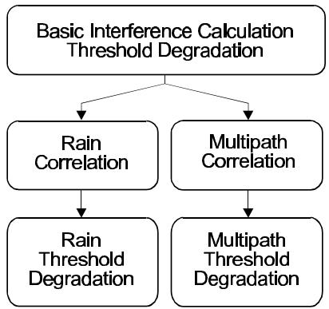

<details>
<summary>flowchart</summary>

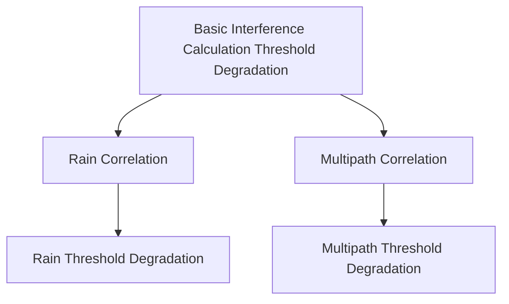
</details>

An example of a correlated fade would a multi hop two frequency plan system with sites designated as A, B and C. The receiver at site A whose associated transmitter is located at site B, will be interfered by the transmitter also at site B transmitting to site C. The carrier to interference ratio is completely determined by the front to back ratio of the interfering transmit antenna. Since both the desired and interfering signals follow the path from B to A, the following considerations can be made.

Rain will attenuate the desired and interfering signal equally if the polarizations are the same for both signals. The polarization of the interfering signal is indeterminate off boresight and can be considered to be circular at discrimination angles greater than 90 degrees. Therefore, the fading could be considered as completely correlated and the case could be ignored.   
The degree of correlation between the desired and interfering signal fades due to multipath will depend on the antenna heights of the desired and interfering transmitters at site B Polarization will affect the correlation to a lesser degree. For equal antenna heights, the fading can be considered to be correlated; otherwise a partial correlation situation exists.

# ADJACENT CHANNEL FADE CORRELATION

A one for N systems is a specialized case of correlation. From a multipath standpoint, the frequency difference between the desired signal and the adjacent channel interferer, is small enough to offer some multipath fading correlation. This correlation combined with the filter improvement is usually sufficient to clear the case. At frequency separations of two or more adjacent channels, the filter improvement is sufficient to ignore the interference.

From a rain fade standpoint, the interfering and desired paths are completely correlated and the interference can be ignored.

# ATPC CONSIDERATIONS

An interference detail report shows the carrier to interference ratio. Prior to the May 2001 build, the C/I was always calculated with the receive signal at the maximum power and the interfering signal at the minimum power when ATPC was specified. The C to I calculation now depends on the spacial correlation as follows Uncorrelated minimum receive signal - minimum interfering signal

Correlated minimum receive signal - maximum interfering signal

# DEFAULT PROGRAM SETTINGS

At the start of an interference calculation, default correlation values can be assigned to the calculation. In the Network module select - Interference - Calculate Intra to bring up the interference dialog box.

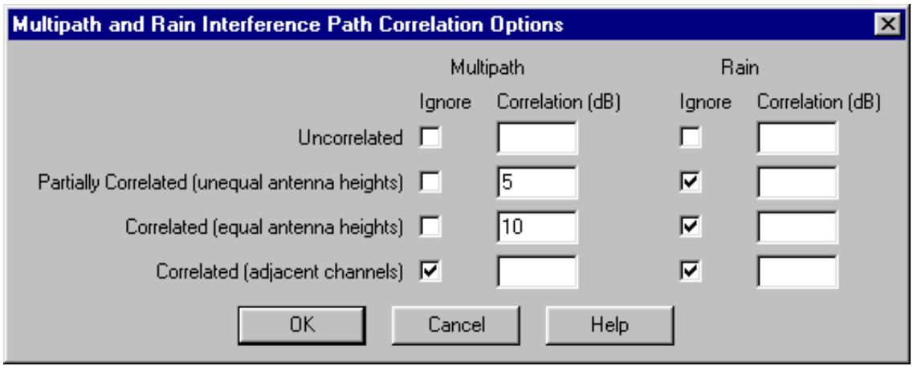

<details>
<summary>text_image</summary>

Multipath and Rain Interference Path Correlation Options
Multipath	Rain
Ignore	Correlation (dB)	Ignore	Correlation (dB)
Uncorrelated
Partially Correlated (unequal antenna heights)
Correlated (equal antenna heights)
Correlated (adjacent channels)
OK	Cancel	Help
</details>

Click the Correlation Options button to set the defaults. Four categories of correlation available including uncorrelated for both multipath and rain. The user can choose to ignore the interference or to specify a value for the correlation. Remember that any setting here do not affect the base calculation.

# EDITING CORRELATION

The correlation can be edited on a case by case basis in the Modify Interference Parameters dialog. This can be accessed from the case detail report under the Modify menu selection. The antenna heights are shown under the designations: itx interfering transmitter atx victim receiver adjacent site transmitter

The correlation can also be edited directly in the Network display. Select Interference - Edit Correlation. The organization is the same as that used in the case detail report. Each receiver is a case. Each interferer into that receiver is a sub case. The interference path is shown on the network display which helps to assign values to the correlation. The arrows on the left changes the receiver (case) and the arrows on the right change the interfering transmitter (sub case)

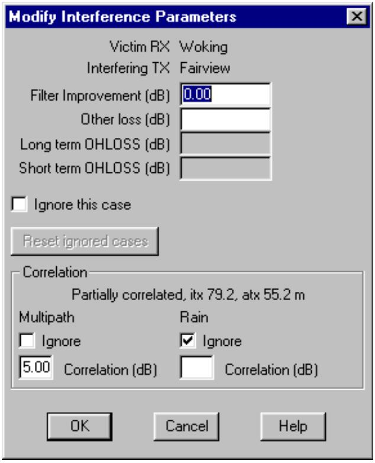

<details>
<summary>text_image</summary>

Modify Interference Parameters
Victim RX Woking
Interfering TX Fairview
Filter Improvement (dB) 0.00
Other loss (dB)
Long term OHLOSS (dB)
Short term OHLOSS (dB)
Ignore this case
Reset ignored cases
Correlation
Partially correlated, itx 79.2, atx 55.2 m
Multipath Rain
Ignore Ignore
5.00 Correlation (dB) Correlation (dB)
OK Cancel Help
</details>

The frequencies and polarization are shown along with the antenna heights using the same nomenclature as described above. In addition the following parameters are given:

v-i victim to interferer path length ang the discrimination angle at the victim receiver

ifl interfering signal level

td threshold degradation

The $\left\lfloor 5 ^ { \circ } \right\rfloor$ button allows the user to go to a specific case number. The cross reference report can be used as an overall index

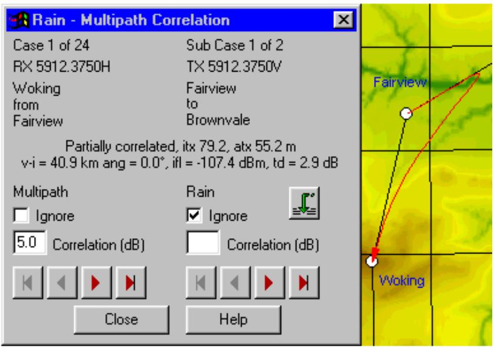

<details>
<summary>text_image</summary>

Rain - Multipath Correlation
Case 1 of 24 Sub Case 1 of 2
RX 5912.3750H TX 5912.3750V
Woking Fairview
from to
Fairview Brownvale
Partially correlated, itx 79.2, atx 55.2 m
v-i = 40.9 km ang = 0.0°, ifl = -107.4 dBm, td = 2.9 dB
Multipath Rain
Ignore Ignore
5.0 Correlation (dB) Correlation (dB)
Close Help
Fairview
Woking
</details>

# ITU-T G.826 ERROR PERFORMANCE OBJECTIVES

ITU-T G.826 defines performance of SDH radio systems in terms of the following parameters.

Severely Errored Seconds Radio (SESR)

Background Block Error Rate (BBER)

Errored Seconds Ratio (ESR)

This section describes the Pathloss implementation of this recommendation.

# SESR BIT ERROR RATE

A modified bit error rate is first determined as follows:

$$
B E R _ {S E S} ^ {\prime} \frac {0 . 4 5 8 @ a _ {1}}{\text {bits per block}}
$$

BERses for various SDH paths and MS sections 

<table><tr><td>Path type</td><td>Bit rate</td><td>BERses(Notes 1 and 2)</td><td>Block per second(Note 2)</td><td>Bits per Block(Note 2)</td></tr><tr><td>VC-11</td><td>1.5</td><td> $5.4 \times 10^{-4}$  a</td><td>2000</td><td>832</td></tr><tr><td>VC-12</td><td>2</td><td> $4.0 \times 10^{-4}$  a</td><td>2000</td><td>1120</td></tr><tr><td>VC-2</td><td>6</td><td> $1.3 \times 10^{-4}$  a</td><td>2000</td><td>3424</td></tr><tr><td>VC-3</td><td>34</td><td> $6.5 \times 10^{-5}$  a</td><td>8000</td><td>6120</td></tr><tr><td>VC-4</td><td>140</td><td> $2.1 \times 10^{-5}$  a</td><td>8000</td><td>18792</td></tr><tr><td>STM-1</td><td>155</td><td> $2.3 \times 10^{-5}$  a $1.3 \times 10^{-5}$  a + 2.2</td><td>8000192000</td><td>19940801</td></tr></table>

NOTE 1 a = 1 indicates a Poisson distribution of errors.   
NOTE 2 The blocks/s are defined in ITU-T G.826 for SDH path, in ITU-T G.829 for SDH sections.   
Some STM-1 equipment might be designed with 8000 blocks/s (19 940 bits/block), but ITU-T G.829 defines the block rate and size to be 192 000 blocks/s and 801 bits/block, respectively.

The value of the $\mathrm { B E R } _ { \mathrm { S E S } }$ will lie between the ${ { 1 0 } ^ { - 3 } }$ and ${ { 1 0 } ^ { - 6 } }$ BER. Determine the RX threshold level at the $\mathrm { B E R } _ { \mathrm { S E S } }$ as follows:

$$
m ^ {\prime} \frac {R X t h r e s h o l d _ {B E R 1 0 ^ {3}} \& R X t h r e s h o l d _ {B E R 1 0 ^ {6}}}{3}
$$

$$
R X t h r e s h o l d _ {B E R S E S} ^ {\prime} R X t h r e s h o l d _ {B E R 1 0 ^ {6}} \% m @ \left(\log_ {1 0} \left(B E R _ {S E S}\right) \% 6\right)
$$

# MULTIPATH

The severely errored seconds ratio is the worst month multipath fade probability at the $\mathrm { B E R } _ { \mathrm { S E S } }$ receiver threshold.

$$
\mathrm{SESR} = \mathrm{P} _ {\mathrm{tSES}} = \mathrm{P} _ {\mathrm{t}} (\mathrm{BER} _ {\mathrm{SES}})
$$

Determine the fade probability in the worst month at the residual bit error rate receive threshold level. The residual BER (RBER) is in the range from 1 × 10-10 to 1 × 10-13 . $1 \times 1 0 ^ { - 1 0 } \mathrm { t o } 1 \times 1 0 ^ { - 1 3 }$

$$
\mathrm{P} _ {\mathrm{tR}} = \mathrm{P} _ {\mathrm{t}} (\mathrm{RBER})
$$

Calculate the slope of the BER distribution curve on a log - log scale for BER in the range $\mathrm { B E R } _ { \mathrm { S E S } }$ to RBER

$$
m ^ {\prime} \left\langle \frac {\log_ {1 0} (R B E R) \& \log_ {1 0} (B E R _ {S E S})}{\log_ {1 0} (P _ {t R}) \& \log_ {1 0} (P _ {t S E S})} \right\rangle
$$

The background bock error rate (BBER) is then given by:

$$
B B E R ^ {\prime} S E S R @ \frac {a _ {1}}{2 . 8 @ a _ {2} @ (m \& 1)} \% \frac {N _ {B} @ R B E R}{a _ {3}}
$$

where

${ \bf a } _ { 1 }$ 10 to 30, number of errors per burst for the BER in the range from $1 \times { 1 0 } ^ { - 3 }$ to $\mathrm { B E R } _ { \mathrm { S E S } }$

${ \bf a } _ { 2 }$ 1 to 10, number of errors per burst for the BER in the range from $\mathrm { B E R } _ { \mathrm { S E S } }$ to RBER

${ \bf { a } } _ { 3 }$ 1, number of errors per burst for the BER lower than RBER

$\mathrm { N _ { B } }$ number of bits per block from the above table

The errored second ratio (ESR) is given by:

$$
ESR^{\prime} SESR^{\circledast \sqrt[m]{n}}\% \frac{n@N_{B}\circ RBER}{a_{3}}
$$

where

n number of blocks per second from the above table

# RAIN

Calculate the unavailability due to rain, $\mathrm { P _ { a R } }$ in the worst month at the $\mathrm { B E R } _ { \mathrm { S E S } }$ receiver threshold level. The BBER and ESR values for rain are obtained by substituting $\mathrm { P _ { a R } }$ for SESR in the multipath calculation.

# UNAVAILABILITY - SESR TRANSITION.

ITU-T G.826 considers unavailable time as the accumulation of all SES states lasting longer than 10 consecutive seconds. SESR time is the accumulation of all SES states lasting less than 10 consecutive seconds. It is assumed that rain fades will always last longer than 10 consecutive seconds and therefore rain fades are classed as unavailability. ITU-R P.530-8 states that multipath fades will always be less than 10 consecutive seconds and therefore will be classed as severely errored seconds. Under this definition rain fades are assigned to unavailability and multipath fades are assigned to SESR.

In the case of multipath fading, this is only true for large fade margins. In the Pathloss implementation of ITU G.821, the multipath fade duration statistics were considered and multipath fades lasting longer than 10 consecutive seconds were assigned to unavailability; the balance were assigned to severely errored seconds. This convention is used in the current implementation of G.826

# PATHLOSS PROGRAM DATA REQUIREMENTS

The following additional radio data is required to calculate G.826 error performance:

residual bit error rate

RX threshold at the residual bit error rate

RX threshold at the ${ { 1 0 } ^ { - 3 } }$ bit error rate

SES bit error rate (optional - can be program calculated)

RX threshold at the SES bit error rate (optional - can be program calculated)

${ \bf a } _ { 1 }$ - number of errors per burst for the BER in the range from $1 \times { 1 0 } ^ { - 3 }$ to ${ \mathrm { B E R } } _ { \mathrm { S E S } } .$

${ \bf a } _ { 2 }$ - number of errors per burst for the BER in the range from $\mathrm { B E R } _ { \mathrm { S E S } }$ to RBER

${ \bf { a } } _ { 3 }$ - number of errors per burst for the BER lower than RBER

number of bits per block

number of blocks per second

The following additional radio data is required to calculate the selective fade probability using the equipment signature instead of the dispersive fade margin.

signature delay (nanoseconds)

signature width (MHz)

signature depth - minimum phase (dB)

signature depth - non minimum phase (dB)

The following parameters have been added to handle the P.530-8 performance calculations for cochannel operation using XPIC devices and IF combining on space diversity systems:

IF combiner gain (dB)

IF combiner selective fading improvement factor

XPIF - cross polarized improvement factor

$\mathrm { X P D } _ { \mathrm { X P I C } }$ - cross polarized discrimination of the XPIC device.

# Radio Data File (RAF - MRS) Changes

To accommodate these new data requirements, the radio data file formats have been expanded with the following new entries and several equipment /calculation options.

DIGRADIO\_TYPE SDH // PDH, SDH or NB\_DIGITAL narrow band digital

SD\_OPERATION IFC // BBS or IFC baseband switch or IF combiner

COCHANNEL\_OPERATION YES // YES or NO

USE\_SIGNATURE YES // YES or NO use equipment signature

XPIF 17 // Cochannel XPD improvement factor

```cmake
XPD_XPI 42 // XPD of the XPIC device
IF_COMB_GAIN 3 // IF combiner gain
LCOMB_FACTOR 10 // IF combiner selective fading improvement factor
BITS_BLOCK 19940 // bits per block (SDH only)
BLOCKS_SEC 8000 // blocks per second (SDH only)
ALPHA1 20 // (SDH only)
ALPHA2 5 // (SDH only)
ALPHA3 1 // (SDH only)
SIGNATURE_DELAY_10-3 6.3 // signature delay (ns) at BER 10-3
SIGNATURE_WIDTH_10-3 28 // signature width (MHz) at BER 10-3
SIGNATURE_MINPH_10-3 23.4 // signature depth - minimum phase (dB) at BER 10-3
SIGNATURE_NONMINPH_10-3 23.4 // signature depth - non minimum phase (dB) at BER 10-3
SIGNATURE_DELAY_10-6 6.3 // signature delay (ns) at BER 10-6
SIGNATURE_WIDTH_10-6 21.7 // signature width (MHz) at BER 10-6
SIGNATURE_MINPH_10-6 21.7 // signature depth - minimum phase (dB) at BER 10-6
SIGNATURE_NONMINPH_10-6 28.3 // signature depth - non minimum phase (dB) at BER 10-6
SIGNATURE_DELAY_SES // signature delay (ns) at BER SES
SIGNATURE_WIDTH_SES // signature width (MHz) at BER SES
SIGNATURE_MINPH_SES // signature depth - minimum phase (dB) at BER SES
SIGNATURE_NONMINPH_SES // signature depth - non minimum phase (dB) at BER SES
RESIDUAL_BER 1.E-10 // residual bit error rate - scientific notation
RXTHRESH_RBER -66 // RX threshold at RBER (dBm)
SES_BER // SES bit error rate - scientific notation
RXTHRESH_SES_BER // RX threshold at BERses (dBm) 
```

The new mnemonics can be placed any where in the file following the header and before the curve data. Blank lines are allowed and comments starting with a double forward slash // can be used.

Several equipment / calculation options have been included:

# DIGRADIO\_TYPE SDH

Permissible values are PDH, SDH or NB\_DIGITAL( narrow band digital). These options only affect the formatting of the data entry forms in the microwave worksheet. For example, signature data or the dispersive fade margin cannot be accessed with the NB\_DIGITAL radio type set.

# SD\_OPERATION

Permissible values are IFC for IF combining and BBS for baseband switching. This option automatically set the space diversity improvement calculation to IF combining or baseband switching. The default value is baseband switching.

# COCHANNEL\_OPERATION

Permissible values are YES or NO. This sets the Cochannel operation option in the Reliability Options dialog box. The default value is NO.

# USE\_SIGNATURE

Permissible options are YES for selective fading calculations using the equipment signature or NO to use the dispersive fade margin and dispersive fade occurrence factor. Note that this options has the effect of calculating diversity improvement is strict accordance with P.530-8.

# Microwave Worksheet Radio Data Entry Forms

All of the new radio data can be accessed in the radio data entry forms in the microwave worksheet. The format of these forms have been modified to include all of the new data.

# Radio Lookup Tables

All of the radio data is included in a lookup entry; however, the following data items cannot be edited:

residual bit error rate

RX threshold at the residual bit error rate

RX threshold at the ${ { 1 0 } ^ { - 3 } }$ bit error rate

SES bit error rate (optional - can be program calculated)

RX threshold at the SES bit error rate (optional - can be program calculated)

${ \bf a } _ { 1 }$ - number of errors per burst for the BER in the range from $1 \times { 1 0 } ^ { - 3 }$ to $\operatorname { B E R } _ { \operatorname { S E S } } .$

${ \bf a } _ { 2 }$ - number of errors per burst for the BER in the range from $\mathrm { B E R } _ { \mathrm { S E S } }$ to RBER

${ \bf { a } } _ { 3 }$ - number of errors per burst for the BER lower than RBER

number of bits per block

number of blocks per second

IF combiner gain (dB)

IF combiner selective fading improvement factor

XPIF - cross polarized improvement factor

$\mathrm { X P D } _ { \mathrm { X P I C } }$ - cross polarized discrimination of the XPIC device

If a lookup table is to be used for G.826 operation, then the data must be imported from a radio data file. To create a new radio entry similar to an existing one, click the left on the similar entry on the left column. The item number will turn red. Then select Edit - Add and make the required changes to the visible portion of the data. The new entry will contain the same hidden data values.

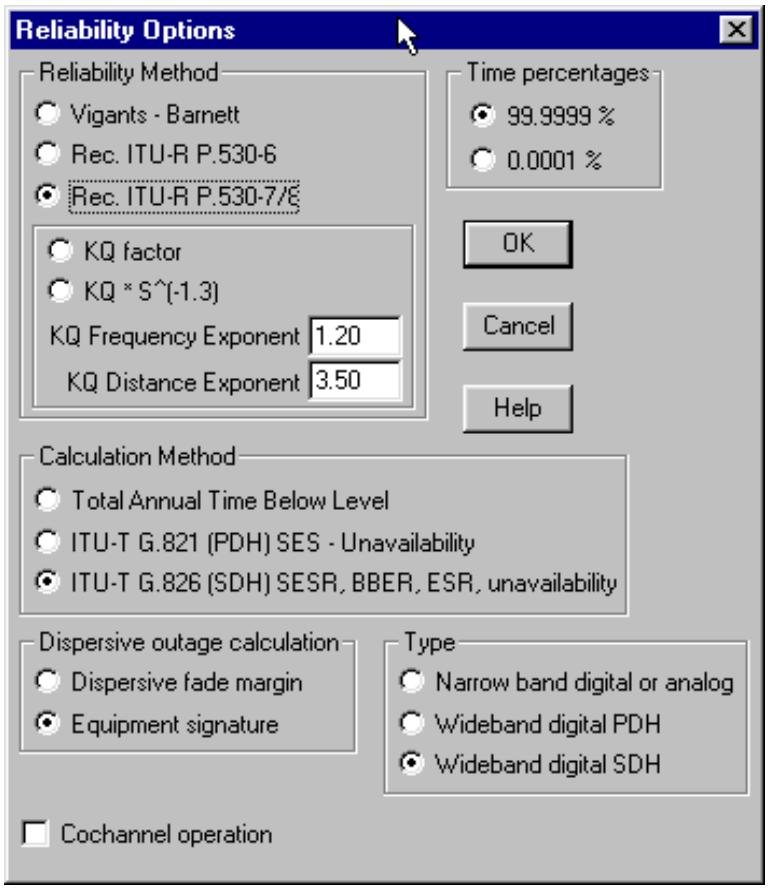

<details>
<summary>text_image</summary>

Reliability Options
Reliability Method
Vigants - Barnett
Rec. ITU-R P.530-6
Rec. ITU-R P.530-7/8
KQ factor
KQ * S^(-1.3)
KQ Frequency Exponent 1.20
KQ Distance Exponent 3.50
Time percentages
99.9999 %
0.0001 %
OK
Cancel
Help
Calculation Method
Total Annual Time Below Level
ITU-T G.821 (PDH) SES - Unavailability
ITU-T G.826 (SDH) SESR, BBER, ESR, unavailability
Dispersive outage calculation
Dispersive fade margin
Equipment signature
Type
Narrow band digital or analog
Wideband digital PDH
Wideband digital SDH
Cochannel operation
</details>

# ITU P.530-8 SELECTIVE OUTAGE AND DIVERSITY IMPROVEMENT FACTORS

The Reliability options includes a selection to use the dispersive fade margin or the equipment signature for dispersive outage calculations.

If the equipment signature option is selected, all diversity improvement (space, frequency and quad) will be carried out in accordance with P.530-8.

This specifics of each calculation are given in the following sections.

# SELECTIVE FADING OUTAGE

The outage probability is defined as the probability that the BER exceeds a given threshold as defined by the BER of the signature data.

$$
\begin{array}{l} P _ {s} ^ {\prime} \frac {\mathrm{n}}{2} @ \frac {W @ \left(b _ {N} \& b _ {M}\right)}{\mathrm{t} _ {\mathrm{r}} @ 1 0 ^ {3}} @ \left(\mathrm{u} ^ {2} \% \mathrm{v} ^ {2}\right) \\ n ^ {\prime} 1 \& e ^ {\& 0. 2 @ P _ {0} ^ {0. 7 5}} \\ b _ {N} ^ {\prime} \frac {1}{1 \& 1 0 ^ {\& \frac {B _ {N}}{2 0}}} \\ b _ {M} ^ {\prime} 1 \& 1 0 ^ {\& \frac {B _ {M}}{2 0}} \\ u ^ {\prime} 0. 7 @ \frac {D}{5 0} \\ \mathrm{v} ^ {2} \text { ’ } 0. 4 9 @ \frac {D}{5 0} \\ \end{array}
$$

where

$\mathrm { \Delta B _ { N } }$ non minimum phase signature depth

${ \tt B } _ { \mathrm { M } }$ minimum phase signature depth

$\mathbf { W }$ signature width (MHz)

$\mathbf { n }$ multipath activity factor

$\mathfrak { t } _ { \mathrm { r } }$ reference delay (ns)

$\mathbf { u }$ mean echo delay time (ns)

$\mathrm { v } ^ { 2 }$ standard deviation of the delay time

$\mathrm { D }$ path length (km)

$\mathrm { P _ { 0 } }$ fade occurrence factor

# SPACE DIVERSITY IMPROVEMENT

The non selective space diversity improvement factor is given by:

$$
I _ {s d n s} ^ {\prime} \left[ 1 \& \exp \left(\& 3. 3 4 @ 1 0 ^ {\& 4} @ S ^ {0. 8 7} @ f ^ {\& 0. 1 2} @ d ^ {0. 4 8} @ P _ {0} ^ {\& 1. 0 4}\right) \right] @ 1 0 ^ {\frac {A \& d G \% I _ {c o m b}}{1 0}}
$$

where

$\mathrm { P _ { 0 } }$ fade occurrence factor

$^ { d \mathrm { G } }$ absolute value of the difference of the main and diversity antenna gains

$\mathbf { A }$ flat fade margin

$\mathbf { S }$ vertical separation between main and diversity antennas (m center to center)

d path length (km)

$\mathrm { I } _ { \mathrm { c o m b } }$ IF combiner gain dB (0 for baseband switching applications)

The corresponding Vigants space diversity improvement factor is given by:

$$
I _ {s d n s} ^ {\prime} 1. 2 @ 1 0 ^ {\& 3} @ \frac {f}{d} @ S ^ {2} @ v ^ {2} @ 1 0 ^ {\frac {A}{1 0}}
$$

It is always interesting to compare different methods:

Assuming equal main and diversity antenna gains dG = 0, v = 1 and $\mathrm { I } _ { \mathrm { c o m b } } = 0$ , a system with the following parameters:

$\mathrm { P _ { 0 } }$ 1.62524

path length 51.925 kilometers

frequency 5.8825 GHz

S 18 meters

A 34.5 dB

would produce a non selective space diversity improvement factor of 37 using the ITU method versus 124 for the Vigants method. Here the same value for $\mathrm { P _ { 0 } }$ is used for both methods. The ITU fade occurrence factor tends to be much smaller than Vigants and this tends to offset the differences.

The selective outage probability is calculated as follows:

Calculate the square of the non selective correlation coefficient, $\mathbf { k } _ { \mathrm { n s } }$

$$
k _ {n s} ^ {2} \text {,} 1 \& \frac {I _ {n s} @ P _ {n s}}{\mathrm{n}}
$$

where

$\mathrm { { I _ { n s } } }$ non selective space diversity improvement factor

$\mathrm { { \cal P } _ { n s } }$ probability of a non selective outage

n multipath activity factor

Calculate the square of the selective correlation coefficient, ${ \bf k } _ { \mathrm { s } }$

$$
k _ {s} ^ {2} \text {   '   } 0. 8 2 3 8 \quad f o r r _ {w} \# 0. 5
$$

$$
k _ {s} ^ {2} \text {,} 1 \& 0. 1 9 5 @ (1 \& r _ {w}) ^ {0. 1 0 9 \& 0. 1 3 @ \log_ {1 0} (1 \& r _ {w})} \quad f o r 0. 5 <   r _ {w} \# 0. 9 6 2 8
$$

$$
k _ {s} ^ {2} \text { ’ } 1 \& 0. 3 9 5 7 @ (1 \& r _ {w}) ^ {0. 5 1 3 6} \quad f o r r _ {w} > 0. 9 6 2 8
$$

$$
r _ {w} ^ {\prime} 1 \& 0. 9 7 4 6 @ \left(1 \& k _ {n s} ^ {2}\right) ^ {2. 1 7 0} \quad f o r k _ {n s} ^ {2} \# 0. 2 6
$$

$$
r _ {w} ^ {\prime} 1 \& 0. 6 9 2 1 @ \left(1 \& k _ {n s} ^ {2}\right) ^ {1. 0 3 4} \quad f o r k _ {n s} ^ {2} > 0. 2 6
$$

The non selective outage probability is given by $P _ { s d n s } ^ { \phantom { \dagger } } \cdot \frac { P _ { n s } } { I _ { s d n s } }$ Isdns P

The selective outage probability is given by

$$
P _ {s d s} \cdot \frac {\left(\frac {P _ {s}}{L _ {c o m b}}\right) ^ {2}}{\mathrm{n} @ \left(1 \& k _ {s} ^ {2}\right)}
$$

where $\mathrm { L } _ { \mathrm { c o m b } }$ is the selective improvement factor due to the combiner.

The total outage probability is then given by $P s d ~ ^ { \cdot } ~ \left( P _ { s d n s } ^ { 0 . 7 5 } ~ \% ~ P _ { s d s } ^ { 0 . 7 5 } \right) ^ { 1 . 3 3 }$

# FREQUENCY DIVERSITY IMPROVEMENT

The non selective frequency diversity improvement is essentially the same as the Vigants formula:

$$
I _ {f d n s} \cdot \frac {8 0}{f @ d} @ \frac {d f}{f} @ 1 0 ^ {\frac {A}{1 0}}
$$

The Vigants method assumes that this improvement factor is valid for non selective and selective fades. The ITU method calculates the selective outage exactly as in the case of space diversity above using $\mathrm { I } _ { \mathrm { c o m b } } = 0$ and $\mathrm { L } _ { \mathrm { c o m b } } = 1$ .

# QUAD DIVERSITY IMPROVEMENT

The non selective quad diversity improvement factor is the sum of the space and frequency diversity factors

$$
\mathrm{I} _ {\mathrm{qdns}} = \mathrm{I} _ {\mathrm{sdns}} + \mathrm{I} _ {\mathrm{fdns}}
$$

The square of the non selective correlation coefficient is given by

$$
\mathrm{k} _ {\mathrm{ns}} = \mathrm{k} _ {\mathrm{ns} \mathrm{sd}} \times \mathrm{k} _ {\mathrm{ns} \mathrm{fd}}
$$

The selective outage is calculated exactly as in the case of space diversity using $\mathrm { I _ { c o m b } = 0 \ a n d L _ { c o m b } = 1 }$ for baseband switching applications.

# COCHANNEL OPERATION

This paragraph describes the procedure to calculate the threshold degradation due to the cross polarized discrimination on radio links operating in a cochannel mode. The XPD will degrade under multipath fading and high intensity rain conditions. Cochannel operation is set by selecting Operations - Reliability and then checking the cochannel operation option. The data is accessed by selecting Operations - Cochannel XPD Interference.

<table><tr><td colspan="3">Cochannel XPD Interference</td></tr><tr><td colspan="3">OK Cancel Help</td></tr><tr><td></td><td>Site 1</td><td>Site 2</td></tr><tr><td>Antenna XPD (dB)</td><td>35.00</td><td>35.00</td></tr><tr><td>TX antenna spacing (m)</td><td></td><td></td></tr><tr><td>XPIF (dB)</td><td>17.00</td><td>17.00</td></tr><tr><td>XPIC device XPD (dB)</td><td>42.00</td><td>42.00</td></tr><tr><td>XPD fade margin - multipath (dB)</td><td>17.36</td><td>17.36</td></tr><tr><td>XPD threshold degradation - multipath (dB)</td><td>38.15</td><td>38.15</td></tr><tr><td>XPD fade margin - rain (dB)</td><td>18.64</td><td>18.64</td></tr><tr><td>XPD threshold degradation - rain (dB)</td><td>36.87</td><td>36.87</td></tr><tr><td colspan="3">Site 1 Antenna XPD (dB):</td></tr></table>

# XPD DEGRADATION DUE TO MULTIPATH

# 1. Calculate

$$
X P D _ {0} ^ {\prime} X P D _ {g} \% 5 \quad \text { for } X P D _ {g} \# 3 5
$$

$$
X P D _ {0} ^ {\prime} 4 0 \quad f o r X P D _ {g} > 3 5
$$

where $X P D _ { \mathrm { g } }$ is the minimum value of the transmit and receive antenna XPD’s measured on the boresight.

# 2 Calculate the multipath activity parameter

$$
\mathrm{n} ^ {\prime} 1 \& \mathrm{e} ^ {\& 0. 2 @ \mathrm{P} _ {0} ^ {0. 7 5}}
$$

where $P _ { 0 }$ is the multipath occurrence factor corresponding to the percentage of time that a fade greater than 0 dB occurs in the average worst month.

# 3 Calculate

$$
Q ^ {\prime} \& 1 0 @ \log_ {1 0} \left(\frac {K _ {x p} @ n}{P _ {0}}\right)
$$

where

$K _ { _ { X P } } \ ^ { , } \quad 0 . 7$ for one transmit antenna

$K _ { \scriptscriptstyle { X P } } ^ { \mathrm { ~ ~ , ~ } } \mathrm { ~ 1 ~ \& ~ 0 . 3 \ @ e x p } \left[ \& 4 \ @ \mathrm { l } 0 ^ { 8 6 } d \left( \frac { S _ { t } } { \ddot { \mathrm { e } } } \right) ^ { 2 } \right] \quad \mathrm { f o r ~ t w o ~ t r a n s m i t ~ a n t e n n a s }$

Calculate

$$
C ^ {\prime} X P D _ {0} \% Q
$$

The carrier to cochannel interference ratio is then given by:

$$
\frac {C _ {0}}{I _ {c o c h}} \cdot \& 1 0 @ \log_ {1 0} \left(1 0 ^ {\& \frac {X P D _ {G T X}}{1 0}} \% 1 0 ^ {\& \frac {X P D _ {G R X}}{1 0}} \% 1 0 ^ {\& \frac {(C \& A)}{1 0}}\right) \% 2
$$

for radios not equipped with an XPIC device and by the following equation for XPIC equipped radios..

$$
\frac {C _ {0}}{I _ {\text { coch   mpth }}} \cdot \& 1 0 @ \log_ {1 0} \left(1 0 ^ {\& \frac {X P D _ {\text { xpic}}}{1 0}} \% 1 0 ^ {\& \frac {X P D _ {\text { GTX }} \% X P I F}{1 0}} \% 1 0 ^ {\& \frac {X P D _ {\text { GRX }} \% X P I F}{1 0}} \% 1 0 ^ {\& \frac {(C \% X P I F \& A)}{1 0}}\right)
$$

where

XPIF is the improvement due to the XPIC device

$\mathrm { X P D } _ { \mathrm { G } }$ is the coss polarized discrimination of the antennas

$\mathrm { { X P D } _ { \mathrm { { x p i c } } } }$ is the XPD of the XPIC device

A is the fade margin including the effects of interference due to other transmitters

The 2 dB improvement in the non XPIC case is due to the Gaussian properties of the interfering crosspolar signal. This figure is included in the XPIF for XPIC equipped radios.

XPD Degradation due to Rain

The XPD reduction factor due to high intensity rain is given by the equation

$$
X P D _ {R A I N} ^ {\prime} 15 \% 30 @ \log_ {1 0} (f _ {G H z}) \& 12.8 @ f _ {G H z} ^ {0. 1 9} @ \log_ {1 0} (A) \quad \text { for } f _ {G H z} \# 20 G H z
$$

$$
X P D _ {R A I N} ^ {\prime} 15 \% 30 @ \log_ {1 0} (f _ {G H z}) \& 22. 6 @ \log_ {1 0} (A) \quad f o r f _ {G H z} > 20 G H z
$$

The corresponding carrier to cochannel interference ratio is then given by:

$$
\frac {C _ {0}}{I _ {\text {coch rain}}} \cdot \& 1 0 @ \log_ {1 0} \left(1 0 ^ {\& \frac {X P D _ {G T X}}{1 0}} \% 1 0 ^ {\& \frac {X P D _ {G R X}}{1 0}} \% 1 0 ^ {\& \frac {X P D _ {R A I N}}{1 0}}\right) \% 2
$$

$$
\frac {C _ {0}}{I _ {\text { coch   rain }}} \cdot \& 1 0 @ \log_ {1 0} \left(1 0 ^ {\& \frac {X P D _ {\text { xpic}}}{1 0}} \% 1 0 ^ {\& \frac {X P D _ {\text { GTX }} \% X P I F}{1 0}} \% 1 0 ^ {\& \frac {X P D _ {\text { GRX }} \% X P I F}{1 0}} \% 1 0 ^ {\& \frac {X P D _ {\text { RAIN }} \% X P I F}{1 0}}\right)
$$

where the parameters are the same as defined above.