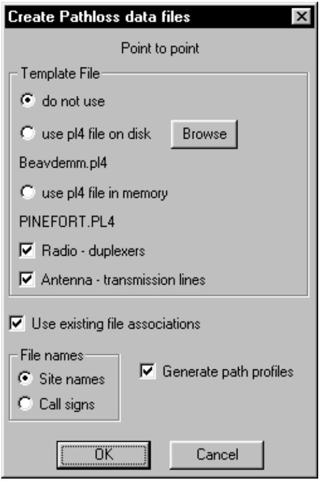
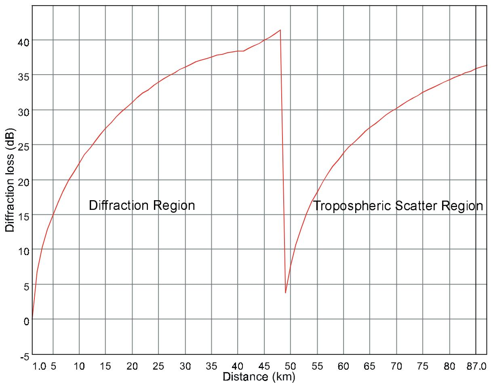
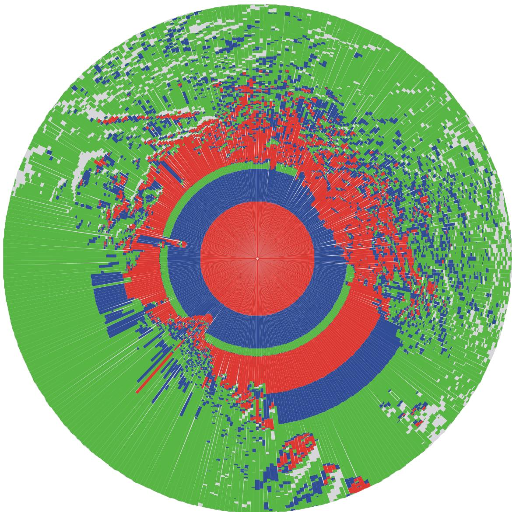
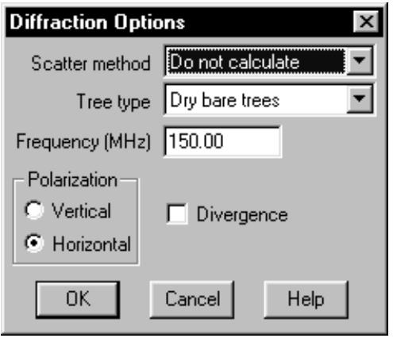
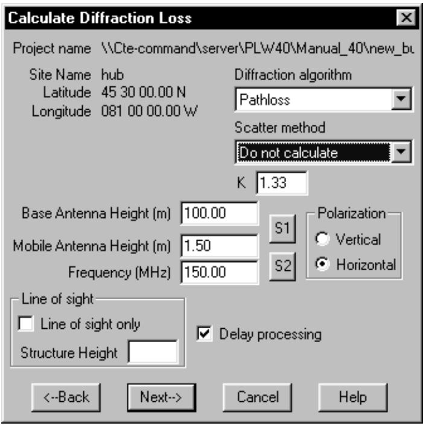
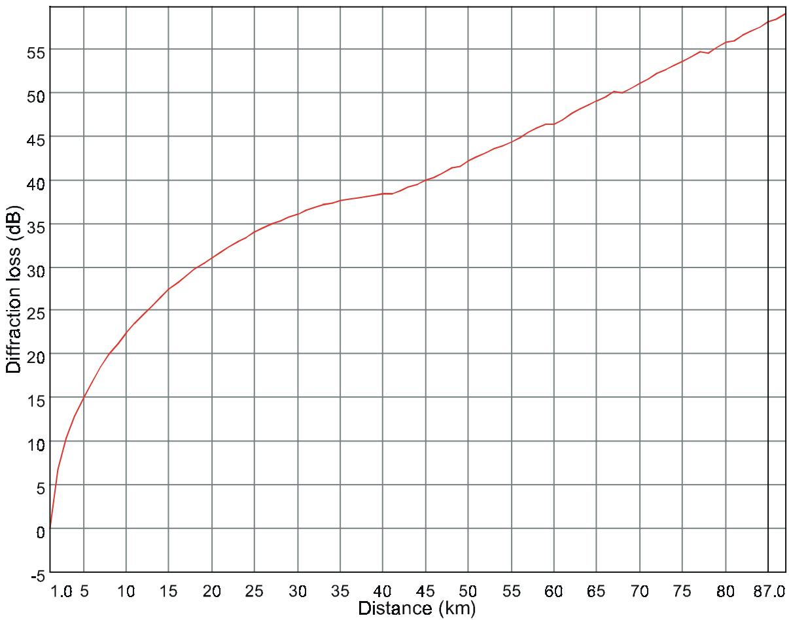
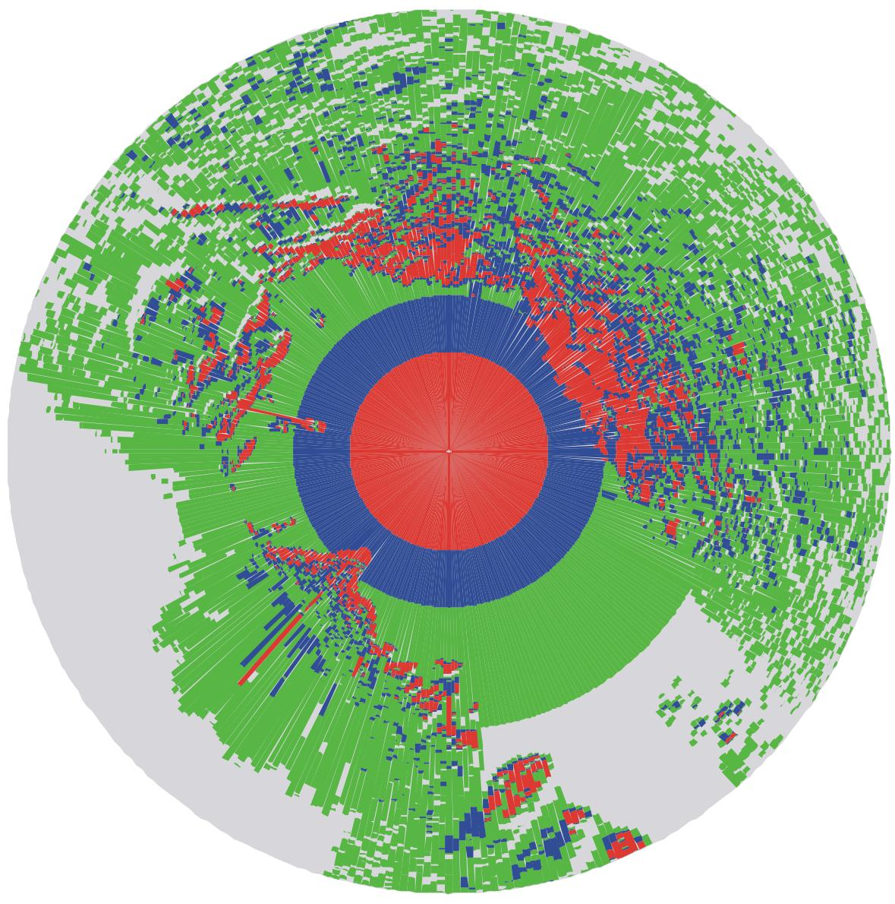

# New in the May 2002 Pathloss program build

• Tropospheric scatter loss is always calculated on obstructed paths and combined with the diffraction loss. An option has been added to not calculate the tropospheric scatter loss. This option is available in the diffraction and coverage modules.   
• Batch printing options are now available in the microwave and VHF - UHF worksheets.   
• Section operations were limited to new profiles. An option has been added to use existing file associations.

# Section Operations

Pathloss file operations for point to point and point to multipoint applications can now use existing file associations. In addition optional template operations have been provided for radios - duplexers and antennas and transmission lines. Several possibilities with these features include:

create new path profiles for several sites which have moved, but retain all existing equipment parameters.   
• change the radio type on a group of files   
• change the antenna models on a group of files   
• change the rain regions for a group of files

# Diffraction - Tropospheric Scatter Loss

Diffraction and tropospheric scatter loss are two independent propagation mechanisms. Diffraction begins when the path clearance is less than 60% of the first Fresnel zone ratio. Tropospheric scatter loss begins when the product of the path length and the scatter angle (the angle formed by the crossover of the horizon rays on an obstructed path) is greater than 0.1. The combined diffraction - tropospheric scatter loss is calculated as a power addition of the two losses. For example a diffraction loss of 50 dB combined with a tropospheric scatter loss of 50 dB would result in a combined loss of 47 dB.

text_image

Create Pathloss data files
Point to point
Template File
do not use
use pl4 file on disk Browse
Beavdemm.pl4
use pl4 file in memory
PINEFORT.PL4
Radio - duplexers
Antenna - transmission lines
Use existing file associations
File names
Site names
Call signs Generate path profiles
OK Cancel

When the combined loss is calculated as a function of distance, a severe discontinuity can occur when tropospheric scatter loss begins to occur. A example of this is shown below for an 87 kilometer path over flat terrain at 150 MHz. The antenna heights are 100 meters and 1.5 meters.

line

| Distance (km) | Diffraction loss (dB) |
| ------------- | --------------------- |
| 1.0           | 0.0                   |
| 5             | 15.0                  |
| 10            | 23.0                  |
| 15            | 28.0                  |
| 20            | 32.0                  |
| 25            | 34.0                  |
| 30            | 36.0                  |
| 35            | 37.0                  |
| 40            | 38.0                  |
| 45            | 39.0                  |
| 48            | 42.0                  |
| 50            | 4.0                   |
| 55            | 15.0                  |
| 60            | 22.0                  |
| 65            | 27.0                  |
| 70            | 30.0                  |
| 75            | 33.0                  |
| 80            | 35.0                  |
| 87            | 36.0                  |

In the diffraction region the loss increases to 40 dB at 48 kilometers. At this point tropospheric scatter loss enters the equation and the combined loss drops to 4 dB. In an area coverage plot, this discontinuity will produce seemingly contradictory results as shown below.

polar_bar

| Category | Value |
| -------- | ----- |
| Red      | 120   |
| Blue     | 150   |
| Green    | 80    |

The plot uses three signal levels coded as red, blue and green from the strongest signal to the weakest. Consider the path at azimuth 135 degrees. As expected the signal strength decreases with distance due to diffraction loss. Tropospheric scatter loss then becomes the dominant propagation mechanism and the patter repeats.

An option is now provided to ignore tropospheric scatter loss in the diffraction and coverage modules. In the diffraction module, select Options - Diffraction Options and set the scatter method to do not calculate.

text_image

Diffraction Options
Scatter method Do not calculate
Tree type Dry bare trees
Frequency (MHz) 150.00
Polarization
Vertical
Horizontal
Divergence
OK Cancel Help

In the coverage module, the options appears in the coverage calculation process under the “Calculate Diffraction loss section.

The results corresponding to the example above using the “Do not calculate” tropospheric scatter loss option are shown below.

text_image

Calculate Diffraction Loss
Project name \Cte-command\server\PL\W40\Manual_40\new_bt
Site Name hub
Latitude 45 30 00.00 N
Longitude 081 00 00.00 W
Diffraction algorithm
Pathloss
Scatter method
Do not calculate
K 1.33
Base Antenna Height (m) 100.00
Mobile Antenna Height (m) 1.50
Frequency (MHz) 150.00
S1
S2
Polarization
Vertical
Horizontal
Line of sight
Line of sight only
Structure Height
Delay processing
<--Back Next--> Cancel Help

line

| Distance (km) | Diffraction loss (dB) |
| ------------- | --------------------- |
| 1.0           | 0.0                   |
| 5             | 15.0                  |
| 10            | 22.0                  |
| 15            | 28.0                  |
| 20            | 32.0                  |
| 25            | 35.0                  |
| 30            | 37.0                  |
| 35            | 38.0                  |
| 40            | 39.0                  |
| 45            | 40.0                  |
| 50            | 42.0                  |
| 55            | 44.0                  |
| 60            | 46.0                  |
| 65            | 48.0                  |
| 70            | 50.0                  |
| 75            | 52.0                  |
| 80            | 54.0                  |
| 87.0          | 56.0                  |

other

| Category | Value |
|---|---|
| Green | 100 |
| Blue | 85 |
| Red | 70 |
| Grey | 65 |

