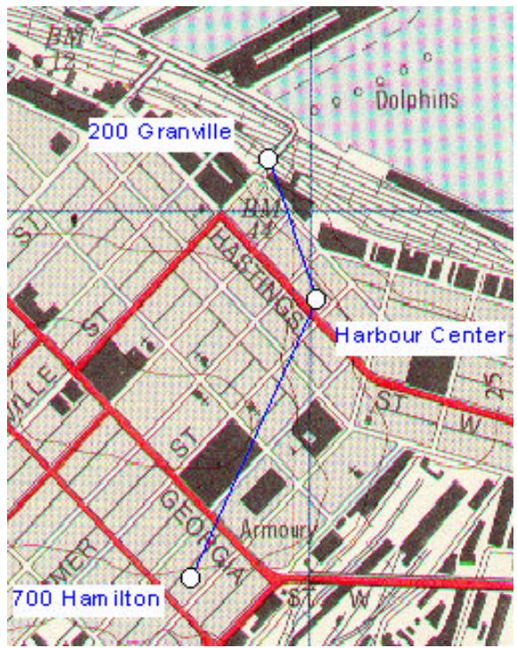
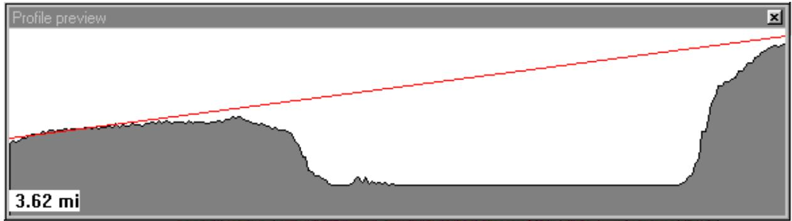
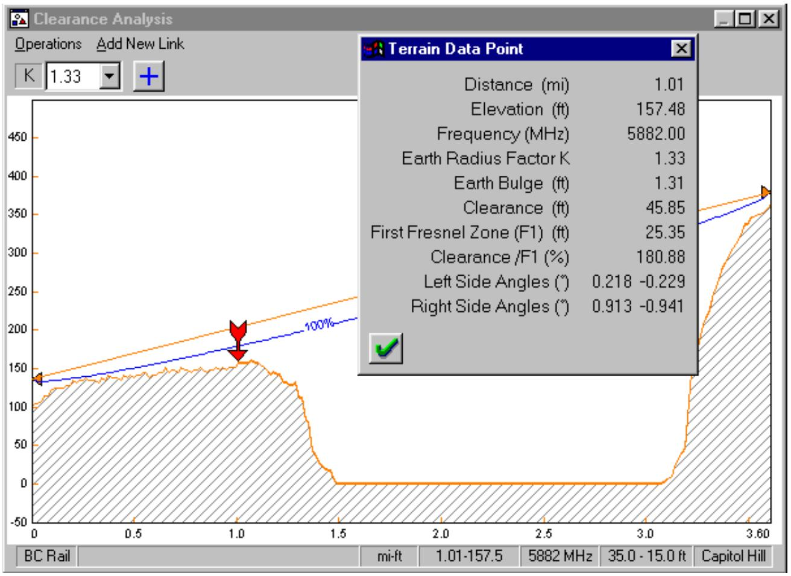
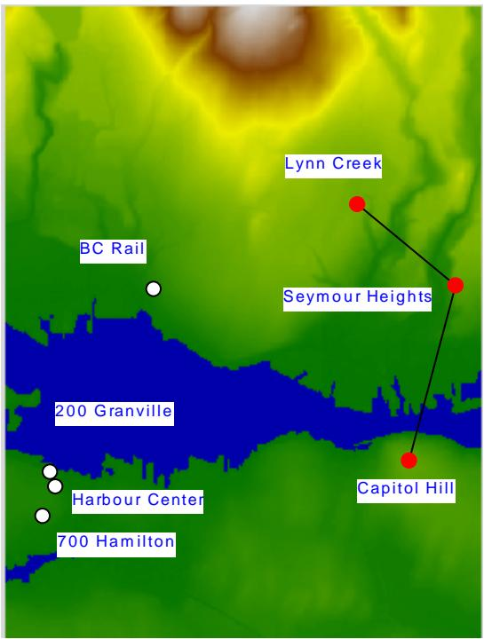
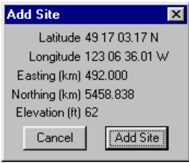
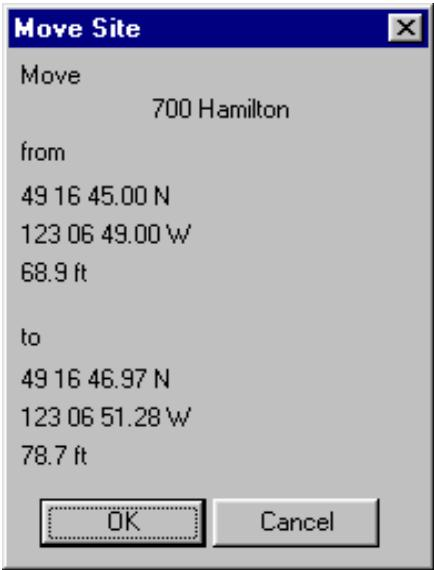
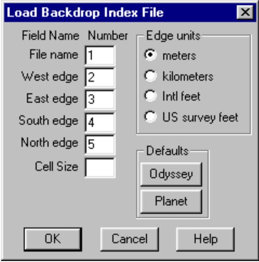
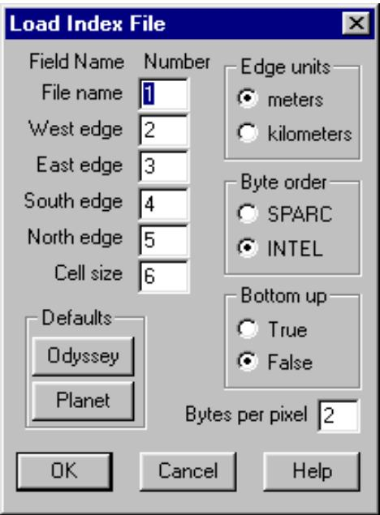
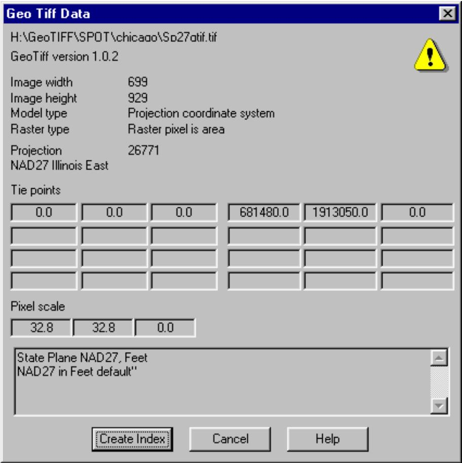

# MAP GRID EXAMPLE

LOADING A MAP GRID PROJECT FILE

NAVIGATING THE MAP GRID DISPLAY

LOAD THE NETWORK EXAMPLE FILE

CLEARANCE TESTING

ELEVATION VIEWS

ADDING AND MOVING SITES

CREATING A MAP GRID PROJECT

GEOTIF FILES

BACKDROP DATA SOURCES

# MAP GRID EXAMPLE

The files and directory structure for the map grid example are shown at the right. Copy these file to your hard drive and make note of the directory as this must be identified as part of the setup procedure.

The directories are named heights and backdrop. The backdrop directory contains a scanned topographic map and ariel photo in the TIF file format. The heights directory contains a terrain database with the same extents as the scanned map. Each directory contains an index file and a projection file in the MSI Planet format. The index file identifies the file name and the edges of the file and this will be loaded into the program. The projection file states the required projection.

map_grid
    /))heights)))0) index
    *
    *) projectn
    *
    .) vancvr.bil
    /))backdrop))0) index
    *
    *) projectn
    *
    *) vcr_map.tif
    *
    .) vcrphoto.tif
    *
    .) vancvr.bil
    /))Geo_Tiff )))sp27gtif.tif
    mg_examp.bkd
    mg_examp.gr4

Map Grid example files and directories

The file mg\_examp.bkd is a map grid project file which contains all of the required definitions for both the backdrop and the terrain database.

The file mg\_examp.gr4 is a Pathloss network data file which can be viewed in both the network and map grid modules.

The first part of the example uses the map grid project file. The second part describes the steps to create the map grid project file and data sources and production issues.

# LOADING A MAP GRID PROJECT FILE

Select Module - Map Grid to enter the map grid module. If there is an existing network file or a temporary file, select Files - New to clear the display.   
Select Site data - Backdrop. Then select Files - Open on the menu bar of the backdrop dialog box. Open the file mg\_examp.bkd. This file contains all of the required information for the example; however, it will be

text_image

200 Granville
Harbour Center
700 Hamilton

necessary to identify the location of the backdrop and heights directories to correspond to your computers directory structure.

" The back drop display is divided into two sections - backdrop and elevations. In the backdrop section, click the Set directory button and identify the backdrop directory.

" Click the Elevation tab to switch to this section. Then click the Set directory button and identify the heights directory.

" Select Files - Save on the on the menu bar of the backdrop dialog box and save the modified map grid project file with the revised directory locations.

" Click the OK button. The backdrop file vcr\_map.tif will be loaded and displayed.

" A second file (vcrphoto.tif) is in the index file. To activate this file, select Site data - Backdrop - Index and click the “show” option.

# NAVIGATING THE MAP GRID DISPLAY

" Initially the entire file will displayed on the screen. Click the button to set the zoom to one drawing pixel equal to one screen pixel. This is the most readable resolution.   
" Click the button to pan the display. Hold down the left mouse button and move the mouse to pan the display.   
" To zoom the display to a custom setting, click the button. A left mouse button click on the display, will magnify the display a preset amount and center the display on the selected point. A right mouse button click will shrink the display.   
" To zoom a specific area, move the mouse to one corner of the area, hold down the left button and drag the mouse to the diagonally opposite corner.   
To display the complete map, click the button.

# LOAD THE NETWORK EXAMPLE FILE

Select Files - Open and load the example network file mg\_examp.gr4. Click the button to zoom the display to the extents of the sites.

Note that the map grid module does not replace the network module. You can switch between the network and map grid modules. Functionally the two modules are identical.

Click the button to set the link cursor mode. This mode is required for the following operations:

creating a link between two sites.

selecting a design module by a left mouse click on the link between two sites editing the site legend, link and site name attributes and moving the site name.

In the network module, this is the default cursor mode.

# CLEARANCE TESTING

Path profiles can be dynamically generated on screen. As an example, determine the feasability of a path between the BC Rail and Capitol Hill sites. Click the button. Position the mouse on the BC Rail site. Hold the left mouse button down and drag the mouse to the Capitol Hill site.

line

| Position | Value |
| -------- | ----- |
| Start    | 3.62  |

The profile will be dynamically displayed on screen along with the path length and a line between antennas. This display does not include earth curvature. If you click the right mouse button at any time during this

operation, the profile will be reset. Release the mouse button at the Capitol Hill site and a detailed profile display will be created which allows a more rigorous clearance analysis.

line

| Metric | Value |
| --- | --- |
| Distance (mi) | 1.01 |
| Elevation (ft) | 157.48 |
| Frequency (MHz) | 5882.00 |
| Earth Radius Factor K | 1.33 |
| Earth Bulge (ft) | 1.31 |
| Clearance (ft) | 45.85 |
| First Fresnel Zone (F1) (ft) | 25.35 |
| Clearance /F1 (%) | 180.88 |
| Left Side Angles (°) | 0.218 -0.229 |
| Right Side Angles (°) | 0.913 -0.941 |

The link can be added to the display and a Pathloss data file can be created at this point.

# ELEVATION VIEWS

An elevation view can be added to the display.

Select Site data - Elevation view - Create. The display extents is always the current screen.

The button toggles the elevation view on and off.

The elevation view overlays the backdrop using raster operations. Several options for the raster operation codes are available. Select Site Data - Elevation view - Options. The SRCCOPY code shown at the right completely overwrites the backdrop. The DSPDxax code is a transparent display which is useful with 8 bit grey scale backdrop images.

# ADDING AND MOVING SITES

text_image

Lynn Creek
Seymour Heights
BC Rail
200 Granville
Harbour Center
700 Hamilton
Capitol Hill

Select Site data - Add site or Move site to access these features.

The initial site locations and subsequent adjustments can be made with the add and move site operations. Moving a site requires two steps. First click on the site to be moved. Then move the site to its new position.

text_image

Add Site
Latitude 49 17 03.17 N
Longitude 123 06 36.01 W
Easting (km) 492.000
Northing (km) 5458.838
Elevation (ft) 62
Cancel Add Site

Moving a site does not automatically regenerate the path profiles for any links connected to this site

text_image

Move Site
700 Hamilton
from
49 16 45.00 N
123 06 49.00 W
68.9 ft
to
49 16 46.97 N
123 06 51.28 W
78.7 ft
OK Cancel

# CREATING A MAP GRID PROJECT

This section describes how to create the map grid project file for this example.

Select Site data - Backdrop and click the reset button to clear the current project.

In this release the same projection must be used for both the backdrop and the elevation data. Even if there is no backdrop you must set the projection for both. Starting with the backdrop proceed as follows.

The file \backdrop\projectn.txt contains the line “NAD27 Clarke 1886 zone 10". These are the required parameters for a UTM projection.

# Backdrop Settings

" Set the grid coordinate selection to Universal Transverse Mercator (UTM) and enter 10 in the zone field.   
" Set the datum to North American 27 (NAD27). Coordinate transformation between datums has not been implemented in the Map Grid module at present; however, it is necessary to specify a region for the datum. In this example set the region to “Canada (Alberta - British Columbia)”.

C Click the set directory button and identify the directory containing the backdrop files.

" Click the index button to bring up the index form. Select Files - Import list on the menu bar. The index file contains the following lines in the Planet format:

vcr\_map.tif 491000 500000 5456000 5468000

vcrphoto.tif 480711 509042 5448588 5461808

" Click the Planet button to set these defaults. The edges are the UTM coordinates of the corners of the file. The cell size field is optional and should be blank for this example.

Click OK, load the index file and verify the entries.

text_image

Load Backdrop Index File
Field Name Number
File name 1
West edge 2
East edge 3
South edge 4
North edge 5
Cell Size
Edge units
meters
kilometers
Intl feet
US survey feet
Defaults
Odyssey
Planet
OK Cancel Help

# Elevation Settings

" Switch to the elevation section and set the projection data to the same values as in the backdrop section.

" Click the set directory button and identify the directory containing the elevation files.

" Click the index button to bring up the index form. Select Files - Import list on the menu bar. The index file contains the following line in the Planet format:

vancvr.bil 491000 500000 5456000 5468000 25

" Click the Planet button to set these defaults. The edges are the UTM coordinates of the corners of the file.

" The bottom up option determines if the file is to be read from the bottom or top. An error here will result in an upside down display.

" The byte order option should be set to Intel for this example. If this is incorrectly set, the elevations will be very large and interpreted as no data values. However near sea level, some data may be produced which can lead to very confusing results.

Click OK, load the index file and verify the entries.

text_image

Load Index File
Field Name Number
File name 1
West edge 2
East edge 3
South edge 4
North edge 5
Cell size 6
Edge units
meters
kilometers
Byte order
SPARC
INTEL
Bottom up
True
False
Defaults
Odyssey
Planet
Bytes per pixel 2
OK Cancel Help

Select Files - Save on the backdrop menu bar and save the project. The next time the Pathloss program starts the map grid project file will be automatically reloaded.

# GEOTIF FILES

GeoTif files are TIF image files with extensions to geographically reference the file. The map grid module supports GeoTif files with UTM and US state plane coordinate projections. The directory map\_grid\Geo\_Tiff contains an example of a GeoTif file using US state plane coordinates.

Select Site data - Backdrop and click the reset button to create a new map grid project. In the backdrop section click the index button.

Select Files - Geo Tiff file and load the file map\_grid\geo\_tiff\sp27gtif.tif. The information dialog at the right summarizes the geographic status of the file.

Click the create index button. All aspects of the backdrop definition are filled in.

text_image

Geo Tiff Data
H:\GeoTIFF\SPOT\chicago\Sp27otif.tif
GeoTiff version 1.0.2
Image width 699
Image height 929
Model type Projection coordinate system
Raster type Raster pixel is area
Projection 26771
NAD27 Illinois East
Tie points
0.0 0.0 0.0 681480.0 1913050.0 0.0
Pixel scale
32.8 32.8 0.0
State Plane NAD27, Feet
NAD27 in Feet default"
Create Index Cancel Help

Close the index and click the OK button to display the file.

# BACKDROP DATA SOURCES

The file vcr\_map.tif was produced by scanning a topographic map in several sections and joining up the sections in a image editing program. A Hewlett Packard ScanJet 3200C was used. The edges must be georeferenced. This means that the rectangular coordinates of the edges must be known. This is a relatively simple procedure if the map contains a UTM grid. The edges of the image can be cut to the grid lines and these values will be entered into the index.

The file format can be either a tagged image file (TIF) or windows bitmap (BMP).

The color should be set to 8 bit palette for both color and grey scale images. The base file size will be one byte per pixel. If 24 bit color is used the base file size will be three times the size.