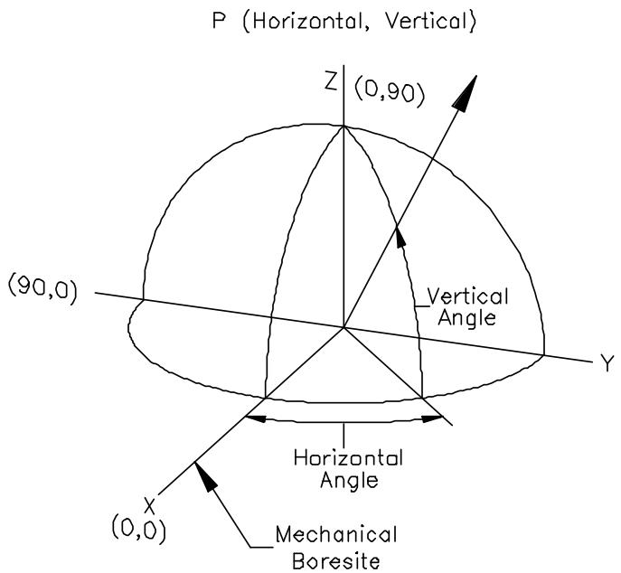
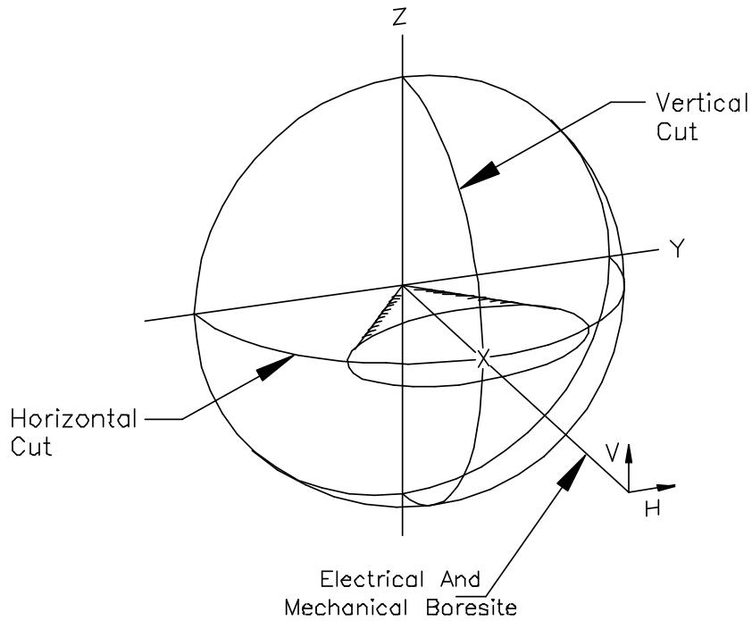
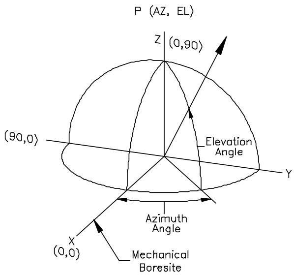
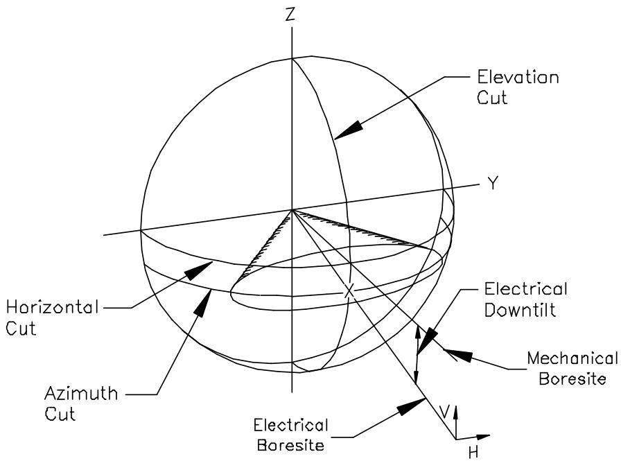
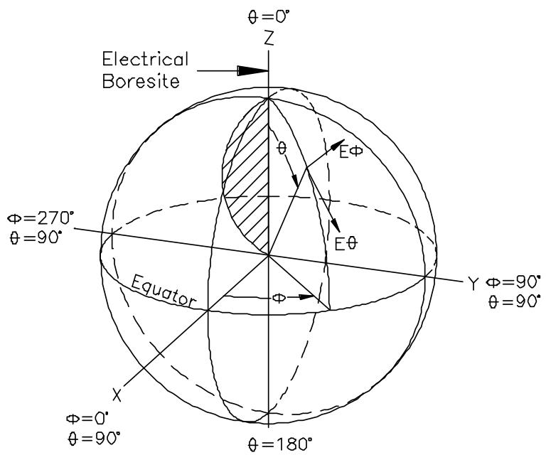

# NSMA --- Antenna Systems --- Standard Format for Digitized Antenna Patterns

RECOMMENDATION WG16.99.050 5/20/99

# Table of Contents

# FOREWORD..

# INTRODUCTION.. iii

1.0 Scope ....   
2.0 References ....   
3.0 Requirements......

3.1 Overall Format .   
3.2 Fields....

3.2.1 Field Characteristics .   
3.2.2 Field parameters described.. .3

4.0 Bibliography .......... .. 14

# Annex A (Normative)..... ... 15

A.1 General Definitions and Practices . .. 15   
A.2 Horizontal/Vertical Pattern Geometry.. ..16   
A.3 Azimuth/Elevation Pattern Geometry ... .. 17   
A.4 Spherical Pattern Geometry....... .. 18   
A.5 Pattern Cut Designators (XXX).. .. 18

# Annex B (Normative)......... ... 19

# Annex C (Informative) .......... ..20

# FOREWORD

(This foreword is not part of this Recommendation)

This Recommendation was prepared by Working Group 16 (Antenna Systems) of the NSMA. Members of TIA Task Group TG-8.11.3 have contributed to the preparation of this document. Many of the requirements contained in this document are compatible with those of the TIA Antenna Pattern Standard Data Format generated by TIA Subcommittee TR 8.11. However, caution is advised because differences may exist between the two documents.

Note: This format is Y2K compatible.

Annexes A and B are normative. Annex C is for information only.

# INTRODUCTION

This purpose of this Recommendation is to provide an extended NSMA pattern data format for manufacturers of commercial antennas to adhere to. It was motivated by the observation by propagation software providers (i.e. users of such patterns) that every manufacturer of base station antennas has its own proprietary format and that a single standardized format would make software development simpler, assure consistent usage of antenna pattern data, and facilitate data accuracy though a robust, common data format.

The intent of this new NSMA Standard Format for Digitized Antenna Patterns is:

1. To be consistent with the current NSMA format but be flexible enough to able to be applied to a variety of commercial antenna types, including L I il   
terrestrial microwave antennas, base station antennas, and earth station antennas.   
2. To be broad in scope so as to be able to handle a variety of pattern cut geometries and polarization cases.   
3. To have the basic pattern data format consistent with antenna test range pattern formats and conventions.   
4. To incorporate descriptive fields along with the antenna pattern data that would contain information and specifications pertinent to system design and coordination.   
5. To include all the data required by existing propagation prediction software file formats.   
6. To be able to be loaded into a simple spreadsheet program.

# NSMA--- Antenna Systems --- Standard Format for Digitized Antenna Patterns

# 1.0 Scope

This document is intended to standardize the presentation of digitized antenna patterns for commercial antenna systems.

# 2.0 References

The following documents should be consulted when applying this Standard:

[1] ANSI/IEEE Std 149, IEEE Standard Test Procedures for Antennas   
[2] EIA/TIA-329-B, Minimum Standards for Communication Antennas, Part 1: Base Station Antennas

# 3.0 Requirements

# 3.1 Overall Format

Each file consists of data for one antenna at one or more frequencies. Each frequency consists of one or more pattern cuts. Each pattern cut consists of a number of data points. Only those fields marked with an “x” are required to be compliant to this standard; however, manufacturers are strongly encouraged to include all fields in their data files. Data shall be entered into the file in the order given in this standard. It is not necessary, however, to include “empty fields” including only the field name.

# 3.2 Fields

# 3.2.1 Field Characteristics

The fields to be used in digitized antenna patterns are defined in Table 1. They are described in detail in subclause 3.2.2.

Per-line comments may be added to any record. In any record, all data after a “!” character will be ignored.

Table 1 Field Characteristics 

<table><tr><td>Req'd?</td><td>Field Name</td><td>Length (Char)</td><td>Abbreviated Name</td></tr><tr><td></td><td></td><td></td><td></td></tr><tr><td>x</td><td>Revision Number</td><td>42</td><td>REVNUM</td></tr><tr><td>x</td><td>Revision Date</td><td>16</td><td>REVDAT</td></tr><tr><td></td><td>Comment1</td><td>80</td><td>COMNT1</td></tr><tr><td></td><td>Comment2</td><td>80</td><td>COMNT2</td></tr><tr><td>x</td><td>Antenna Manufacturer</td><td>42</td><td>ANTMAN</td></tr><tr><td>x</td><td>Model Number</td><td>42</td><td>MODNUM</td></tr><tr><td></td><td>Pattern ID Number</td><td>42</td><td>PATNUM</td></tr><tr><td></td><td>Pattern File Number</td><td>13</td><td>FILNUM</td></tr><tr><td></td><td>Feed Orientation</td><td>13</td><td>FEDORN</td></tr><tr><td></td><td>Description1</td><td>80</td><td>DESCR1</td></tr><tr><td></td><td>Description2</td><td>80</td><td>DESCR2</td></tr><tr><td></td><td>Description3</td><td>80</td><td>DESCR3</td></tr><tr><td></td><td>Description4</td><td>80</td><td>DESCR4</td></tr><tr><td></td><td>Description5</td><td>80</td><td>DESCR5</td></tr><tr><td></td><td>Date of data</td><td>16</td><td>DTDATA</td></tr><tr><td>x</td><td>Low Frequency (MHz)</td><td>21</td><td>LOWFRQ</td></tr><tr><td>x</td><td>High Frequency (MHz)</td><td>21</td><td>HGHFRQ</td></tr><tr><td>x</td><td>Gain Units</td><td>15</td><td>GUNITS</td></tr><tr><td></td><td>Low-band gain</td><td>12</td><td>LWGAIN</td></tr><tr><td>x</td><td>Mid-band gain</td><td>16</td><td>MDGAIN</td></tr><tr><td></td><td>High-band gain</td><td>12</td><td>HGGAIN</td></tr><tr><td></td><td>Mid-band Az Bmwdth</td><td>16</td><td>AZWIDT</td></tr><tr><td></td><td>Mid-band El Bmwdth</td><td>16</td><td>ELWIDT</td></tr><tr><td></td><td>Connector Type</td><td>80</td><td>CONTYP</td></tr><tr><td></td><td>VSWR</td><td>13</td><td>ATVSWR</td></tr><tr><td></td><td>Front-to-back Ratio(dB)</td><td>10</td><td>FRTOBA</td></tr><tr><td>x</td><td>Electrical Downtilt (deg)</td><td>16</td><td>ELTILT</td></tr><tr><td></td><td>Radiation Center (m)</td><td>13</td><td>RADCTR</td></tr><tr><td></td><td>Port-to-Port Iso (dB)</td><td>12</td><td>POTOPO</td></tr><tr><td></td><td>Max Input Power (W)</td><td>17</td><td>MAXPOW</td></tr><tr><td></td><td>Antenna Length (m)</td><td>14</td><td>ANTLEN</td></tr><tr><td></td><td>Antenna Width (m)</td><td>14</td><td>ANTWID</td></tr><tr><td></td><td>Antenna Depth (m)</td><td>14</td><td>ANTDEP</td></tr><tr><td></td><td>Antenna Weight (kg)</td><td>16</td><td>ANTWGT</td></tr><tr><td></td><td>Future Field</td><td>80</td><td>FIELD1</td></tr><tr><td></td><td>Future Field</td><td>80</td><td>FIELD2</td></tr><tr><td></td><td>Future Field</td><td>80</td><td>FIELD3</td></tr><tr><td></td><td>Future Field</td><td>80</td><td>FIELD4</td></tr><tr><td></td><td>Future Field</td><td>80</td><td>FIELD5</td></tr><tr><td>Req’d?</td><td>Field Name</td><td>Length (Char)</td><td>Abbreviated Name</td></tr><tr><td></td><td></td><td></td><td></td></tr><tr><td></td><td></td><td></td><td></td></tr><tr><td>x</td><td>Pattern Type</td><td>16</td><td>PATTYP</td></tr><tr><td>x</td><td># Freq this file</td><td>10</td><td>NOFREQ</td></tr><tr><td>x</td><td>Pattern Freq (Mhz)</td><td>21</td><td>PATFRE</td></tr><tr><td>x</td><td># Pattern cuts</td><td>11</td><td>NUMCUT</td></tr><tr><td>x</td><td>Pattern Cut</td><td>11</td><td>PATCUT</td></tr><tr><td>x</td><td>Polarization</td><td>15</td><td>POLARI</td></tr><tr><td>x</td><td># Data Points</td><td>13</td><td>NUPOIN</td></tr><tr><td>x</td><td>First &amp; Last Angle</td><td>25</td><td>FSTLST</td></tr><tr><td></td><td>X-axis Orientation</td><td>53</td><td>XORIEN</td></tr><tr><td></td><td>Y-axis Orientation</td><td>53</td><td>YORIEN</td></tr><tr><td></td><td>Z-axis Orientation</td><td>53</td><td>ZORIEN</td></tr><tr><td>x</td><td>Pattern cut data</td><td>28/point</td><td></td></tr><tr><td>x</td><td>End of file</td><td>11</td><td>ENDFIL</td></tr></table>

# 3.2.2 Field parameters described

The following are detailed explanations of each of the data lines. The amount of data specified includes all characters except CRLF.

# 3.2.2.1 Revision Number

This is the version of this standard to which the pattern conforms. It should include the complete standard number. e.g. “NSMA WG16.99.050”.

(data)

REVNUM:,XXXXXXXXXXXXXXXXXXXXXXXXXXXXXXXXXXCRLF

# 3.2.2.2 Revision Date

This is the date of the current revision of the standard.

(16 data)

REVDAT:,YYYYMMDDCRLF

# 3.2.2.3 Comments1

This is a field for comments on the current revision.

(80 data)

COMNT1:,XXXXXXXXXXXXXXXXXXXXXXXXXXXXXXXXXXXXXXXXXXXXXXXXXXX XXXXXXXXXXXXXXXXXXXXXCRLF

# 3.2.2.4 Comments2

This is a field for comments on the current revision.

(80 data)

COMNT2:,XXXXXXXXXXXXXXXXXXXXXXXXXXXXXXXXXXXXXXXXXXXXXXXXXXX XXXXXXXXXXXXXXXXXXXXXCRLF

# 3.2.2.5 Antenna Manufacturer

(42 data)

ANTMAN:,XXXXXXXXXXXXXXXXXXXXXXXXXXXXXXXXXXCRLF

This is the name of the antenna manufacturer. There will be no abbreviations.

# 3.2.2.6 Full model number

(42 data)

MODNUM:,XXXXXXXXXXXXXXXXXXXXXXXXXXXXXXXXXXXCRLF

This is the full model number as used when the data was taken. Modifiers to the model number such as dashes or exceptions are to be included.

# 3.2.2.7 Pattern File Number

(13 data)

FILNUM:,XX/XXCRLF

For cases where more than one file is associated with a specific antenna model number this field will contain the particular file number and the total number of files associated with that model number. An example of such a case would be a dual band antenna with two pattern files associated with it. In that case the field for the first file would be “01/02” and the second “02/02”.

# 3.2.2.8 Pattern ID Number

(42 data)

PATNUM:,XXXXXXXXXXXXXXXXXXXXXXXXXXXXXXXXXXXCRLF

This is the manufacturer assigned pattern ID number that may optionally be assigned to the pattern data. For terrestrial microwave this is the NSMA ID number.

# 3.2.2.9 Feed Orientation

(13 data)

FEDORN:,XXXXXCRLF

For a terrestrial microwave antenna this is the orientation of the feed hook when looking from the back of the antenna in the direction of the mechanical boresite. The standard orientations are “right” and “left”.

# 3.2.2.10 Description1

(80 data)

DESCR1:,XXXXXXXXXXXXXXXXXXXXXXXXXXXXXXXXXXXXXXXXXXXXXXXXXXXX XXXXXXXXXXXXXXXXXXXXCRLF

This is used to describe the antenna and its characteristics.

# 3.2.2.11 Description2

(80 data)

DESCR2:,XXXXXXXXXXXXXXXXXXXXXXXXXXXXXXXXXXXXXXXXXXXXXXXXXXXX XXXXXXXXXXXXXXXXXXXXCRLF

This is used to describe the antenna and its characteristics

# 3.2.2.12 Description3

(80 data)

DESCR3:,XXXXXXXXXXXXXXXXXXXXXXXXXXXXXXXXXXXXXXXXXXXXXXXXXXXX XXXXXXXXXXXXXXXXXXXXCRLF

This is used to describe the antenna and its characteristics

# 3.2.2.13 Description4

(80 data)

DESCR4:,XXXXXXXXXXXXXXXXXXXXXXXXXXXXXXXXXXXXXXXXXXXXXXXXXXXX XXXXXXXXXXXXXXXXXXXXCRLF

This is used to describe the antenna and its characteristics

# 3.2.2.14 Description 5

(80 data)

DESCR5:,XXXXXXXXXXXXXXXXXXXXXXXXXXXXXXXXXXXXXXXXXXXXXXXXXXXX

XXXXXXXXXXXXXXXXXXXXCRLF

This is used to describe the antenna and its characteristics.

# 3.2.2.15 Date of data

(16 data)

DTDATA:,YYYYMMDDCRLF

This is the date the pattern data was taken.

# 3.2.2.16 Low frequency

(21 data)

LOWFRQ:,999999.999999CRLF

This is to identify the lower frequency of the operating bandwidth of the antenna. The frequency is in Megahertz. If the antenna can be operated in two distinct frequency bands, then the performance of the antenna in each band shall be described in separate files.

# 3.2.2.17 High frequency

(21 data)

HGHFRQ:,999999.999999CRLF

This is to identify the upper frequency of the operating bandwidth of the antenna. The frequency is in Megahertz. If the antenna can be operated in two distinct frequency bands, then the performance of the antenna in each band shall be described in separate files.

# 3.2.2.18 Gain Units

(15 data)

GUNITS:,XXX/YYYCRLF

The units that gain figures are to be expressed in. The characters before the slash represent the units for the “Low-Band Gain”, “Mid-Band Gain”, and “High-Band Gain”. The characters after the slash represent the units used in the pattern data. The characters used shall be the following:

# Table 2

# Gain Units

<table><tr><td>Characters</td><td>Explanation</td><td>MaxG</td><td>Pattern</td></tr><tr><td>DBI</td><td>Decibels relative to an isotropic radiator</td><td>x</td><td>x</td></tr><tr><td>DBD</td><td>Decibels relative to a half-wave dipole</td><td>x</td><td>x</td></tr><tr><td>DBR</td><td>Decibels relative to maximum gain (dB Off-Peak)</td><td></td><td>x</td></tr><tr><td>LIN</td><td>Ratio relative to maximum gain (Relative Field)</td><td></td><td>x</td></tr></table>

# 3.2.2.19 Low-Band gain

(12 data)

LWGAIN:,99.9CRLF

This is the gain of the antenna at the low frequency of the frequency band. The gain is in units described in GUNITS.

# 3.2.2.20 Mid-Band gain

(16 data)

MDGAIN:,99.9,9.9CRLF

This is the gain of the antenna at the mid frequency of the frequency band and may include a full bandwidth tolerance. The gain is in units described in GUNITS.

# 3.2.2.21 High-Band gain

(12 data)

HGGAIN:,99.9CRLF

This is the gain of the antenna at high frequency of the frequency band. The gain is in units described in GUNITS.

# 3.2.2.22 Azimuth beamwidth

(16 data)

AZWIDT:,99.9,9.9CRLF

This is the nominal total width of the main beam at the -3 dB points in the azimuth plane. This is a mid-band measurement expressed in degrees and may include a full bandwidth tolerance.

# 3.2.2.23 Elevation beamwidth

(16 data) ELWIDT:,99.9,9.9CRLF

This is the nominal total width of the main beam at the -3 dB points in the elevation plane. This is a mid-band measurement expressed in degrees and may include a full bandwidth tolerance.

# 3.2.2.24 Connector type

(80 data) CONTYP:,XXXXXXXXXXXXXXXXXXXXXXXXXXXXXXXXXXXXXXXXXXXXXXXXXXX XXXXXXXXXXXXXXXXXXXXXCRLF

This is a description of the antenna connector type.

# 3.2.2.25 VSWR

(13 data) ATVSWR:,99.99CRLF

This is the worst case limit of the antennas VSWR over the operating bandwidth.

# 3.2.2.26 Front to back ratio

(10 data) FRTOBA:,99CRLF

Over the antennas operating bandwidth, this is the worst case power level in dB between the main lobe peak and the peak of the antenna’s back lobe. The back lobe peak does not necessarily point 180 degrees behind the main lobe.

# 3.2.2.27 Electrical downtilt

(16 data) ELTILT:,99.9,9.9CRLF

This is the amount that the main beam peak of the antenna (electrical boresite) is dowtilted below the mechanical boresite of the antenna. This is a midband measurement and may include a tolerance. This measurement is expressed in degrees.

# 3.2.2.28 Radiation center

(13 data)

RADCTR:,999.9CRLF

This is the height of the center of the radiating aperture above the mechanical bottom of the antenna. It is not necessarily the phase center of the antenna. It is expressed in meters.

# 3.2.2.29 Port to port isolation

(12 data)

POTOPO:,99.9CRLF

This is a measurement made on dual polarization antennas. It is the maximum amount of power over the antennas operating bandwidth that is coupled between ports. It is the power ratio expressed in dB’s between a reference signal injected into one port and the amount of coupled power returned back out of the other port.

# 3.2.2.30 Maximum input power

(17 data)

MAXPOW:,9999999.9CRLF

This is the maximum amount of average RF input power which can be applied to each of the antennas input ports in the antennas operating frequency range. The power is to be expressed in watts.

# 3.2.2.31 Antenna length

(14 data)

ANTLEN:,999.99CRLF

This is the mechanical length of the antenna in meters. This does not include the antenna mount. For a circularly symmetric parabolic antenna this would be the diameter.

# 3.2.2.32 Antenna width

(14 data)

ANTWID:,999.99CRLF

This is the mechanical width of the antenna in meters. This does not include the antenna mount. For a circularly symmetric parabolic antenna this would be the diameter.

# 3.2.2.33 Antenna depth

(14 data)

ANTDEP:,999.99CRLF

This is the mechanical depth antenna in meters. This does not include the antenna mount.

# 3.2.2.34 Antenna weight

(16 data)

ANTWGT:,999999.9CRLF

This is the weight of the antenna in kg. This includes the antenna mount.

# 3.2.2.35 Future field

(80 data)

FIELD1:,XXXXXXXXXXXXXXXXXXXXXXXXXXXXXXXXXXXXXXXXXXXXXXXXXXXXX XXXXXXXXXXXXXXXXXXXCRLF

# 3.2.2.36 Future field

(80 data)

FIELD2:,XXXXXXXXXXXXXXXXXXXXXXXXXXXXXXXXXXXXXXXXXXXXXXXXXXXXX XXXXXXXXXXXXXXXXXXXCRLF

# 3.2.2.37 Future field

(80 data)

FIELD3:,XXXXXXXXXXXXXXXXXXXXXXXXXXXXXXXXXXXXXXXXXXXXXXXXXXXXX XXXXXXXXXXXXXXXXXXXCRLF

# 3.2.2.38 Future field

(80 data) FIELD4:,XXXXXXXXXXXXXXXXXXXXXXXXXXXXXXXXXXXXXXXXXXXXXXXXXXXXX XXXXXXXXXXXXXXXXXXXCRLF

# 3.2.2.39 Future field

(80 data) FIELD5:,XXXXXXXXXXXXXXXXXXXXXXXXXXXXXXXXXXXXXXXXXXXXXXXXXXXXX XXXXXXXXXXXXXXXXXXXCRLF

# 3.2.2.40 Pattern Type

(16 data) PATTYP:,XXXXXXXXCRLF

This is the pattern type, either “typical” or “envelope”.

A “typical” pattern being defined as an actual measured radiation pattern representing a typical pattern for an antenna model. A “typical” pattern will normally have a frequency associated with it.

A pattern “envelope” being defined as a composite representation of an antenna model’s full frequency band radiation pattern. The envelope is a linear piecewise representation of the worst–case maximum sidelobe level as a function of angle for all frequencies of specified operation.

# 3.2.2.41 Number of Frequencies this File

(10 data) NOFREQ:,99CRLF

The number of pattern frequencies which comprise the full data set. All data below this subclause (3.2.2.44 through 3.2.2.51, however not 3.2.2.52– “end of file”) will be repeated for each frequency. Thus if there were three radiation patterns of different frequencies in a file, NOCUT would have a value of 3, and the information below would be repeated 3 times, once for each frequency.

# 3.2.2.42 Pattern frequency

(21 data) PATFRE:,999999.999999CRLF

The frequency of the pattern data for a typical pattern. The frequency is in MHz.

# 3.2.2.43 Number of pattern cuts

(11 data)

NUMCUT:,999CRLF

The number of pattern cuts which comprise the full data set. All data below this subclause (3.2.2.44 through 3.2.2.51, however not 3.2.2.52– “end of file”) will be repeated for each pattern cut. Thus if there is a horizontal and vertical antenna cuts, NUMCUT would have a value of 2, and the information below would be repeated for each cut

# 3.2.2.44 Pattern cut

(11 data)

PATCUT:,XXXCRLF

The geometry of a particular pattern cut. Each pattern cut is preceded by an indication of the type pattern cut. Pattern cut geometries and designators are defined in Annex A.

# 3.2.2.45 Polarization

(15 data)

POLARI:,XXX/XXXCRLF

The particular polarization of a pattern cut. The first polarization is the polarization of the antenna-under-test and the second the polarization of the illuminating source. The two polarizations are separated by a /.

Each pattern cut is preceded by an indication of the polarization of the data. Polarization designators are defined in Annex A.

# 3.2.2.46 Number of data points

(13 data)

NUPOIN:,99999CRLF

The number of data points in a particular pattern cut data set.

# 3.2.2.47 First and Last Angle of Pattern Data

(25 data)

FSTLST:,S999.999,S999.999CRLF

The first and last angle (in degrees) of the antenna pattern data. NOTE: Pattern data shall be expressed monotonically, with respect to angle. Azimuths shall be stated as either –180 to +180 or 0 to 360 degrees.

# 3.2.2.48 X- Axis Orientation

A verbal description of the physical orientation of the x-axis on the antenna.

(53 data)

XORIEN:,XXXXXXXXXXXXXXXXXXXXXXXXXXXXXXXXXXXXXXXXXXXXXCRLF

# 3.2.2.49 Y- Axis Orientation

A verbal description of the physical orientation of the y-axis on the antenna.

(53 data)

YORIEN:,XXXXXXXXXXXXXXXXXXXXXXXXXXXXXXXXXXXXXXXXXXXXXCRLF

# 3.2.2.50 Z- Axis Orientation

A verbal description of the physical orientation of the z-axis on the antenna.

(53 data)

ZORIEN:,XXXXXXXXXXXXXXXXXXXXXXXXXXXXXXXXXXXXXXXXXXXXXCRLF

# 3.2.2.51 Pattern Cut Data

Angle(8 data/space),Magnitude(8data/space),Phase(8data/space)

S999.999,S999.999,S999.999CRLF

The data is presented in three columns. The angle of observation is listed first followed by the antenna magnitude response and phase response. In most cases the phase response will not be included in the data set. “S” designates the sign of the number.

The antenna power magnitude is listed in the units specified in the antenna units field (GUNITS).

The angle and phase data are expressed in units of degrees.

Although pattern data is allowed values that have up to three digits to the right of the decimal point this does not imply that the pattern data is to or can be measured to that accuracy. Typical accuracy for an antenna pattern measurement is 0.1 dB and 0.1 degree.

For all patterns, azimuths values should not be repeated. For example, values should not be provided for both a "0.0" degree azimuth and a "360.0" azimuth, nor should 2 different discrimination values be provided for a "20.0" degree azimuth twice.

# 3.2.2.52 End of File

(11 data)

ENDFIL:,EOFCRLF

This field designates the end of the file with the characters EOF.

# 4.0 Bibliography

[1] ANSI/IEEE Std 149, IEEE Standard Test Procedures for Antennas   
[2] J.S. Hollis, T.J. Lyon, L. Clayton, Microwave Antenna Measurements, Scientific-Atlanta Georgia, 1985.

# Annex A (Normative)

# Definition of Pattern Cut Geometries

# A.1 General Definitions and Practices

The mechanical boresite of the antenna shall determine the 0 degree reference for all pattern cuts (except cuts defined by a spherical coordinate system). For most antennas, the mechanical boresite is the direction perpendicular to the plane or line defined by the radiating aperture. If the mechanical boresite is ambiguous, as in the case of an omni-directional antenna, the mechanical boresite needs to be defined on the antenna structure.

The electrical boresite of the antenna is the direction of maximum gain and consequently will be the direction of maximum received signal level when measuring a radiation pattern. This maximum level is to be assigned the reference value of 0dB(1 linear), or a value equivalent to the antenna maximum gain relative to an isotropic radiator or a half-wave dipole. See section 3.2.2.18 for allowable radiation pattern units. For a non-steerable antenna, unless a mechanical tilt is specified it is assumed that in an operational situation an antenna’s mechanical boresite is pointed in a direction parallel to the earths horizon. In this case horizontal and vertical pattern cuts can be defined, which are referenced to the earth’s horizon. The vertical cut being perpendicular to the horizon.

For an electrically or mechanically steerable antenna or an antenna which has a fixed electrical or mechanical tilt, azimuth and elevation pattern cuts are defined. These are pattern cuts which are orthogonal through the peak of the antennas main beam (electrical boresite). The azimuth cut is the cut which would be closest to the horizon in an operational situation. If the direction that the antenna is pointing is known, a horizontal cut can still be defined.

General pattern cuts can be defined by a spherical coordinate system with the electrical boresite of the antenna oriented in the direction of the Z-axis. At different values of phi, pattern cuts can be taken with theta as the dependent variable. These will be greatcircle cuts through the main-beam peak. An additional measurement relating the mechanical and electrical boresite must be made to fully characterize the antenna. Also the orientation of the antenna to the spherical coordinate system must be defined.(example: top of the antenna oriented in the +x direction).

# A.2 Horizontal/Vertical Pattern Geometry

text_image

P (Horizontal, Vertical)
Z (0,90)
Vertical
Angle
Y
Horizontal
Angle
X (0,0)
Mechanical
Boresite

Example: Sector antenna (no electrical downtilt)   

text_image

Z
Vertical Cut
Y
Horizontal Cut
V
H
Electrical And
Mechanical Boresite

# A.3 Azimuth/Elevation Pattern Geometry

text_image

P (AZ, EL)
Z (0,90)
Elevation
Angle
Y
(90,0)
Azimuth
Angle
X (0,0)
Mechanical
Boresite

Example: Sector antenna (electrically downtilted, with conical azimuth pattern cut)

text_image

Elevation Cut
Y
Horizontal Cut
Azimuth Cut
Electrical Downtilt
Mechanical Boresite
Electrical Boresite
V
H
Z

# A.4 Spherical Pattern Geometry

text_image

Electrical
Boresite
θ=0°
Z
Φ=270°
θ=90°
Equator
X
Φ=0°
θ=90°
Y Φ=90°
θ=90°
Φ=180°

# A.5 Pattern Cut Designators (XXX)

Horizontal Cut H

Vertical Cut V

Azimuth Cut AZ

Elevation Cut EL

Phi Cut XXX Phi angle Example: 180

# 4.0 Annex B (Normative)

# Definition of Polarization Designators

The polarization designators for horizontal and vertical polarization cases are:

Horizontal: H

Vertical: V

The possible polarization cases for these designators are:

H/H Horizontal polarized port response to a horizontally polarized signal.

(Co-polarized pattern)

H/V Horizontal polarized port response to a vertically polarized signal.

(Cross-polarized pattern)

V/V Vertical polarized port response to a vertically polarized signal.

(Co-polarized pattern)

V/H Vertical polarized port response to a horizontally polarized signal.

(Cross-polarized pattern)

Polarization designators for other orthogonal polarization cases are:

Linear Slant 45

Slant right: SLR1

Slant left: SLL1

Circular

right hand: RCP1

left hand: LCP1

Spherical geometry

E theta ETH

E phi EPH

# 5.0 Annex C (Informative)

# Example File

REVNUM:, NSMA WG16.99.050

REVDAT:,19990520

COMNT1:,This is a sample file for 1 frequency and 2 cuts

ANTMAN:,ABC Antenna Company

MODNUM:,800A-065-25-4N

DESCR1:,800 Mhz 65 deg AZ BW 2.5meter 4 deg E-tilt base station antenna

DTDATA:,19971216

LOWFRQ:,806

HGHFRQ:,896

GUNITS:,DBI/DBR

MDGAIN:,16.8,0.5

AZWIDT:,65.0

ELWIDT:,7.1

CONTYP:,n connector

ATVSWR:,1.40

FRTOBA:,30

ELTILT:,4.0,0.5

MAXPOW:,500

ANTLEN:,2.367

ANTWID:,0.366

ANTDEP:,0.178

ANTWGT:,19.0

PATTYP:,typical

NOFREQ:,1

PATFRE:,851

NUMCUT:,2

PATCUT:,EL

POLARI:,V/V

NUPOIN:,180

FSTLST:,-180.000,+178.000

-180.000,-29.799,

-178.000,-28.912,

-176.000,-28.777,

-174.000,-29.738,

-172.000,-32.718,

-170.000,-38.453,

-168.000,-39.742,

-166.000,-39.746,   
-164.000,-38.157,   
-162.000,-37.854,   
-160.000,-39.097,   
-158.000,-39.794,   
-156.000,-39.778,   
-154.000,-39.720,   
-152.000,-39.712,   
-150.000,-39.683,   
-148.000,-39.720,   
-146.000,-39.716,   
-144.000,-39.720,   
-142.000,-39.732,   
-140.000,-39.736,   
-138.000,-39.777,   
-136.000,-39.745,   
-134.000,-39.786,   
-132.000,-39.794,   
-130.000,-39.794,   
-128.000,-39.808,   
-126.000,-39.769,   
-124.000,-39.798,   
-122.000,-39.781,   
-120.000,-39.757,   
-118.000,-39.732,   
-116.000,-39.484,   
-114.000,-38.421,   
-112.000,-38.458,   
-110.000,-39.550,   
-108.000,-39.670,   
-106.000,-39.637,   
-104.000,-39.641,   
-102.000,-39.604,   
-100.000,-39.637,   
-98.000,-39.653,   
-96.000,-39.719,   
-94.000,-39.748,   
-92.000,-39.596,   
-90.000,-36.250,   
-88.000,-34.111,   
-86.000,-30.864,   
-84.000,-29.719,   
-82.000,-29.280,   
-80.000,-28.923,   
-78.000,-28.566,   
-76.000,-28.151,   
-74.000,-27.786,

-72.000,-27.654,   
-70.000,-27.962,   
-68.000,-29.030,   
-66.000,-31.136,   
-64.000,-33.898,   
-62.000,-36.678,   
-60.000,-33.073,   
-58.000,-28.595,   
-56.000,-25.405,   
-54.000,-23.258,   
-52.000,-22.684,   
-50.000,-23.090,   
-48.000,-25.459,   
-46.000,-28.862,   
-44.000,-29.059,   
-42.000,-25.200,   
-40.000,-23.435,   
-38.000,-22.606,   
-36.000,-22.487,   
-34.000,-21.313,   
-32.000,-18.558,   
-30.000,-16.095,   
-28.000,-15.701,   
-26.000,-17.688,   
-24.000,-21.046,   
-22.000,-20.410,   
-20.000,-14.294,   
-18.000,-11.276,   
-16.000,-11.063,   
-14.000,-12.249,   
-12.000,-10.057,   
-10.000,-5.378,   
-8.000,-2.463,   
-6.000,-0.649,   
-4.000,0.000,   
-2.000,-0.653,   
0.000,-2.800,   
2.000,-7.582,   
4.000,-13.588,   
6.000,-20.760,   
8.000,-18.822,   
10.000,-17.915,   
12.000,-20.669,   
14.000,-21.618,   
16.000,-19.775,   
18.000,-18.913,   
20.000,-20.953,

22.000,-24.471, 24.000,-24.914, 26.000,-22.230, 28.000,-21.171, 30.000,-22.985, 32.000,-31.475, 34.000,-38.166, 36.000,-31.154, 38.000,-26.430, 40.000,-26.023, 42.000,-27.756, 44.000,-30.280, 46.000,-29.004, 48.000,-25.748, 50.000,-23.983, 52.000,-23.154, 54.000,-23.478, 56.000,-24.817, 58.000,-26.840, 60.000,-28.926, 62.000,-29.792, 64.000,-28.339, 66.000,-26.878, 68.000,-26.011, 70.000,-25.507, 72.000,-25.277, 74.000,-25.511, 76.000,-25.880, 78.000,-26.430, 80.000,-27.018, 82.000,-27.670, 84.000,-28.397, 86.000,-29.206, 88.000,-30.043, 90.000,-30.733, 92.000,-31.427, 94.000,-32.166, 96.000,-32.999, 98.000,-33.586, 100.000,-34.112, 102.000,-34.629, 104.000,-34.826, 106.000,-34.859, 108.000,-34.900, 110.000,-35.171, 112.000,-35.742, 114.000,-36.780,

116.000,-38.168,   
118.000,-39.346,   
120.000,-39.190,   
122.000,-38.229,   
124.000,-37.700,   
126.000,-37.725,   
128.000,-38.505,   
130.000,-39.720,   
132.000,-39.769,   
134.000,-39.802,   
136.000,-39.796,   
138.000,-39.792,   
140.000,-39.810,   
142.000,-39.810,   
144.000,-39.796,   
146.000,-39.810,   
148.000,-39.796,   
150.000,-39.819,   
152.000,-39.800,   
154.000,-39.807,   
156.000,-39.775,   
158.000,-39.819,   
160.000,-39.779,   
162.000,-39.742,   
164.000,-39.771,   
166.000,-39.786,   
168.000,-39.626,   
170.000,-39.741,   
172.000,-39.245,   
174.000,-37.262,   
176.000,-34.614,   
178.000,-31.966,   
PATCUT:,AZ   
POLARI:,V/V   
NUPOIN:,180   
FSTLST:,-180.000,+178.000   
-180.000,-32.219,   
-178.000,-32.353,   
-176.000,-32.688,   
-174.000,-33.081,   
-172.000,-33.683,   
-170.000,-34.343,   
-168.000,-35.249,   
-166.000,-36.196,   
-164.000,-37.069,   
-162.000,-37.646,   
-160.000,-37.940,

-158.000,-37.089,   
-156.000,-35.350,   
-154.000,-34.174,   
-152.000,-33.093,   
-150.000,-32.188,   
-148.000,-31.772,   
-146.000,-31.163,   
-144.000,-30.697,   
-142.000,-30.318,   
-140.000,-30.004,   
-138.000,-29.654,   
-136.000,-29.217,   
-134.000,-28.604,   
-132.000,-28.117,   
-130.000,-27.270,   
-128.000,-26.447,   
-126.000,-25.711,   
-124.000,-24.863,   
-122.000,-24.102,   
-120.000,-23.436,   
-118.000,-22.830,   
-116.000,-22.155,   
-114.000,-21.427,   
-112.000,-20.785,   
-110.000,-20.159,   
-108.000,-19.542,   
-106.000,-18.826,   
-104.000,-18.315,   
-102.000,-17.739,   
-100.000,-17.265,   
-98.000,-16.734,   
-96.000,-16.285,   
-94.000,-15.790,   
-92.000,-15.345,   
-90.000,-14.851,   
-88.000,-14.439,   
-86.000,-14.010,   
-84.000,-13.561,   
-82.000,-13.190,   
-80.000,-12.745,   
-78.000,-12.218,   
-76.000,-11.827,   
-74.000,-11.250,   
-72.000,-10.809,   
-70.000,-10.368,   
-68.000,-9.891,   
-66.000,-9.400,

-64.000,-8.898,   
-62.000,-8.465,   
-60.000,-7.987,   
-58.000,-7.547,  
-56.000,-7.011,   
-54.000,-6.620,   
-52.000,-6.166,   
-50.000,-5.759,   
-48.000,-5.330,   
-46.000,-4.951,   
-44.000,-4.477,   
-42.000,-4.065,   
-40.000,-3.763,   
-38.000,-3.454,   
-36.000,-3.157,   
-34.000,-2.819,   
-32.000,-2.526   
-30.000,-2.245,   
-28.000,-1.948,   
-26.000,-1.679,   
-24.000,-1.382,   
-22.000,-1.216,   
-20.000,-0.977,   
-18.000,-0.762,   
-16.000,-0.526,   
-14.000,-0.434,   
-12.000,-0.338,   
-10.000,-0.246,   
-8.000,-0.134,   
-5.000,-0.132,   
-2.000,-0.006,   
0.000,-0.029,   
2.000,-0.020,   
4.000,-0.059,   
6.000,-0.210,   
8.000,-0.274,   
10.000,-0.350,   
12.000,-0.534,   
14.000,-0.684,   
16.000,-0.830,   
18.000,-1.022,   
20.000,-1.275,   
22.000,-1.499,   
24.000,-1.740,   
26.000,-1.965,   
28.000,-2.296,   
30.000,-2.573,

32.000,-2.855,   
34.000,-3.162,   
36.000,-3.493,   
38.000,-3.935,   
40.000,-4.278,   
42.000,-4.634,   
44.000,-5.027,   
46.000,-5.432,   
48.000,-5.837,   
50.000,-6.266,   
52.000,-6.749,   
54.000,-7.220,   
56.000,-7.703,   
58.000,-8.166,   
60.000,-8.571,   
62.000,-9.000,   
64.000,-9.430,   
66.000,-9.786,   
68.000,-10.281,   
70.000,-10.912,   
72.000,-11.387,   
74.000,-11.747,   
76.000,-12.106,   
78.000,-12.561,   
80.000,-12.953,   
82.000,-13.387,   
84.000,-13.841,   
86.000,-14.341,   
88.000,-14.795,   
90.000,-15.213,   
92.000,-15.704,   
94.000,-16.203,   
96.000,-16.736,   
98.000,-17.256,   
100.000,-17.730,   
102.000,-18.172,   
104.000,-18.738,   
106.000,-19.426,   
108.000,-19.995,   
110.000,-20.528,   
112.000,-21.167,   
114.000,-21.917,   
116.000,-22.519,   
118.000,-23.035,   
120.000,-23.604,   
122.000,-24.148,   
124.000,-24.755,

126.000,-25.418,   
128.000,-25.947,   
130.000,-26.545,   
132.000,-27.134,   
134.000,-27.761,   
136.000,-28.372,   
138.000,-29.122,   
140.000,-29.769,   
142.000,-30.277,   
144.000,-30.862,   
146.000,-31.485,   
148.000,-32.428,   
150.000,-33.137,   
152.000,-34.219,   
154.000,-35.450,   
156.000,-36.914,   
158.000,-38.083,   
160.000,-38.751,   
162.000,-38.564,   
164.000,-37.430,   
166.000,-36.389,   
168.000,-35.221,   
170.000,-34.021,   
172.000,-33.227,   
174.000,-32.618,   
176.000,-32.275,   
178.000,-31.982,   
ENDFIL:,EOF