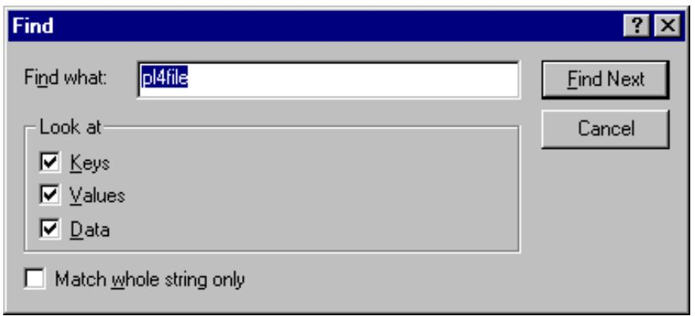
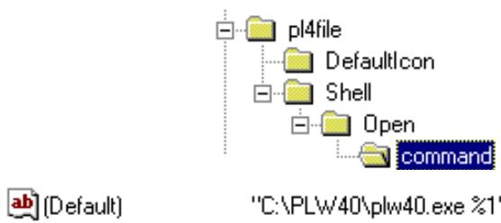
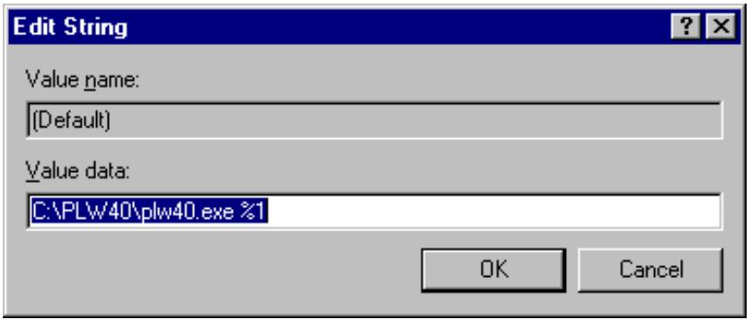

# Pathloss Version 4.0 File Association

The pathloss installation program did not complete the Windows registry entry correctly on shipments before August 1999. Double clicking on a pathloss file (pl4) would start the program but did not load the file. The procedure to edit the registry and correct this problem is given in the steps below.

Click Start - Run and enter the command line REGEDIT. Click OK to start the windows registry editor program.   
Select Edit - Find.. on the menu bar and enter the search string pl4file.

text_image

Find
Find what: pl4file
Look at
Keys
Values
Data
Match whole string only
Find Next
Cancel

The correct location is shown in the directory structure on the right.

text_image

pl4file
DefaultIcon
Shell
Open
command
C:\PLW40\plw40.exe %1

Double click on the “ab” icon and edit the entry as shown. The %1 is the missing portion. The path name will be the directory that the pathloss program was installed in.   
Click OK and close REGEDIT program.

text_image

Edit String
Value name:
(Default)
Value data:
C:\PLW40\plw40.exe %1
OK	Cancel

