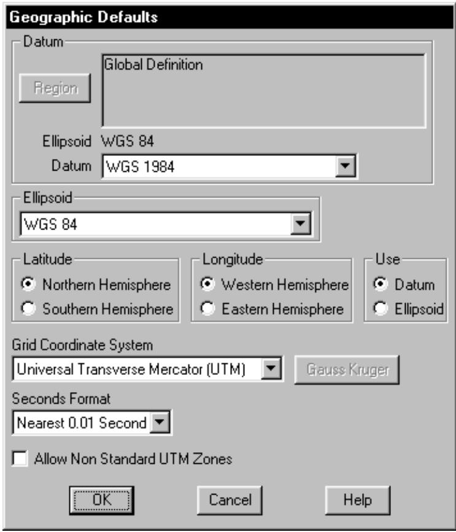
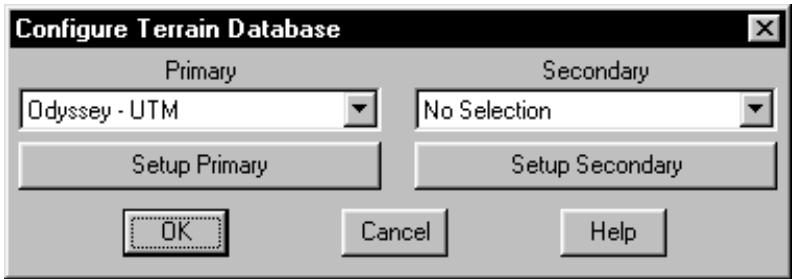
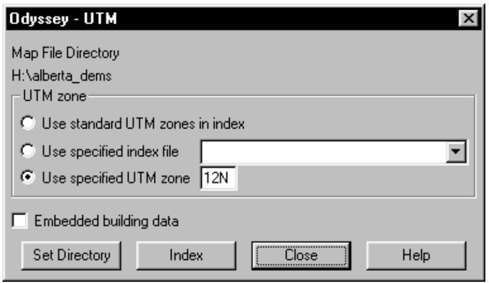
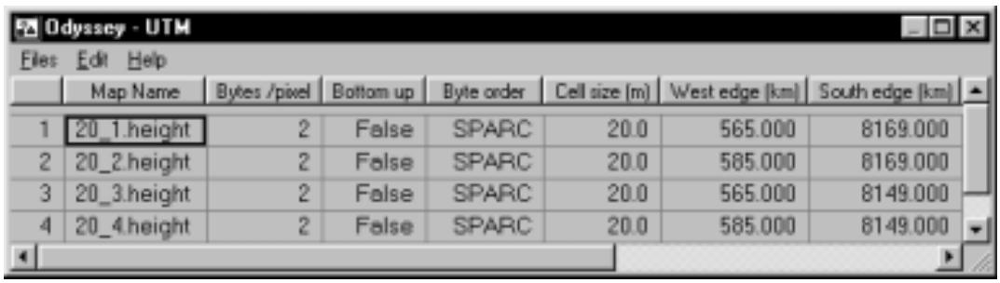
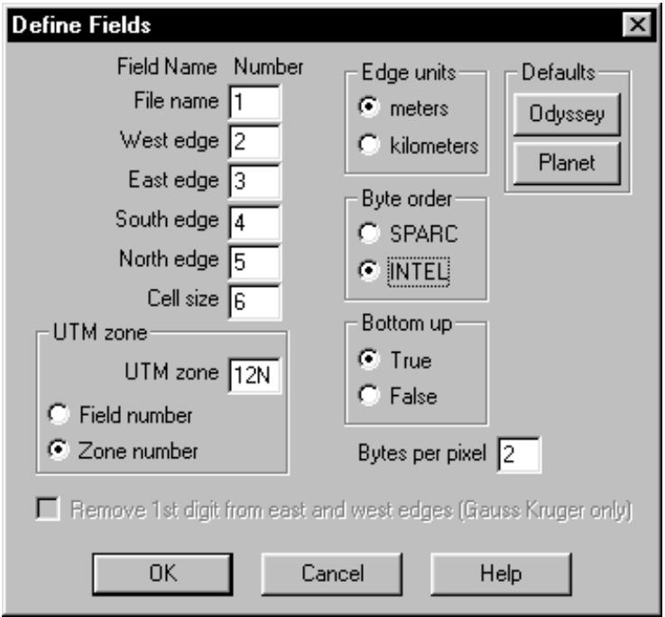
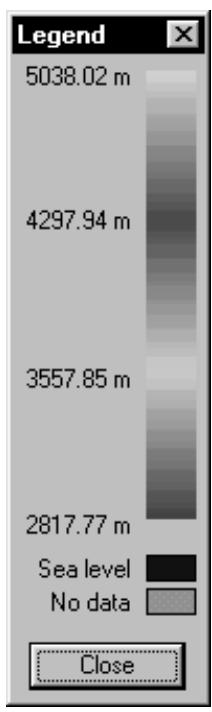
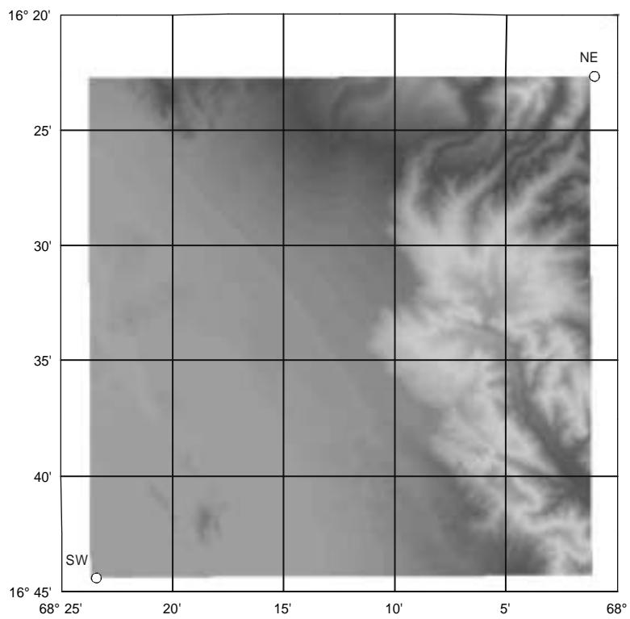
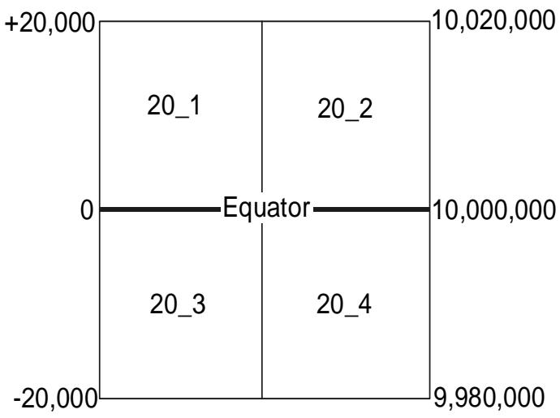

# MSI PLANET Terrain Data UTM Projection

# Universal Transverse Mercator (UTM) Projection

The UTM projection divides the world into 60 zones or segments. Each zone covers 6 degrees of longitude. The first zone starts at the international date line and the numbers increase eastwards. At the center of each zone is a central meridian, which is the measurement reference for that zone.

East-west grid lines are attached to the central meridian at right angles and follow great circle paths away from it. These are lines of constant northing and do not follow parallels of latitude, since parallels of latitude are not great circles. Finally, north-south grid lines are draw as lines of constant easting.

UTM coordinates are relative to a particular zone number and are expressed as an easting or X coordinate and a northing or Y coordinate. The easting is the distance from the central meridian along the east west grid lines using a positive east negative west sign convention. To avoid negative numbers, a false easting of 500,000 meters is assigned to the central meridian.

The northing is the distance from the equator along the north-south grid lines using a positive north - negative south sign convention. To avoid negative numbers in the southern hemisphere, a false northing of 10,000,000 meters is assigned to the equator. This false northing creates an ambiguity in this coordinate system. Consider the UTM coordinates:

zone = 12, easting = 575 kilometers, northing = 5600 kilometers.

Using the WGS84 datum, this converts to:

latitude 50 32 49.64 N and longitude 109 56 29.12 W in the northern hemisphere or

latitude 39 44 47.78 S and longitude 110 07 28.56 W in the southern hemisphere

To resolve this ambiguity, the Pathloss program adds the suffix N or S to the UTM zone. e.g. 12N or 12S. This false northing introduces an additional complication when a terrain data base spans the equator. Northings of 20 and 9980 kilometers represent points 20 kilometers north and south of the equator respectively.

# Planet Terrain Database Description

The Planet terrain database format consists of regular array of elevations. Each elevation represents the average elevation in a square cell. The file is arranged in rows running from west to east starting at either the SW or NW corner of the file. Normally the elevations are stored as 2 byte integers. The byte order could be INTEL (little endian) or SPARC (big endian)

The geo-referencing information is contained in two external files: an index file and a projection file.

An example of a projection file is given below. The format will vary depending on the projection. This example denotes a UTM projection in zone 18 using the WGS84 datum.

WGS-84

18

UTM

The index file defines the edges of the terrain database and specifies the cell size. One entry is provided for each file. An example of a line in an index file is given below.

toluca1.hgt 384000 484050 2080200 2180250 50

This is interpreted as 

<table><tr><td>file name</td><td>tolucal.hgt</td></tr><tr><td>west edge</td><td>384000 meters</td></tr><tr><td>east edge</td><td>48450 meters</td></tr><tr><td>south edge</td><td>2080200 meters</td></tr><tr><td>north edge</td><td>2180250 meters</td></tr><tr><td>cell size</td><td>50 meters</td></tr></table>

The east and west edges are the UTM eastings and the north and south edges are the UTM northings.

# Geographic Defaults

The first step is to set the datum or ellipsoid to correspond to the projection file. Select Configure - Geographic Defaults. Set the grid coordinate system (projection) to UTM.

text_image

Geographic Defaults
Datum
Region
Global Definition
Ellipsoid WGS 84
Datum WGS 1984
Ellipsoid
WGS 84
Latitude
Northern Hemisphere
Southern Hemisphere
Longitude
Western Hemisphere
Eastern Hemisphere
Use
Datum
Ellipsoid
Grid Coordinate System
Universal Transverse Mercator (UTM)
Gauss Kruger
Seconds Format
Nearest 0.01 Second
Allow Non Standard UTM Zones
OK	Cancel	Help

# Configuration

The Pathloss program uses a generic terrain database reader which was developed for the Logica Odyssey file format. The Planet height files can be read directly. No file conversions are necessary. The setup procedure is described below:

Select Configure - Terrain Database and then select Odyssey UTM.

Click the Setup Primary button to configure the terrain database.

# Set directory

Click the Set Directory button and point to the directory (folder) containing the Planet data files.

text_image

Configure Terrain Database
Primary
Odyssey - UTM
Setup Primary
Secondary
No Selection
Setup Secondary
OK	Cancel	Help

# UTM zone methods

In many cases, terrain data is supplied in a single file. The east and west edges may extend outside of the standard UTM zone boudaries. In these cases, the UTM zone must be specified by either of the following two methods:

Check the "Use specified index file" option and then select the file from the dropdown list. The UTM zone associated with the selected file will be used and only the selected file will be used even if the index contains multiple files.

text_image

Odyssey - UTM
Map File Directory
H:\alberta_dems
UTM zone
Use standard UTM zones in index
Use specified index file
Use specified UTM zone 12N
Embedded building data
Set Directory	Index	Close	Help

Check the “Use specified UTM zone” and enter the zone number suffixed by N or S. If N or S is not specified the zone will default to the northern hemisphere. The S suffix must be specified for the southern hemisphere

In all other cases use the “Use standard UTM zones in index” option.

# Embedded building data

Normally an elevation is interpolated from the nearest four elevations to the point of interest. If the terrain data contains embedded building or canopy data, check the “Embedded building data” option. The cell elevations will be used in this case.

# Index

Click the Index button to access the digital map index. Data can be entered manually. Select Edit- Add on the Index menu bar and enter the data as shown on the next page. This information is available from the Planet index files. When the data entry is complete Click OK

text_image

Odyssey - UTM
Files Edit Help
Map Name Bytes /pixel Bottom up Byte order Cell size (m) West edge (km) South edge (km)
1 20_1.height 2 False SPARC 20.0 565.000 8169.000
2 20_2.height 2 False SPARC 20.0 585.000 8169.000
3 20_3.height 2 False SPARC 20.0 565.000 8149.000
4 20_4.height 2 False SPARC 20.0 585.000 8149.000

Two additional fields must be set directly on the Grid data entry form. There are:

Bottom up This field determines if the file starts in the south west corner or the north west corner. Double click on this field to change the setting to true of false. If the network background or terrain view is upside down, then change this field.

Byte order The is equivalent to "big and little endian" Double click on this field to change the field to SPARC (big endian) or INTEL (little endian)

<table><tr><td colspan="2">Edit Item 1</td></tr><tr><td colspan="2">OK Cancel</td></tr><tr><td>Map Name</td><td>20_1.height</td></tr><tr><td>Bytes /pixel</td><td>2</td></tr><tr><td>Cell size (m)</td><td>20.0</td></tr><tr><td>West edge (km)</td><td>565.000</td></tr><tr><td>South edge (km)</td><td>8169.000</td></tr><tr><td>East edge (km)</td><td>585.000</td></tr><tr><td>North edge (km)</td><td>8189.000</td></tr><tr><td>UTM zone</td><td>12S</td></tr></table>

# Import Index

A generalized text import feature can be customized to read Planet index files. Select Files - Index to bring up the field definition dialog box.

Click the Planet button to obtain the default settings for Planet indexes.

Note that the “Byte order” and “Bottom up” options may have to be experimentally determined.

Enter the UTM zone N or S suffix and check “Zone number”. A Planet index does not include the UTM zone number. If the UTM zone is included in the index file, enter the field number for the UTM zone and check the “Field number” option.

The “Bytes per pixel setting is always 2 and the Edge units are always meters for Planet

Click OK and load the Planet index file.

text_image

Define Fields
Field Name Number
File name 1
West edge 2
East edge 3
South edge 4
North edge 5
Cell size 6
UTM zone
UTM zone 12N
Field number
Zone number
Edge units
meters
kilometers
Defaults
Odyssey
Planet
Byte order
SPARC
INTEL
Bottom up
True
False
Bytes per pixel 2
Remove 1st digit from east and west edges (Gauss Kruger only)
OK Cancel Help

# Testing the Terrain Database Settings

This is best carried out in the Network module. Create two sites at the south west and north east corners of the extents of the terrain database files. Refer to the index for the UTM coordinates. Select Files - New to clear the display. Select Site Data - Site List and then select Edit - Add.

Enter the easting, northing and UTM zones. The latitude will be automatically determined

When both sites are on the display, select Site Data - Create background.

<table><tr><td colspan="2">Edit Item 1</td></tr><tr><td colspan="2">OK Cancel</td></tr><tr><td>Site Name</td><td>SW</td></tr><tr><td>Sector number</td><td></td></tr><tr><td>Call Sign</td><td></td></tr><tr><td>Latitude</td><td>16 44 27.50 S</td></tr><tr><td>Longitude</td><td>068 23 24.67 W</td></tr><tr><td>Elevation (m)</td><td></td></tr><tr><td>Structure Height (m AMSL)</td><td></td></tr><tr><td>Easting (km)</td><td>565.000</td></tr><tr><td>Northing (km)</td><td>8149.000</td></tr><tr><td>UTM zone</td><td>19S</td></tr></table>

heatmap

| Value       |
| ----------- |
| 5038.02 m   |
| 4297.94 m   |
| 3557.85 m   |
| 2817.77 m   |

Select Site Data - Color Legend and verify that the elevation range is reasonable.

heatmap

| Latitude | Longitude | Label |
| -------- | --------- | ----- |
| 16°45'   | 68°       | SW    |
| 16°20'   | 68°       | NE    |

# Possible Problems

# The background is not generated

• The file names in the index file are not the same as the actual database files. The extensions may be missing or different.   
• The UTM zones in the index file are not correct or the N-S suffix is missing   
• The UTM method is wrong. The zone is incorrectly specified or the N-S suffix is missing   
• The SPARC - INTEL setting is wrong   
• The map file directory is incorrectly set

• The file contains “no data” elevations. These values are usually 9999 and the program will ignore these.

# The elevations are not correct or the display is incomplete

• The SPARC - INTEL setting is wrong

# The display is upside down. This will be very apparent if the database has several vertical tiles

• The bottom - up setting in the index is wrong

# Equatorial Considerations

Terrain databases which span the equator require special consideration. Two index files are shown below. Both of these consists of four terrain data files covering an area of 20 kilometers by 20 kilometers. Two of these files extend 20 kilometers above the equator and the other two files extend 20 kilometers below the equator.

The first index is referenced to the northern hemisphere. The map edge northings are +20,000 meters, 0 and -20,000 meters. In this case, a northern hemisphere UTM zone must be specified in both the index and the UTM zone method

scatter

| Point | X (approx) | Y (approx) |
|---|---|---|
| 20_1 | 0 | 20_1 |
| 20_2 | 0 | 20_2 |
| 20_3 | 0 | -20,000 |
| 20_4 | 0 | 20_4 |
| Equator | 10,000,000 | 10,020,000 |
| Equator | -10,000,000 | -9,980,000 |

Northern Hemisphere Reference 

<table><tr><td>20_1.height</td><td>565000</td><td>585000</td><td>0</td><td>20000</td><td>20</td></tr><tr><td>20_2.height</td><td>585000</td><td>605000</td><td>0</td><td>20000</td><td>20</td></tr><tr><td>20_3.height</td><td>565000</td><td>585000</td><td>-20000</td><td>0</td><td>20</td></tr><tr><td>20_4.height</td><td>585000</td><td>605000</td><td>-20000</td><td>0</td><td>20</td></tr></table>

The second index is referenced to the southern hemisphere. The northing of the equator is 10,000,000 meters.The map edge northings are 9,980,000 meters, 10,000,000 meters and 10,020,000 meters. In this case, a southern hemisphere UTM zone must be specified in both the index and the UTM zone method

Southern Hemisphere Reference 

<table><tr><td>20_1.height</td><td>565000</td><td>585000</td><td>10000000</td><td>10020000</td><td>20</td></tr><tr><td>20_2.height</td><td>585000</td><td>605000</td><td>10000000</td><td>10020000</td><td>20</td></tr><tr><td>20_3.height</td><td>565000</td><td>585000</td><td>9980000</td><td>10000000</td><td>20</td></tr><tr><td>20_4.height</td><td>585000</td><td>605000</td><td>9980000</td><td>10000000</td><td>20</td></tr></table>