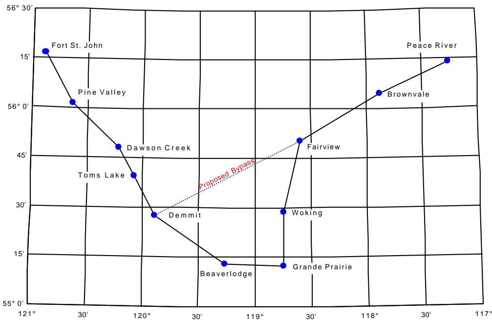
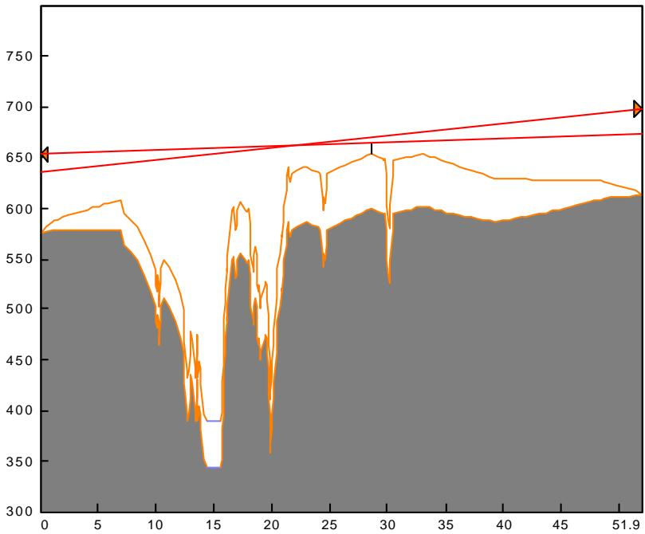
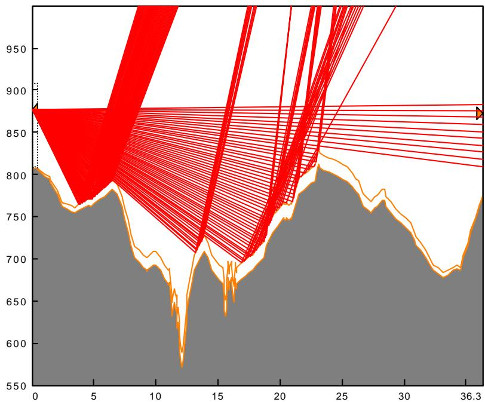
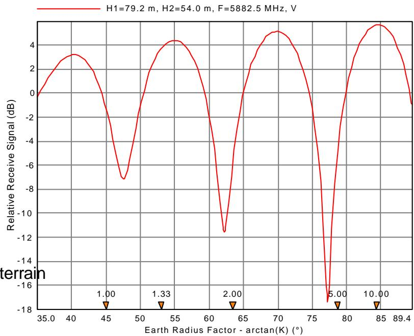
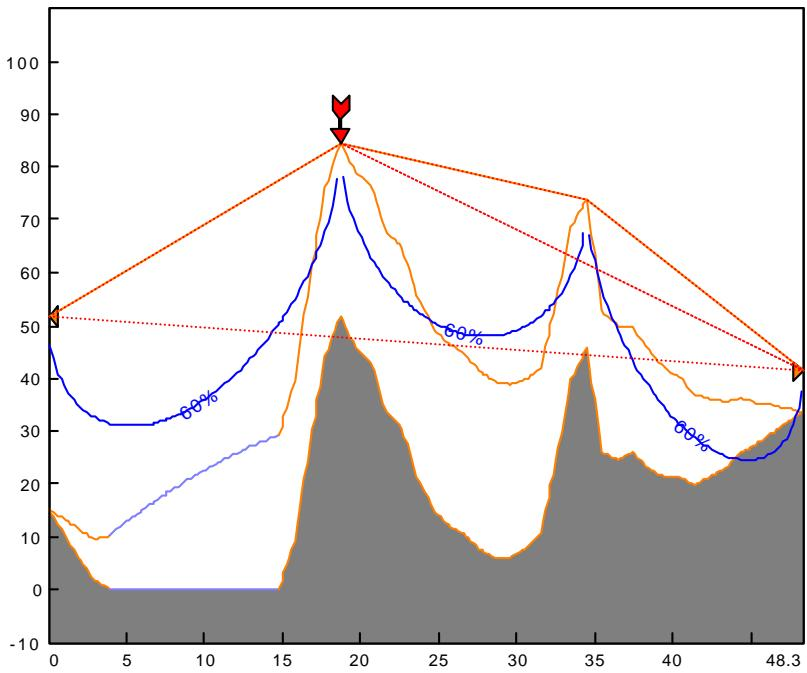
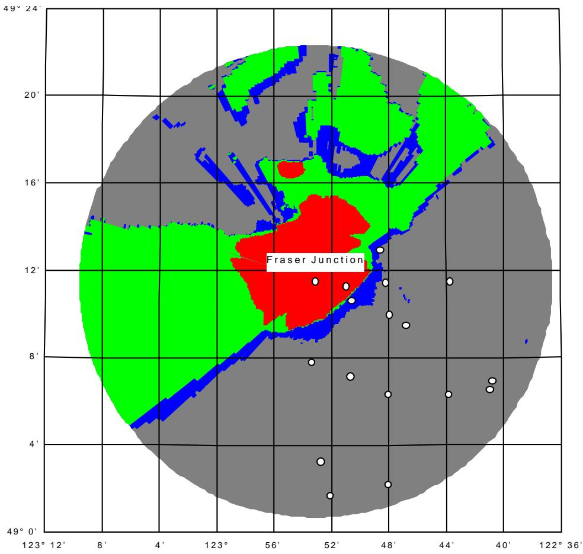
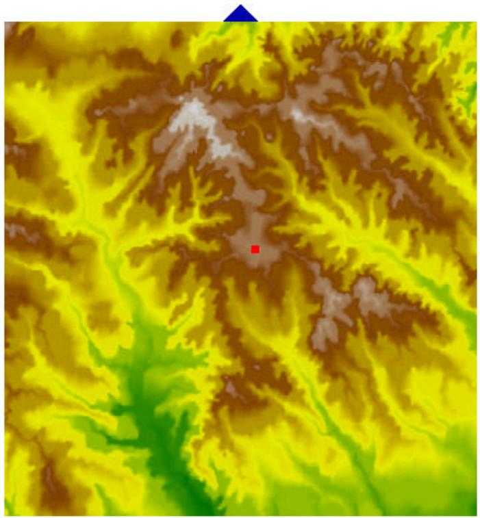

PROGRAM ORGANIZATION

NETWORK MODULE

SUMMARY MODULE 3

TERRAIN DATA MODULE 3

ANTENNA HEIGHTS MODULE 4

MICROWAVE WORKSHEET MODULE 5

VHF - UHF WORKSHEET MODULE 6

MULTIPATH MODULE

REFLECTION MODULE

DIFFRACTION MODULE 8

AREA COVERAGE MODULE 9

PRINT PROFILE MODULE 10

TERRAIN VIEW 10

SITE DATABASE 10

INTRA SYSTEM INTERFERENCE 11

ANTENNA and RADIO DATA FILES 11

TERRAIN DATABASES 13

REPORTS 14

LANGUAGE 14

DOCUMENTATION 14

# PROGRAM ORGANIZATION

The Pathloss program is a comprehensive path design tool for radio links operating in the frequency range from 30 MHZ to 100 GHz. The program is organized into eight path design modules, an area signal coverage module and a network module which integrates the radio paths and area coverage analysis. Switching between modules is accomplished by selecting the module from the menu bar. The functions and features of these modules are described in the following paragraphs.

# NETWORK MODULE

The Network module provides a geographic interface to the path design modules simply by clicking on the link between two sites. This feature significantly reduces the design effort on large projects. Intra system interference calculations are carried out in the Network module.

# Data Integrity

Managing change is a difficult task on any project. As the design proceeds, the network module tracks all changes made to the site names, coordinates and site elevations and ensures data integrity throughout all data files.

line

| Location | X (°) | Y (°) |
|---|---|---|
| Fort St. John | 121 | 15 |
| Pine Valley | 29 | 56 |
| Dawson Creek | 118 | 46 |
| Toms Lake | 120 | 33 |
| Demmit | 122 | 29 |
| Beaverlodge | 107 | 14 |
| Woking | 109 | 29 |
| Grande Prairie | 109 | 14 |
| Fairview | 109 | 46 |
| Brownvale | 118 | 56 |
| Peace River | 107 | 15 |

# Layers

Both links and sites can be assigned different layers to selectively work on different routing options or frequency bands.

# Drawing Scaling

Scaling options are provided to produce a workable display for several sites or networks with several thousand sites. Networks consisting of widely separated cities each with a high concentration of radio links are handled using a combination of scaling and layers.

# Importing Site Data

A project normally starts by entering a list of site names and coordinates. This can be carried out by importing comma delimited files from a spreadsheet or any text file. Sites and links can also be imported from the site database or by directly importing Pathloss data files.

# Link Labels

Labels can be drawn on the link lines between sites in either a free form or using predefined specifications which are updated from the individual pathloss data files. The predefined formats include

any combination of the following parameters:

TX channel ID

TX frequency

polarization

distance

azimuth

# Map Crossings

A map crossing report for a link itemizes the intersections in terms of the distance in inches / centimeters from the nearest corner of the map and the accumulated distance along the profile.

# Site List Report

This report provides a listing of site names, call signs, coordinates and elevations

# Equipment Summary Report - Microwave applications

This report reads the individual pathloss data files and generates an equipment summary.

# Frequency Plan Report - Microwave applications

This report reads the individual pathloss data files and generates a transmit and receive frequency assignment summary.

# SUMMARY MODULE

The Summary Module is the default startup display in the Pathloss program and provides the following functions:

provides a central location for the entry of path data parameters. Path calculations are carried out down to the receive signal level. The Worksheet module completes the propagation reliability analysis. Some items such as the site names and call signs can only be entered in this module. Other entries, such as antenna heights, can be changed in any design module in the program.   
provides the interface to the Pathloss site database for data entry and interference analysis.   
sets the application type as either microwave (point to point or point to multipoint) or VHF-UHF.

# TERRAIN DATA MODULE

A terrain profile is a prerequisite to access most design modules in the program. This consists of a table of distance and elevations between the two sites. Terrain profiles are created in this module using any of the following methods:

• manual entry of distances and elevations from topographic maps   
direct entry of distance - elevation data from topographic maps using a digitizing tablet   
conversion of distance - elevation data in text files from other sources   
distance-elevation data is read from a terrain database

The design has been optimized for manual data entry and editing. Single structures (trees, buildings or water towers) or ranges of structures can be added to the profile.

# Special Features

# Grid coordinate systems

Site coordinates can be entered as latitude and longitudes or in any of the grid coordinate formats listed below. Entry in either latitude-longitude format or grid format will automatically be converted to the other format.

UTM (Universal Transverse Mercator)

South African Gauss conformal

UK Ordinance grid

Gauss Kruger (soon)

Swiss national grid

New Zealand grid

Irish grid

# Transformation between Datums

Site coordinates can be transformed from one datum to another (e.g. NAD-27 to NAD-83). The program includes definitions for 120 different datums.

# Terrain Profile Modifications

Terrain profiles taken from topographic maps usually show flat top hills and valleys. These can be automatically enhanced by a specified percentage of the contour interval.   
The profile can be stretched or shrunk to match the distance calculated from the coordinates.   
Redundant points can be stripped from a terrain profile

# Survey Angles

Vertical angles from either site to any point on the profile can be calculated considering the instrument height and the value of K for light. The measured angle can be entered to shown the correction required to the elevation at the selected point.

# ANTENNA HEIGHTS MODULE

This module determines the antenna heights which satisfy a clearance criteria specified as an earth radius factor (K), a percentage of the first Fresnel zone radius and an optional fixed height. Two separate clearance criteria can be specified for both main and diversity antennas.

The antenna heights can be varied in any combination or the heights can be optimized based on the minimum value of the sum of the squares of the antenna heights.

# Special Features

# Structures

The location of the critical points may not be

area

| x    | Area Value | Line Value |
| ---- | ---------- | ---------- |
| 0    | 580        | 650        |
| 5    | 580        | 650        |
| 10   | 500        | 650        |
| 15   | 350        | 650        |
| 20   | 550        | 650        |
| 25   | 580        | 650        |
| 30   | 600        | 650        |
| 35   | 600        | 650        |
| 40   | 600        | 650        |
| 45   | 600        | 650        |
| 51.9 | 620        | 700        |

evident when the profile was created in the Terrain Data module. A structure can be added, edited or even moved directly in the Antenna Heights module.

# Calculating clearance on an existing path

The clearance criteria on an existing path can be determined interactively by entering a value of K or a percent of the first Fresnel zone radius. The other parameter will be calculated over the entire path.

# Clearance display

The clearance can be displayed at any point detailing the contributions of the controlling clearance criteria.

# Clearance and Orientation Reports

These reports show all points which are within a specified tolerance of the clearance criteria. The azimuthal and vertical angles are given along with the variation of the vertical angle for a range of values of K.

# Antenna height tradeoff reports

The antenna height at one site is varied in fixed increments and the corresponding antenna height at the other site is reported.

# MICROWAVE WORKSHEET MODULE

A complete transmission analysis is carried out in the Microwave Worksheet module. The data entry forms are accessed by clicking on an equipment icon. The worksheet is calculated and the results are displayed as the data entry proceeds.

# Reliability Methods

Multipath propagation reliability can be calculated using any of the following methods:

Vigants - Barnett © factor, climatic factor and terrain roughness). Terrain roughness is calculated over any segment of the profile reference to sea level or to a least squares fit of the terrain.   
ITU-R P.530-6 (path inclination, grazing angle and geoclimatic factor). The grazing angle is calculated by defining the dominant reflective plane on the profile)   
ITU-R P.530-7 (path inclination and geoclimatic factor)   
KQ factor   
KQ factor including terrain roughness. The frequency and distance exponents can be set for specific regional standards.

Propagation reliability can be expressed as availability or unavailability using the following conventions.

Total time below level for the worst month and annual basis.   
Worst month unavailability and severely errored seconds (SES) using the criteria that fades which last longer than 10 consecutive seconds are considered as system unavailability. The remaining time below level is considered as SES.

Diversity Improvement Systems

The following diversity improvement calculations are provided for baseband switching and IF combining systems.

Space diversity   
Angle diversity   
Frequency diversity for 1 for 1 and 1 for N systems   
Hybrid diversity - a frequency diversity system equipped with space diversity at one end.

# Rain Attenuation

Outage due to high intensity rain can be calculated using the Crane or ITU-R p.530 methods using any of the following rain statistics files:

Crane rain regions   
modified Crane rain regions (1966)   
ITU rain regions   
Canadian data for 47 radiosonde locations

# Passive Repeaters

Passive repeater links can be created using single/double rectangular reflectors or back to back antennas. A path can have up to three passive repeaters of any type. Separate path profiles are first created for each passive link and analyzed for clearance. The profiles are then merged together in the Microwave Worksheet module to form the complete passive design, including transmission and propagation reliability analysis.

# Templates

Data entry can be simplified by loading the equipment parameters from another pathloss data file. Any file can be used as a template.

# Lookup Tables

Lookup tables can be created for antennas, transmission lines, radios and TX channel assignments. Data can be imported from antenna and radio data files into a lookup table or directly into the worksheet.

# VHF - UHF WORKSHEET MODULE

A separate worksheet is available for applications in the VHF-UHF and cellular frequency ranges. The data entry format is tailored for the typical equipment specifications used in these applications.

Antenna gains in these frequency ranges are usually specified in dBd (dB above a theoretical dipole) and are mounted with a horizontal antenna boresight unlike microwave antennas which provide for vertical alignment. The transmission analysis considers the vertical and horizontal antennal angles using antenna data files.

The VHF-UHF Worksheet module includes lookup tables for antennas, radios and transmission lines and uses antenna data files. The template feature is also implemented for data entry convenience.

# MULTIPATH MODULE

Ray tracing techniques are employed to analyze the reflective characteristics of a path and to simulate abnormal propagation conditions. The display operates in two modes

# Constant Gradient

A curved earth representation is used and all rays are drawn as straight lines. The path of the reflected rays show the susceptibility of the path to a specular refection and helps identify the extents of the reflective plane. In this mode, the signal variation as a function of an antenna height can be displayed.

# Variable Gradient

The user defines the refractivity gradient or K as a function of height. The display uses a flat earth representation and the rays are drawn as curved lines.

area

| x    | Red Area | Orange Area |
| ---- | -------- | ----------- |
| 0    | 880      | 800         |
| 5    | 870      | 780         |
| 10   | 860      | 750         |
| 15   | 840      | 680         |
| 20   | 820      | 720         |
| 25   | 800      | 760         |
| 30   | 780      | 740         |
| 36.3 | 760      | 720         |

# Profile Formats

An instructional display which illustrates the concept of the effective earth radius is available in the multipath module. Profiles can be displayed in virtually any format.

# REFLECTION MODULE

The Reflection module analyzes the variation in receive signal level on paths whose geometry can support a specular reflection. The receive signal is calculated as a function of any of the following variables:

Site 1 antenna height

Frequency

Site 2 antenna height

Earth radius factor(K)

Tide level

The calculation starts by defining the end points of the reflective plane. The reflective plane can be constructed by any of the following means:

a least squares fit of the terrain over the defined range   
a plane defined only by the end points   
a constant elevation plane

The effects of divergence (the scattering of a reflected signal due to the curvature of the earth), roughness, ground cover and clearance loss can be included in the calculation. The antenna

line

| Earth Radius Factor - arctan(K) (°) | Relative Receive Signal (dB) |
| ---------------------------------- | ---------------------------- |
| 45                                 | -1.00                        |
| 53                                 | -1.33                        |
| 65                                 | 2.00                         |
| 78                                 | 5.00                         |
| 85                                 | 10.00                        |

discriminations are automatically factored into the results using the 3 dB beamwidths.

A dispersion worksheet shows a breakdown of the relative amplitude and delay of the reflected signal. Any of the parameters (frequency, antenna heights, K, beamwidths.. ) can be changed to determine the corresponding change in the reflected signal amplitude.

# DIFFRACTION MODULE

# Diffraction Algorithms

A diffraction loss calculation first characterizes the terrain using the following categories:

single knife edge   
near single knife edge or isolated obstacle   
multiple knife edge (using Epstein-Peterson or Deygout methods)   
foreground loss between an antenna and its horizon (height - gain)   
default irregular terrain (Longley-Rice) or rough earth diffraction

line

| x    | Blue Line | Orange Line | Gray Area |
| ---- | --------- | ----------- | --------- |
| 0    | 50        | 50          | 15        |
| 5    | 30        | 30          | 0         |
| 10   | 30        | 30          | 0         |
| 15   | 50        | 50          | 0         |
| 20   | 80        | 80          | 50        |
| 25   | 50        | 50          | 20        |
| 30   | 50        | 50          | 10        |
| 35   | 70        | 70          | 45        |
| 40   | 30        | 30          | 20        |
| 48.3 | 40        | 40          | 35        |

Three automatic diffraction algorithms are provided:

TIREMterrain integrated rough earth model   
NSMA National Spectrum Managers Association   
Pathloss a user configurable algorithm

Each of these algorithms follow a set of rules to characterize the terrain and are the basis of variable parameter calculations, area coverage and interference analysis.

On line of sight paths with less than 60% first Fresnel zone , the loss is determined using the following methods:

a series of isolated obstacles defined by the 60% Fresnel zone intersections with the terrain .   
Longley-Rice   
Longley-Reasoner

# Interactive Diffraction Loss Calculation

In addition to the three automatic algorithms, the user can analyze any portion of the path using any combination of the following basic algorithms:

<table><tr><td>knife edge</td><td>isolated obstacle (knife edge with a radius)</td></tr><tr><td>average diffraction</td><td>2 ray optics</td></tr><tr><td>height gain</td><td>Longley and Rice</td></tr></table>

This feature permits such computations as:

replacing otherwise irregular terrain with an effective obstacle   
determining the loss from a reflection point to either site.

# Tropospheric Scatter Loss - Combined Loss

On obstructed paths, tropospheric scatter loss is automatically calculated and combined with the diffraction loss.

# Time Variability

On non line of sight paths, the time variability of the transmission loss is analyzed using the statistical curves contained in Technical note 101. The complete set of these curves have been digitized into the program.

# Variable Parameters

Diffraction loss can be calculated as a function of any of the following parameters:

site 1 or site 2 antenna height

frequency

earth radius factor (K)

distance along the path

# AREA COVERAGE MODULE

An area coverage analysis requires a terrain data base. A completely automated 3 step process is used to create area coverage and line of sight displays.

Step 1 generates the radial terrain profile data

Step 2 calculates the combined diffraction and tropospheric scatter loss and the vertical angles along each radial.

Step 3 specifies the radio and antenna parameters, signal level criteria and the time and location variability constraints.

A calculation can be modified by returning to the appropriate step and changing the required parameters .The analysis considers the elevation angles on line of sight paths or the horizon angles on obstructed paths. Base station antennas can include mechanical down tilt.

geo

| Longitude | Latitude | Region |
| :--- | :--- | :--- |
| 52' | 12' | Fraser Junction |
| 48' | 16' | Fraser Junction |
| 44' | 8' | Fraser Junction |
| 40' | 12' | Fraser Junction |
| 36' | 16' | Fraser Junction |
| 56' | 12' | Fraser Junction |
| 52' | 16' | Fraser Junction |
| 48' | 8' | Fraser Junction |
| 44' | 12' | Fraser Junction |
| 40' | 16' | Fraser Junction |
| 36' | 8' | Fraser Junction |
| 52' | 12' | Fraser Junction |
| 48' | 16' | Fraser Junction |
| 44' | 8' | Fraser Junction |
| 40' | 12' | Fraser Junction |
| 36' | 16' | Fraser Junction |
| 52' | 12' | Fraser Junction |
| 48' | 16' | Fraser Junction |
| 44' | 8' | Fraser Junction |
| 40' | 12' | Fraser Junction |
| 36' | 16' | Fraser Junction |
| 52' | 12' | Fraser Junction |
| 48' | 16' | Fraser Junction (Green) |
| 44' | 8' | Fraser Junction (Blue) |
| 40' | 12' | Fraser Junction (Red) |
| 36' | 16' | Fraser Junction (Green) |
| 52' | 12' | White (White) |
| 48' | 16' | White (White) |
| 44' | 8' | White (White) |
| 40' | 12' | White (White) |
| 36' | 16' | White (White) |
| 52' | 12' | White (White) |
| 48' | 16' | White (White) |
| 44' | 8' | White (White) |
| 40' | 12' | White (White) |
| 36' | 16' | White (White) |
| 52' | 12' | White (White) |
| 52' | 16' | White (White) |
| 52' | 8' | White (White) |
| 52' | 12' | White (White) |
| 52' | 16' | White (White) |
| 52' | 8' | White (White) |
| 52' | 12' | White (White) |
| 52' | 8' | White (White) |
| 52' | 12' | White (White) |
| 52' | 8' | White (White) |
| 52' | 12' | White (White) |
| 52' | 8' | White (White) |
| 52' | 12' | White (White) |

The displays are presented as color coded radial lines or a solid color coded display. Both line of sight and signal level displays are available in either format.

# Multi Site Area Coverage

Both line of sight and signal coverage calculations can be imported into the network display to analyze multi site coverage. These can be selectively switched on and off to determine their effectiveness in the site selection process. Each site coverage display can be set to show either signal coverage or line of sight.

# PRINT PROFILE MODULE

Three common profile formats are provided:

a flat earth display with the earth radius factor (K) represented as secondary profiles above the flat earth. The Fresnel zones are displayed on the rays between the antennas. Four different values of K and Fresnel zone references can be displayed.

curved earth displays with either straight or curved horizontal axis are available using a single value of K with four Fresnel zone references.

On space diversity applications, different the Fresnel zone references can be specified for the main and diversity antenna combinations.

# Title Block

A optional title block can be included for project specific information.

# TERRAIN VIEW

A three dimensional terrain view is available in the Terrain Data and Network modules. In the Network module, the user simply defines a rectangular area on the screen to display the terrain. New sites can be added in the terrain view. The implementation is based on the Sun Microsystems OPENGL libraries supplied with Windows 95/98 and Windows NT.

# SITE DATABASE

All options of the program include an interface in the Summary and Network modules to a site database. Any number of site databases can be created. The examples section of the CD-ROM includes the complete microwave data base for Canada.

natural_image

Color-coded topographic or topographic map with yellow, green, and brown gradients, featuring a red square marker and a blue arrow (no text or symbols)

The database consists of the following Borland Paradox tables:

owners and operators

site records

station records

link records

transmit channel records

passive repeaters records

The table design has been optimized for interference calculations using the current pathloss data file against a site data base. The analysis is identical to the intra system interference analysis described in the following paragraph.

Due to the relationship between tables, it is not possible to simply transfer data from existing databases into the Pathloss site database. Contact CTE for additional information.

# INTRA SYSTEM INTERFERENCE

Interference calculations carry the analysis down to the composite threshold degradation of the victim receivers due to multiple interferers. In conjunction with the Microwave Worksheet you can see the effect of the interference on outage times. Antenna data files are used to determine antenna discriminations. The radio data files are used to calculate the filter improvement (interference reduction factor). If threshold to interference (T-I) or interference reduction factor curves, are available for the victim - interferer combination, these will be used. Otherwise, the transmit spectrum of the interferer will be convoluted against the receive selectivity. If these are not available, default masks will be used.

The Network module is used to calculate intra system interference. The calculation is made only for the sites and links on visible layers.

# Case Detail Report

This report shows a complete analysis for each interference case. All of the cases for each receiver are summarized and the composite threshold degradation is calculated. If an interference case is a OHLOSS candidate, the calculation can be carried out directly and the results are incorporated into the report. The radio and antenna data files used in the calculation can be displayed.

# Summary and Cross Reference Reports

Two versions of a summary report are available. The cross reference report is indented as a navigation aid to the more comprehensive case detail report.

# High-Low Violation Report

This report itemizes the frequencies used at each site and identifies any high-low violations in the frequency plan. The channel ID naming convention is used as the criteria for violation.

# ANTENNA and RADIO DATA FILES

# Microwave Antenna Data Files

A microwave interference analysis requires horizontal radiation pattern envelopes for the four polarization combinations (HH, VV, HV and VH). The same information is required for point to multipoint applications where the base antenna has a fixed orientation. This data is contained in separate antenna data files one for each antenna model. These files start as ASCII files following a standard format used by most antenna manufacturers and converted to a binary format inside the Pathloss program. The file contains the basic antenna specifications and the radiation pattern envelopes and can also include vertical radiation pattern

data.

At present, the program includes ASCII and binary antenna files for approximately 3500 microwave antenna models.

# Microwave Radio Data Files

In order to calculate the degradation of a digital receiver threshold in the presence of interfering signals of any bandwidth and modulation, the following parameters are required:

$1 0 ^ { - 6 }$ BER threshold   
threshold to interference ratio (T-I) for a like modulation and capacity cochannel interferer   
channel bandwidth   
3 dB bandwidth of the transmit spectrum

The following curves will be used if available:

transmitter spectrum versus frequency   
T-I ratio versus frequency for a like modulations and capacity interferer   
T-I ratio versus frequency for a CW interferer   
T-I ratio versus frequency for interferers with different modulations and capacities   
Interference reduction factor versus frequency for a like modulation and capacity interferer.   
Interference reduction factor versus frequency for interferers with different modulation and capacities

The above data and other general specifications is contained in radio data files. These files start as ASCII files and are converted to a binary format inside the Pathloss program. The binary file conversion will create default transmit spectrum and receive selectivity masks which will be used to determine the filter improvement if the required curves are not available.

At present, the program includes ASCII and binary radio data files for approximately 120 digital radio models from major manufacturers.

# Threshold-to-Interference (T-I) Ratio Definition

The T-I ratio is defined as the ratio of to the desired to the undesired signal power that degrades the digital receiver 10-6 BER threshold by 1 dB. The advantages of T-I are that the difference in thresholds, due to bit rate, modulation technique, and noise figure, are all taken into account.

Measurement of T-I for a digital radio is accomplished by fading the receiver to the 10-6 BER threshold point. The signal level is then increased by 1 dB and interference is injected until a BER of 10-6 is again achieved on the link. The ratio of the initial power level of the desired received signal to the interference power is the T-I ratio. Note that this value will be different for different interferers, especially if the interfering signal is offset in frequency from and/or has a wider spectrum than, the victim receiver’s bandwidth.

# VHF-UHF Antenna Data Files

Vertical and horizontal radiation patterns are required in an receive signal area coverage analysis and in a point to multipoint application where the base station antenna has a fixed orientation. This data is contained in separate VHF-UHF antenna data files one for each antenna model. These files start as ASCII files following the format proposed by the NSMA and are converted to a binary format inside the Pathloss program. The file contains the basic antenna specifications and the horizontal and vertical radiation pattern. Unlike the microwave antenna patterns which are envelope patterns, the patterns for the VHF-UHF antennas are typical patterns.

The program includes approximately 1500 VHF-UHF antenna data files for several manufacturers in the frequency range 50 to 2500 MHZ.

# TERRAIN DATABASES

A terrain database is required for area coverage analysis, OHLOSS calculations in interference analysis and the terrain view feature. Single path profiles can also be generated from a terrain data base

# Primary and Secondary Databases

The Pathloss program supports a primary and secondary database. This allows a high resolution database with partial coverage to be supplemented with a second database of lower resolution, but complete coverage. An example of this situation is the USGS 1 degree and 7.5 minute digital elevation models in the United States. The 1 degree DEM has a resolution of 3 arc seconds for latitudes less than 50E and has complete coverage. The 7.5 minute DEM has a 30 meter resolution. The coverage of the latter is not complete. One could specify the 7.5 minute DEM as the primary database and the 1 degree DEM as the secondary. A terrain profile would be generated from the 7.5 minute data, where it is available, and default to the 1 degree data if the required files are not available. The program creates a report on the primary and secondary file usage over the profile.

# Datum - Coordinate Transformation

If a database is based on the WGS84 datum, the users geographic coordinates will be automatically transformed to this datum for all database operations.

# Supported Terrain Database Formats

The following terrain data base formats are currently supported.

USGS 1:250,000 DEMS (3 arc second)   
USGS 30 and 10 meter data for 7.5 minute quad mapping   
USGS GTOPO30 global 30 arc second terrain data   
DTED (Digital terrain elevation data - US DMA format)   
CRC - Canadian Research Council)   
ESRI (ArcInfo) GRIDASCII in geographic and UTM formats   
South African National Exchange Standard   
MDT200 and MDT25 - Spain   
Odyssey Terrain data in UTM, Swiss, Irish and UK grid formats   
Phoenix -Airtouch Cellular format   
Micropath - 3 second terrain data   
AUSLIG - Australian 3 second terrain data

# Formats Under Development

USGS 30 and 10 meter data supplied in SDTS format   
UK Ordnance Survey   
MSI Planet   
DGM - Germany

Pathloss Terrain Data (soon - no charge upgrade)

Both the USGS 1:250,000 3 arc second DEMS and the GTOPO30 global 30 arc second terrain data are available at no charge from the USGS web site.

As a convenience to Pathloss users, the program ships with USGS GTOPO30 data for the world (except for the Antarctic region). The header and elevation data files are supplied in the native USGS format on two CD-ROMS.

For Pathloss users in the United States, the program ships with compressed 3 second terrain data for the United States and Alaska on a single CD-ROM. This data has been taken directly from the USGS 1:250,000 DEMS. The Pathloss program reads the compressed data directly.

# REPORTS

All modules include a report selection with a print preview showing the pagination and can include your company logo. The reports can be printed or copied as formatted text into your word processor. All of the profile screen displays can also be copied to create custom reports. Reports can be save in either RTF (Rich text format) or as ASCII text files.

# LANGUAGE

All documentation and help files are in the English Language. The program and all reports can be switched between English, French, Spanish or a user translation. All text used in the program is located in external ASCII files and can be edited by the user.

# DOCUMENTATION

Complete documentation is supplied which describes the operation of the program and the underlying theory. All formulas and references used in the program are given.

The documentation is not intended as a primer for radio path design.