# RAPID DEPIOTHENT

For high frequency networks

Automated network transmission design   
Dynamic network outage analysis   
Network stability testing for adaptive ATPC radios   
Composite interference analysis under simulated rain conditions

# RAPID DEPLOYMENT 3

# OVERVIEW 3

Standard Automatic Transmit Power Control . . 3

Adaptive Automatic Transmit Power Control . 3

Basic Procedure 4

# PRELIMINARY SETUP . 4

# RULES FILE . 5

File Header 7

Dual Polarized Antennas 7

Rain File - Rain Method - Availability Method - Rain Availability .

Antenna Priority . .

Outage Tolerance

Accumulate Threshold Degradation 7

Report Threshold Degradation . . 8

Clear Air Receive Level (Adaptive ATPC) . 8

Critical Threshold Degradation (Adaptive ATPC) . . 8

Call Sign Prefix 8

# PROCEDURE . 8

Setting the Rapid Deployment Mode 8

Setting the High - Low Frequency Plan . . . 9

Setting the Polarizations 9

Transmission Design . . . 10

Standard ATPC Radios . 10

Adaptive ATPC Radios . . 10

Clear Air Interference Analysis 11

Interference under Rain Conditions . 12

Single Rain Cell Location 13

Automatic Rain Cell Scan . . 14

Rain Cell Definition . . 15

Interfering Path Polarization 15

Generate Pathloss Data Files 15

Transmission Design Report . . 16

# EXAMPLES 18

Standard ATPC Example file 19

Set the High Low Frequency Plan . . 20

Set the Polarizations . . 20

Transmission Design . . 20

Clear Air Interference Analysis . . . . 21

Interference Under Rain Conditions . . 21

Generate Pathloss Data Files . . . 22

Adaptive ATPC Example file 22

Set the High Low Frequency Plan . . . . . . 23

Set the Polarizations . . . . 23

Transmission Design . . . 24

Clear Air Interference Analysis . . . . 24

Interference Under Rain Conditions . . . 25

Generate Pathloss Data Files . . . 25

# RAPID DEPLOYMENT

# OVERVIEW

A network design begins by creating Pathloss data files for the individual links. Typically, this consists of the following steps:

set antenna heights   
enter equipment parameters   
calculate the availability due to multipath and rain fading.

The overall network performance can then be analyzed in terms of the receiver threshold degradations. On large high frequency networks, this approach has several limitations.

The network connectivity is the limiting factor in the overall performance. Changing the network configuration requires new Pathloss data files. This can become very tedious in dense networks.   
Performance under rain conditions is not completely determined, as the rain attenuation relative to the desired and interfering paths is not known. The designer is always confronted with the decision to use the thermal or flat fade margin (thermal plus interference). In many cases, the performance objectives cannot be met if the worst case flat fade margin is used.   
Instability can occur on networks using adaptive automatic transmit power control. The transmit power will increase to overcome threshold degradation. This power increase may result in new interference cases and produce a runaway situation.

With the introduction of the Rapid Deployment feature in the January 2000 program build, an attempt has been made to address these limitations. Two general classes of radio equipment are supported:

# Standard Automatic Transmit Power Control

The transmit power is controlled by the receive signal level only. The power level used in a clear air interference calculation is the maximum power minus the ATPC range. Under rain conditions the power will increase to compensate for the rain attenuation on the path up to the maximum value.

# Adaptive Automatic Transmit Power Control

The transmit power is controlled by both the receive signal level and signal quality (bit error rate). These radios have a high ATPC range in the order of 50 dB. Under clear air conditions, the transmit power is set to produce a receive signal slightly above threshold (determined by a bit error rate in the order of 10-12). The transmit power is automatically adjusted to maintain this bit error rate for both changes in path attenuation due to rain and threshold degradation due to interference. This arrangement allows for very dense networks; however, instabilities can occur. A network stability test is performed by running the interference calculation a number of times. At the end of each iteration, the transmit power is increased to overcome the threshold degradation. The iterations will terminate if no changes have occurred, and the network is deemed to be stable. If a transmit power has changed at the end of a run, the network is assumed to be unstable.

# Basic Procedure

The rapid deployment procedure is carried out in the network module using parameters and options contained in a rules file. The basic procedure is summarized below:

Enter the sites into the network module. The site data can be imported from text \ CSV files , MapInfo link (mif) files, the site data base or existing Pathloss data files.

Link up the sites. In metropolitan areas, this step usually requires a field visit to determine the line of sight possibilities. The January 2000 program build includes topographic backgrounds for the network display. The ARCINFO GRIDASCII database, with imbedded building data, can be used to position and link up sites.

Invoke the Rapid Deployment procedure. This menu selection brings up a tool bar with a button for each of the remaining steps. The rules file is loaded and validated.

Set the high low frequency plan. This step identifies one site as a high frequency site. All other connected sites will be automatically set. The site legend color identifies the high and low frequency assignment.

Set the polarizations. Polarizations are toggled between vertical and horizontal by simply clicking on the links. The link color identifies the polarization.

Transmission design. This step creates two database tables for the transmitters and receivers. An error summary is issued for links which fail to meet the design criteria specified in the rules file.

Interference analysis. Threshold degradation and outage tests are carried out under clear air conditions or with a simulated rain cell. The rain cell can be scanned over the entire network.

Generate Pathloss data files. This final step creates individual Pathloss data files for the links in the network display. This would be carried out only after the overall network performance is judged to be acceptable.

# PRELIMINARY SETUP

Create a project directory or folder. A separate directory is required for each project. This directory will contain the following files:

```txt
network file (gr4)
rules file (rules.r_d)
database tables for the transmitters, receivers and interference calculations
Pathloss data files will be created in this directory 
```

There are some restrictions on the directory name due to limitations in the BDE database engine. The full path name of the directory cannot include spaces or international characters.

The frequency plan and polarization use predefined colors for the site legends and link lines. Any user defined colors will be replaced. Do not carry out any drawing customization before the analysis has been completed..

The parameters and options used in the design and interference analysis are contained in the file RULES.R\_D which must be located in the project directory. This is an ASCII text file containing a series of mnemonics and values. The file format is described in the following section.

# RULES FILE

This file must be named "RULES.R\_D" and be located in the same directory as the network data file (gr4). The file consists of a series of mnemonics followed by a value separated by one or more spaces. The file format is described in the following table. An asterisk (\*) in the $3 ^ { \mathrm { r d } }$ column denotes that a value must be provided.

<table><tr><td>Mnemonic</td><td>Typical Value</td><td>*</td><td>Description</td></tr><tr><td colspan="2">PL40_RAPDEP_ADAPTIVE_ATPCPL40_RAPDEP_STANDARD_ATPC</td><td>*</td><td>File header sets the method to either adaptiveATPC or standard ATPC</td></tr><tr><td>RX_THRESHOLD_DBM</td><td>-76.0</td><td>*</td><td>receiver threshold level (dBm)</td></tr><tr><td>RX_THRESHOLD_CRIT</td><td>10-3 BER</td><td></td><td>receiver threshold criteria (text)</td></tr><tr><td>HI_POWER_DBM</td><td>27.0</td><td></td><td>transmitter high power option</td></tr><tr><td>LO_POWER_DBM</td><td>17.0</td><td>*</td><td>transmitter low power option</td></tr><tr><td>ATPC_RANGE_DB</td><td>50.0</td><td>*</td><td>automatic transmit power control range</td></tr><tr><td>MAX_RXSIG_DBM</td><td>-20.0</td><td></td><td>maximum RX signal (dBm)</td></tr><tr><td>RADIO_CODE</td><td>adp_atpc</td><td>*</td><td>microwave radio code</td></tr><tr><td>ANTENNA_CODE1</td><td>hplp1-38</td><td>*</td><td>low gain antenna code</td></tr><tr><td>ANTENNA_CODE2</td><td></td><td></td><td>high gain antenna code</td></tr><tr><td>DUAL_POLARIZED</td><td>0</td><td>*</td><td>1 - dual polarized0 - single polarized</td></tr><tr><td>ANTENNA_PRIORITY</td><td>1</td><td>*</td><td>1 - change antennas first0 - change transmitter power first</td></tr><tr><td>TX_LOSS_DB</td><td></td><td></td><td>optional transmit side loss (dB)</td></tr><tr><td>RX_LOSS_DB</td><td></td><td></td><td>optional receive side loss (dB)</td></tr><tr><td>FREQUENCY_LO_MHZ</td><td>38600</td><td>*</td><td>low transmit frequency (MHZ)</td></tr><tr><td>FREQUENCY_HI_MHZ</td><td>39300</td><td>*</td><td>high transmit frequency (MHZ)</td></tr><tr><td>CHANNELID_LO</td><td>1AL</td><td></td><td>low channel identifier (text)</td></tr><tr><td>CHANNELID_HI</td><td>1AH</td><td></td><td>high channel identifier (text)</td></tr><tr><td>RAIN_FILE</td><td>c:\plw40\..\cran96d3.rai</td><td>*</td><td>full path name of the rain statistics file</td></tr><tr><td>RAIN_METHOD</td><td>1</td><td>*</td><td>1 - Crane0 - ITU 530</td></tr><tr><td>AVAILABILITY_METHOD</td><td>1</td><td>*</td><td>1 - annual0 - worst month</td></tr><tr><td>RAIN_AVAILABILITY</td><td>99.999</td><td>*</td><td>availability (annual or worst month)</td></tr><tr><td>RNCELL_INRADIUS_KM</td><td>2.5</td><td>*</td><td>rain cell inner radius (km)</td></tr><tr><td>RNCELL_OUTRADIUS_KM</td><td>3.0</td><td>*</td><td>rain cell outer radius (km)</td></tr><tr><td>RNCELL_XYINC_KM</td><td>2.0</td><td>*</td><td>rain cell scan increment (km)</td></tr><tr><td>RELIABILITY_METHOD</td><td>1</td><td>*</td><td>1 - Vigants0 - ITU 530-7</td></tr><tr><td>C_FACTOR</td><td>4.0</td><td></td><td>C factor - required for Vigants only</td></tr><tr><td>GEOCLIM_FACTOR</td><td>2.5E-06</td><td></td><td>geoclimatic factor - required for ITU 530-7 only</td></tr><tr><td>ACCUMULATE_THRDEG_DB</td><td>0.1</td><td>*</td><td>minimum threshold degradation to be accumulated in the composite value (dB)</td></tr><tr><td>REPORT_THRDEG_DB</td><td>1.0</td><td></td><td>minimum reporting threshold degradation</td></tr><tr><td>GENERATE_PROFILES</td><td>0</td><td>*</td><td>1 - generate path profiles0 - do not generate</td></tr><tr><td>PROFILE_DIST_INC_M</td><td>100</td><td></td><td>profile distance increment (meters)</td></tr><tr><td>OUTAGE_TOLERANCE_DB</td><td>3.0</td><td>*</td><td>outage = flat fade margin &lt; outage tolerance</td></tr><tr><td>MAXDIST_KM</td><td>50.0</td><td></td><td>maximum V-I distance (km)</td></tr><tr><td>CALL_SIGN_PREFIX</td><td>OR</td><td></td><td>call sign prefix</td></tr><tr><td colspan="4">The following mnemonics only apply to adaptive automatic transmit power control radios</td></tr><tr><td>CLRAIR_RXLEVEL_DBM</td><td>-69</td><td>*</td><td>clear air receive level</td></tr><tr><td>CRITICAL_THRDEG_DB</td><td>2</td><td>*</td><td>critical threshold degradation (dB)</td></tr></table>

On optional fields, if a value is not specified, then it will be ignored. Alternately, use a double forward slash // in front of the mnemonic to ignore the complete line. This // can also be used to add comments to a file. Additional information on the mnemonics is given below:

# File Header

The first line in the file must be either PL40\_RAPDEP\_ADAPTIVE\_ATPC or

PL40\_RAPDEP\_STANDARD\_ATPC. The former specifies design rules for radios using adaptive automatic transmit power control. The latter specifies design rules for radios using standard ATPC. The design procedures for the two types are radically different.

# Dual Polarized Antennas

Some radio designs utilize dual polarized antennas to achieve the transmitter to receiver isolation. In these cases, vertical polarization means “transmit high vertical and receive low horizontal”. Horizontal polarization means “transmit high horizontal and receive low vertical”. The performance is asymmetrical on a dual polarized radio.

Most radios are single polarized and the DUAL\_POLARIZED mnemonic will be set to 0.

# Rain File - Rain Method - Availability Method - Rain Availability

The full path name of the rain file must be specified. e..g c:\plw40\rain\crane\_96\cran96\_f.rai. The rain file is loaded and verified when the rapid deployment procedure is started.

The rain method must be specified as 1 for Crane or 0 for ITU-530 .

The availability method is set to 1 for total annual or 0 for the worst month. If the worst month is used, the rain availability will be converted to an annual value with the equation below:

$$
P _ {a n n u a l} ^ {\prime} 0. 3 @ P _ {w o r s t m o n t h} ^ {1. 1 4 9}
$$

# Antenna Priority

This setting is applicable if the rules file contains high and low transmit power options and high and low gain antenna codes. The transmission design starts with the low power option and the low gain antenna code. If the required availability is not met, an iterative procedure is used to increase the antenna gains and transmit powers. The Antenna Priority determines if the antennas or the transmit powers will be changed first.

# Outage Tolerance

A receiver outage test is performed after each interference calculation as follows:

flat fade margin = receive signal - receiver threshold level - composite threshold degradation If the flat fade margin is less than the specified outage tolerance, an outage is reported.

# Accumulate Threshold Degradation

An interference calculation determines the composite threshold degradation for each receiver and considers all transmitters in the network. If the threshold degradation due to one interfering transmitter is less than the specified Accumulate Threshold Degradation, then that interferer will be ignored. A value of 0.5 dB will be adequate for most cases.

# Report Threshold Degradation

The interference reports show the composite threshold degradation of each receiver and lists the specific interferers involved. In some network configurations, a large number of cases could result, if a small value of Accumulate Threshold Degradation was specified. The Report Threshold Degradation acts as a filter and will only report interference cases equal to or greater than the specified value.

# Clear Air Receive Level (Adaptive ATPC)

This is the receive signal level under clear air conditions and no interference. The power reduction is calculated for this receive signal level and sets the initial power to be used in an interference calculation.

# Critical Threshold Degradation (Adaptive ATPC)

When a receiver experiences threshold degradation, the associated transmitter does not respond until the critical threshold degradation is reached. Beyond this level, the transmit power will increase on a dB for dB basis. For example, if the composite receiver threshold degradation is 6.5 dB and the critical threshold degradation is 3 dB, then the power increase will be 3.5 dB.

# Call Sign Prefix

Interference calculations use unique call signs as station identifiers. These are automatically created using the site sequence number (e.g. 001, 002 ..). If the CALL\_SIGN\_PREFIX mnemonic, contains an entry this will be used (e.g. ORL001, ORL002 ..).

# PROCEDURE

# Setting the Rapid Deployment Mode

Select Interference - Rapid Deployment on the Network menu bar. This selection is grayed under the following conditions:

the database engine has not been initialized. This is an installation problem.

the network file has not been saved or there are no sites.

The program attempts to load the file RULES.R\_D in the network file directory. The file is

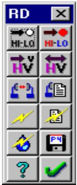

<details>
<summary>text_image</summary>

RD
HI-LO
HI-LO
V
V
(*)
P-V
?
</details>

validated using the following criteria:

the required parameters must be specified   
the rain file must exist   
the antenna code(s) must be found and loaded   
the radio code must be found and loaded. The directories for the antenna and radio codes must be correctly set. (Configure - Directories - Microwave Antenna Codes / Microwave Radio Codes).

Once the parameters have been successfully verified, the rapid deployment tool bar is displayed. To close the rapid deployment mode, click on the tool bar close button or select Interference - Rapid Deployment again.

Note that if the user modifies the rules file, while in rapid deployment mode, then it will be necessary to close the tool bar and then re-select rapid deployment for the new rules to take effect.

# Setting the High - Low Frequency Plan

The site legend color is used to identify the high-low frequency plan. The colors are predefined using red for high and blue for low. This is a two step procedure. First click the reset hi-lo button . This will set all site legends to an unfilled black color. This signifies that the frequency assignment has not been made.

Then click the set hi-lo button . The cursor will change to indicate a hi-lo selection is in progress. Select a high frequency site and click the left mouse button on its legend. This will cancel the hi-lo selection mode. All other connected sites will be automatically assigned a high or low color identification.

If there are several independent sections in the network, click the set hi-lo button again and identify a high site in the remaining sections.

A high - low violation will occur in a ring configuration with an odd number of sites. An error message is issued and the network connections must be revised to continue. One way of handling this is to split the offending site into two sites with slightly shifted coordinates. There cannot be a link between the two sites.

# Setting the Polarizations

Polarizations are identified by the link line color. Black designates vertical polarization and violet designates horizontal polarization.

If a dual polarized antenna is used, black designates transmit vertical on the high frequency and transmit horizontal on the low frequency. Violet designates the opposite (transmit vertical low and transmit horizontal high.

Click the reset polarization button to set all links to vertical polarization (black lines)

Click the set polarization button . The cursor will change to indicate a polarization selection is in progress. To toggle a polarization between vertical and horizontal, click the left mouse button on the link.

Click the right mouse button anywhere on the display to cancel the polarization setting mode.

# Transmission Design

Click the transmission design button to set the transmission parameters for all the links on the network display. This step must be repeated if the rules file, network connectivity, polarization or the hi - lo frequency plan is changed. Two database tables are created in this step for transmitters and receivers. These will be used to run an interference calculation and to generate the individual pathloss data files. When the design calculation is complete, an error log is displayed which summarizes any performance discrepancies. The error log uses the standard windows Notepad.

The thermal fade margin required to meet the rain availability is first calculated. On dual polarized radios, both directions of transmission are considered. Multipath fading is assumed to be negligible.

Starting with the low power and low antenna gain options, the design determines the power and antenna options required to meet the thermal fade margin using an iterative procedure. The antenna priority option determines if antennas or transmit powers are changed first.

Specific considerations for standard ATPC radios and adaptive ATPC radios are given below:

# Standard ATPC Radios

The basic calculation is as follows:

required receive signal = receiver threshold level

\+ required fade margin

actual receive signal = transmit power

- TX loss - RX loss   
+ antenna gains   
- free space loss   
- atmospheric absorption loss

An error message is logged if the required receive signal cannot be met with the highest power and antenna gain options. If the actual receive signal is greater than the maximum receive signal level minus the ATPC range, an error message is also logged.

# Adaptive ATPC Radios

The design power is the power which will exactly meet the availability and is calculated as follows:

design transmit power = receiver threshold level

\+ required thermal fade margin

+ TX loss + RX loss   
- antenna gains   
+ free space loss   
+ atmospheric absorption loss

If the design transmit power cannot be met with the antenna and power options, an error message will be logged and the transmit power will be set to the maximum value.

The power reduction to reduce the receive signal to the clear air value is then calculated. The design power minus the power reduction is the initial power value used in an interference calculation. If the total power reduction below the maximum power is greater than the ATPC range, an error message is logged.

# Clear Air Interference Analysis

Once the transmission design is complete, the cochannel interference can be calculated. The basic procedure is identical to that described in the Interference section of the manual. Click clear air interference button to start the calculation. The composite threshold degradation of each receiver is calculated considering all transmitters.

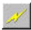

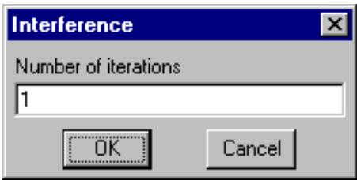

<details>
<summary>text_image</summary>

Interference
Number of iterations
1
OK Cancel
</details>

For adaptive ATPC radios, the user is prompted to enter the number of iterations. At the end of each run the transmit powers will be increased if the associated receiver threshold degradation has exceeded the critical value. The iterations will continue to completion unless no changes to any transmit power have occurred.

The following criteria are used to register an interference case:

the interfering transmit frequency must be the same as the victim receive frequency (cochannel)   
" the distance between the interferer and victim must be less than the value of MAXDIST\_KM specified in the rules file.   
the victim receiver threshold degradation for a single interfering transmitter must be greater than the value specified by ACCUMULATE\_THRDEG\_DB in the rules file.

The report is automatically displayed on completion of the calculation. To return to a report, click the report button . A sample report is shown below.

Interference - Clear air conditions (rapdep\_s.gr4)

<table><tr><td>Maximum V-I distance (mi)</td><td>50.00</td><td>pwr</td><td>TX power (dBm)</td></tr><tr><td>Minimum threshold degradation (db)</td><td>0.50</td><td>v-i</td><td>Victim to interferer path length (mi)</td></tr><tr><td>Minimum interference level (dBm)</td><td>-96.27</td><td>tad</td><td>Total antenna discrimination (dB)</td></tr><tr><td>Minimum report threshold degradation (dB)</td><td>1.00</td><td>ifl</td><td>Interfering Signal (dBm)</td></tr><tr><td>Design availability (%)</td><td>99.9990</td><td>td</td><td>Threshold Degradation (dB)</td></tr><tr><td>Total number of cases calculated</td><td>6</td><td>*</td><td>OHLOSS</td></tr></table>

Case 1 sd02 (a = 266.9° sd05), VHPX4-220A, 23600V, td = 6.95

1-1 sd03 (a = 135.5° sd02), VHPX4-220A, 23600V, pwr = 17.0 (27.0)

v-i = 6.3, tad = 50.1 (i 0.0° v 48.6°), ifl = -81.2 (-15.1), td = 6.95

Case 2 sd05 (a = 86.9° sd02), VHPX4-220A, 22600V, td = 7.83

2-1 sd02 (a = 315.5° sd03), VHPX4-220A, 22600V, pwr = 17.0 (27.0)

v-i = 5.8, tad = 50.1 (i -48.6° v 0.0°), ifl = -80.1 (-16.2), td = 7.83

The first line of each case gives the victim receiver details. The azimuth and the coordinate transmitter are shown in brackets. The line also includes the antenna model, frequency, polarization and the composite threshold degradation.

The interfering transmitters are listed below the receiver using two lines for each. The first line gives the azimuth and coordinate receiver in brackets followed by the antenna model, frequency, polarization and transmit power. The transmit power is formatted as follows:

# Adaptive ATPC radios

a) design power minus the power reduction   
b) maximum power   
c) the power value used in the last iteration of the interference calculation. If this is the same as (a), then its associated receiver did not exceed its critical threshold degradation.

# Standard ATPC radios

a) design power minus the ATPC range   
b) maximum power

The second line lists the following parameters:

victim to interferer path length   
the total antenna discrimination with the interferer and victim discrimination angles in brackets   
the interfering level with the difference between the objective and interfering level in brackets   
the receiver threshold degradation due to this transmitter   
an \* designates that the interfering path could be blocked and is a candidate for an OHLOSS calculation

A receiver outage report follows the threshold degradation summary. If the flat fade margin is less than the outage tolerance, an outage is reported.

# Interference under Rain Conditions

Click the interference - rain button to start the calculation.

For adaptive ATPC radios, the rain calculation dialog includes the number of iterations to run. Note that the outage calculation for adaptive ATPC radios is meaningless unless several iterations are specified. This is necessary to allow an increase in the transmit powers to overcome the interference.

The calculation can be made for either a fixed rain cell location or an automatic

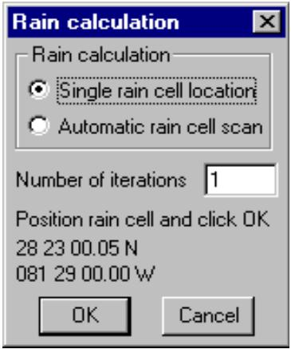

<details>
<summary>text_image</summary>

Rain calculation
Rain calculation
● Single rain cell location
○ Automatic rain cell scan
Number of iterations 1
Position rain cell and click OK
28 23 00.05 N
081 29 00.00 W
OK Cancel
</details>

rain cell scan over the network.

# Single Rain Cell Location

Select the single rain cell location option. Position the rain cell on the network by holding down the left mouse button on the network display and moving the rain cell to the desired location. Click OK to run the calculation. A sample report is shown below:

Interference - Single rain cell location (rapdep\_s.gr4) 

<table><tr><td>Maximum V-I distance (mi)</td><td>50.00</td><td>pwr</td><td>TX power (dBm)</td></tr><tr><td>Minimum threshold degradation (db)</td><td>0.50</td><td>v-i</td><td>Victim to interferer path length (mi)</td></tr><tr><td>Minimum interference level (dBm)</td><td>-96.27</td><td>tad</td><td>Total antenna discrimination (dB)</td></tr><tr><td>Minimum report threshold degradation (dB)</td><td>1.00</td><td>ifl</td><td>Interfering Signal (dBm)</td></tr><tr><td>Design availability (%)</td><td>99.9990</td><td>td</td><td>Threshold Degradation (dB)</td></tr><tr><td>Design rain rate (mm/hr)</td><td>70.70</td><td></td><td></td></tr><tr><td>Total number of cases calculated</td><td>4</td><td>*</td><td>OHLOSS</td></tr><tr><td>Rain cell inner radius (mi)</td><td>4.97</td><td>rr</td><td>Rain Rate (mm/hr)</td></tr><tr><td>Rain cell outer radius (mi)</td><td>7.46</td><td>ra</td><td>Rain Attenuation (dB)</td></tr></table>

Rain cell location 34 12 30.47 N - 118 45 00.00 W   
Case 1 sd02 (a = 266.9° sd05), VHPX4-220A, 23600V, td = 4.82   
1-1 sd03 (a = 135.5° sd02), VHPX4-220A, 23600V, pwr = 27.0 (27.0), rr = 9.0, ra = 12.3   
v-i = 6.3, tad = 50.1 (i 0.0° v 48.6°), rr = 9.0, ra = 12.9, ifl = -84.0 (-12.2), td = 4.82

The first line of each case gives the victim receiver details. The azimuth and the coordinate transmitter are shown in brackets. The line also includes the antenna model, frequency, polarization and the composite threshold degradation.

The interfering transmitters are listed below the receiver on two lines for each. The first line gives the azimuth and coordinate receiver in brackets followed by the antenna model, frequency, polarization and transmit power. The rain rate and rain attenuation on the interfering transmitter’s operating path are also given. The rain attenuation is calculated using the polarization of the transmitter. The transmit power is formatted as follows:

# Adaptive ATPC radios

a) design power minus the power reduction plus the rain attenuation. If this value exceeds the maximum power, then the maximum power is used.   
b) maximum power   
c) the power value used in the last iteration of the interference calculation. If this is the same as (a), then its associated receiver did not exceed its critical threshold degradation.

# Standard ATPC radios

a) design power minus the ATPC range plus the rain attenuation. If this value exceeds the maximum power, then the maximum power is used.   
b) maximum power

The second line lists the following parameters:

l victim to interferer path length   
the total antenna discrimination with the interferer and victim discrimination angles in brackets

rain rate and rain attenuation on the interfering path. Note that rain attenuation is always calculated using circular polarization on interference paths.   
the interfering level with the difference between the objective and interfering level in brackets   
the receiver threshold degradation due to this transmitter   
" an \* designates that the interfering path could be blocked and is a candidate for an OHLOSS calculation   
The receiver outage report follows the threshold degradation summary.

Receiver Outage Report (outage tolerance = 2.0 dB)

1 sd02 (sd05), 23600V, pwr = 27.0, td = 4.8, rr = 62.0, ra = 49.5, npl = 49.0, ffm = -0.3

A outage is reported when the flat fade margin is less than the outage tolerance defined in the rules file. The flat fade margin is calculated from the following terms.

```txt
flat fade margin (ffm = -0.3) = transmit power (pwr = 27.0)
- net path loss (npl = 49.0)
- rain attenuation (ra = 49.5)
- receiver threshold level (-76 dBm defined in the rules file)
- threshold degradation (td = 4.8) 
```

# Automatic Rain Cell Scan

Select the automatic rain cell scan option and click OK. The rain cell starts at the north - west corner of the network display and moves from west to east at the increment specified in the rules file.

The rain cell must intersect at least one radio link to calculate.

At each location an interference / outage calculation is carried out. The worst interference and outage is reported along with the location of the rain cell for those conditions. A sample report is shown below:

Interference - Automatic rain cell scan (rapdep\_s.gr4)

```txt
Maximum V-I distance (mi) 50.00 pwr TX power (dBm)
Minimum threshold degradation (db) 0.50 v-i Victim to interferer path length (mi)
Minimum interference level (dBm) -96.27 tad Total antenna discrimination (dB)
Minimum report threshold degradation (dB) 1.00 ifl Interfering Signal (dBm)
Design availability (%) 99.9990 td Threshold Degradation (dB)
Design rain rate (mm/hr) 70.70
Total number of cases calculated 16 *
OHLOSS
Rain cell inner radius (mi) 4.97 rr Rain Rate (mm/hr)
Rain cell outer radius (mi) 7.46 ra Rain Attenuation (dB)
Rain cell scan increment (mi) 3.11 
```

```txt
Case 1 sd01 (a = 228.4° sd02), VHPX4-220A, 22600V, td = 2.15
Number of exposures 2 Rain cell location 34 22 30.83 N - 118 45 00.00 W
Case 2 sd08 (a = 244.3° sd01), VHPX2-220A, 23600V, td = 1.06
Number of exposures 1 Rain cell location 34 20 00.74 N - 118 45 00.00 W 
```

The victim receiver line is identical in all reports. The threshold degradation is the worst value calculated in the

rain cell scan. The second line gives the number of exposures and the location of the rain cell.

Receiver Outage Report (outage tolerance = 2.0 dB)

1 sd02 (sd01), 23600V, pwr = 27.0, td = 0.0, rr = 70.7, ra = 55.1, npl = 49.1, ffm = -1.2

Rain cell location 34 17 30.32 N 118 35 58.14 W

2 sd02 (sd05), 23600V, pwr = 27.0, td = 0.0, rr = 70.7, ra = 54.7, npl = 49.0, ffm = -0.7

Rain cell location 34 15 00.53 N 118 41 59.47 W

The outage report format is identical to the single rain cell calculation with the addition of the rain cell location. The worst case outage is the minimum flat fade margin value. Note that worst case outage does not necessarily correspond to the worst case threshold degradation.

# Rain Cell Definition

A rain cell is defined as two concentric circles in the rules file. The rain rate in the inner circle is constant at the value determined from the rain availability. The rain rate at the outer circle is zero and varies linearly to the maximum value at the inner circle radius. The rain rate of a path which intersects the rain cell is computed as the line integral over the length of the path (L).

$$
\text { rain   rate } ^ {\prime} \frac {1}{L} _ {0} ^ {L} r r (l) d l
$$

# Interfering Path Polarization

In general, the polarization of a signal which is not on the antenna boresight is indeterminate. The rain attenuation of all interfering paths is calculated using circular polarization. The regression coefficients for circular polarization are calculated according to ITU-R P.838-1

$$
\text {``} _ {C} \cdot \frac {\left(\text {``} _ {V} \% \text {``} _ {H}\right)}{2}
$$

$$
_ {C} \cdot \frac {\left(“ _ {V} @ _ {V} \% ” _ {H} @ _ {H}\right)}{2 @ _ {C}}
$$

# Generate Pathloss Data Files

Click the button to generate the pathloss data files for the network display. These will be saved in the project directory. The parameters are taken from the rules file and the values calculated in the transmission design step.

The file naming convention is based on the call signs. The network is updated with these file names and the individual design modules can be accessed by clicking on the associated link on the network display.

# Transmission Design Report

Click the button to bring up the transmission design report. The report format is user configurable and the output is written to a comma delimited file (CSV) which then can be opened with a spreadsheet program such as Excel. A selection list is first presented to the user. Note that the choice will be affected by one or two lines per link option setting.

Select items from the available list box and transfer them to the Selected list box with the single arrow button > The double arrow button transfers all available items.

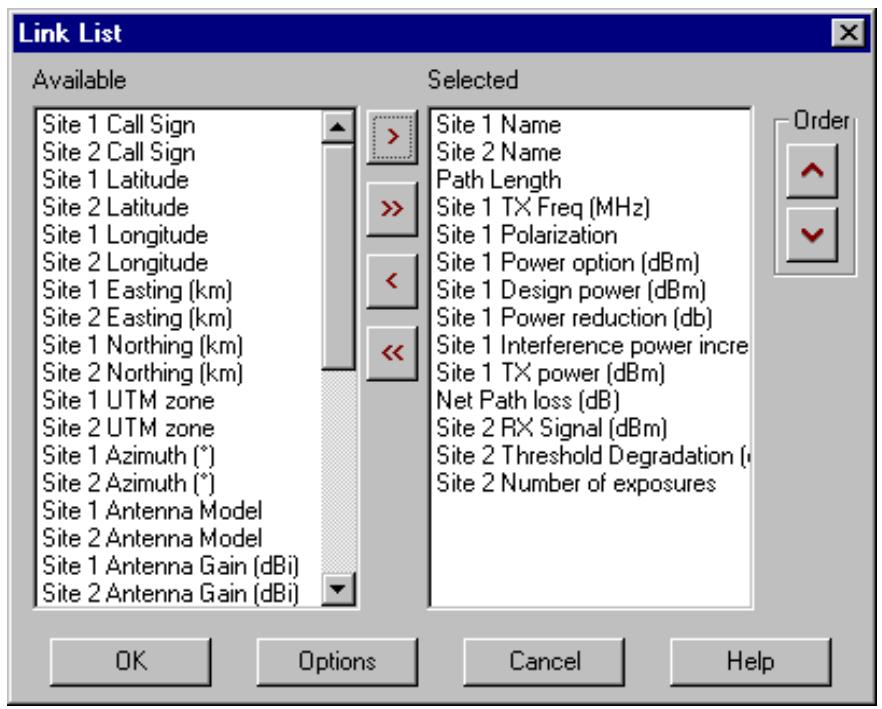

<details>
<summary>text_image</summary>

Link List
Available
Site 1 Call Sign
Site 2 Call Sign
Site 1 Latitude
Site 2 Latitude
Site 1 Longitude
Site 2 Longitude
Site 1 Easting (km)
Site 2 Easting (km)
Site 1 Northing (km)
Site 2 Northing (km)
Site 1 UTM zone
Site 2 UTM zone
Site 1 Azimuth (°)
Site 2 Azimuth (°)
Site 1 Antenna Model
Site 2 Antenna Model
Site 1 Antenna Gain (dBi)
Site 2 Antenna Gain (dBi)
Selected
Site 1 Name
Site 2 Name
Path Length
Site 1 TX Freq (MHz)
Site 1 Polarization
Site 1 Power option (dBm)
Site 1 Design power (dBm)
Site 1 Power reduction (db)
Site 1 Interference power incre
Site 1 TX power (dBm)
Net Path loss (dB)
Site 2 RX Signal (dBm)
Site 2 Threshold Degradation (
Site 2 Number of exposures
Order
OK	Options	Cancel	Help
</details>

To return items in the selected list box, to the available list, select the items and use the and buttons. The order of the selected items is set with the and buttons.

# Report Options

Click the Options button to set the format options for the report.

The report can be written as one or two lines per link. If the one line per link option is used, then the user must define a criteria to determine which of the two sites will be site 1 (the first site).

Either a comma or tab can be used as the field delimiter. If a spreadsheet such as Excel will be used to display the report, a comma should be used.

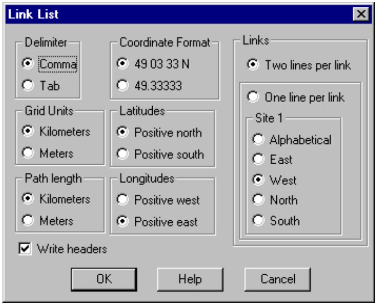

<details>
<summary>text_image</summary>

Link List
Delimiter
Comma
Tab
Coordinate Format
49.03 33 N
49.33333
Grid Units
Kilometers
Meters
Latitudes
Positive north
Positive south
Path length
Kilometers
Meters
Longitudes
Positive west
Positive east
Write headers
OK	Help	Cancel
Links
Two lines per link
One line per link
Site 1
Alphabetical
East
West
North
South
</details>

The path length will be in either miles or kilometers as determine by the global measurements units setting. If the path length in meters is selected, then the path length will be written in feet or meters.

When the selections and options are complete, click OK to display the report. To sort the report, click on the column header of the field to be used as the sort criteria. The first click sorts the data in an ascending order. The second click sorts in a descending order.

<table><tr><td colspan="7">Link List</td></tr><tr><td colspan="7">Files Help</td></tr><tr><td></td><td>Site 1 Name</td><td>Site 2 Name</td><td>Path Length</td><td>Site 1 TX Fre...</td><td>Sit...</td><td>Site 1 Power</td></tr><tr><td>1</td><td>2700 Summit</td><td>2653 Summit</td><td>0.20</td><td>27375.0000</td><td>H</td><td>13.00</td></tr><tr><td>2</td><td>2653 Summit</td><td>2700 Summit</td><td>0.20</td><td>28350.0000</td><td>V</td><td>13.00</td></tr><tr><td>3</td><td>901 Jupiter</td><td>2653 Summit</td><td>0.47</td><td>27375.0000</td><td>H</td><td>13.00</td></tr><tr><td>4</td><td>2653 Summit</td><td>901 Jupiter</td><td>0.47</td><td>28350.0000</td><td>V</td><td>13.00</td></tr><tr><td>5</td><td>US Data</td><td>901 Jupiter</td><td>3.98</td><td>28350.0000</td><td>V</td><td>23.00</td></tr><tr><td>6</td><td>901 Jupiter</td><td>US Data</td><td>3.98</td><td>27375.0000</td><td>H</td><td>23.00</td></tr><tr><td>7</td><td>US Data</td><td>2700 Summit</td><td>4.13</td><td>28350.0000</td><td>V</td><td>23.00</td></tr><tr><td>8</td><td>2700 Summit</td><td>US Data</td><td>4.13</td><td>27375.0000</td><td>H</td><td>23.00</td></tr></table>

Select Files - Save to save the report.

# RAPID DEPLOYMENT EXAMPLES

The CD-ROM contains rapid deployment examples for standard ATPC and adaptive ATPC radios. The examples cannot run directly from the CD-ROM as read and write access is required. The procedure will create database tables in this directory.

The adaptive ATPC example files are located on the CD-ROM under Examples\Rap\_depl\Adp\_atpc. The following files are included:

```txt
raddep_a.gr4 Pathloss network data file
hplp1-38.mas example antenna code (binary format)
hplp1-38.dat example antenna code (ASCII format)
adp_atpc.mrs example radio code (binary format)
adp_atpc.raf example radio code (ASCII format)
rules.r_d rapid deployment rules file 
```

The standard ATPC example files are located on the CD-ROM under Examples\Rap\_depl\Std\_atpc. The following files are included:

```txt
rapdep_s.gr4 Pathloss network data file
a3958.mas example low gain antenna code (binary format)
a3959.mas example high gain antenna code (binary format)
std_atpc.mrs example radio code (binary format)
std_atpc.raf example radio code (ASCII format)
rules.r_d rapid deployment rules file 
```

Create a new directory on your hard drive for one of the above examples and copy the files to that directory. There are some restrictions on the directory name. The full path name of the directory cannot contain spaces or international characters. Additionally, the windows directory “My Documents” cannot be used. These restrictions are due to the BDE (Borland database engine).

Once this is complete, the Pathloss program must be told where to find the radio and antenna files. Select Configure - Directories - Microwave Antenna Codes and point to the example directory. Repeat this for the Microwave Radio Codes.

Load the example network file. Select Module - Network.

# Standard ATPC Example file

This is a series of 23 GHz links located in an arid region.

Starting with this network drawing, the paths will be designed and analyzed for interference.

Then a rain simulation will be carried out by moving a rain cell over the network. At each point, the interference will be recalculated to determine if any outages occur.

The basis of the design and analysis is the rules file “rules.r\_d”. The ASCII text file used in this example is listed below:

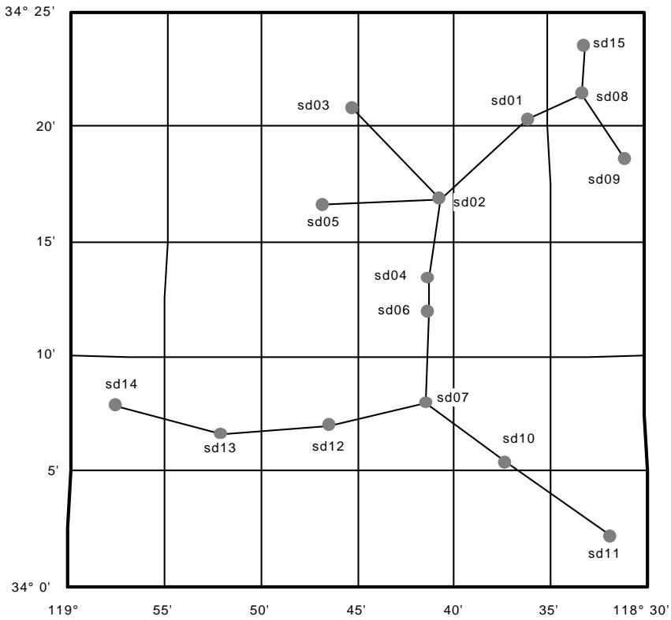

<details>
<summary>line</summary>

| Label | Latitude (°) | Longitude (°) |
| :--- | :--- | :--- |
| sd03 | 21 | 45 |
| sd05 | 16.5 | 43 |
| sd02 | 17 | 39 |
| sd04 | 13.5 | 38 |
| sd06 | 12 | 38 |
| sd07 | 8 | 39 |
| sd10 | 5.5 | 42.5 |
| sd11 | 3.5 | 118 |
| sd15 | 23.5 | 37 |
| sd08 | 22 | 37 |
| sd09 | 18.5 | 118 |
| sd14 | 7.8 | 113 |
| sd13 | 6.5 | 50 |
| sd12 | 6.8 | 52 |
| sd02 | 17 | 39 |
</details>

```txt
PL40_RAPDEP_STANDARD_ATPC // denotes a standard ATPC rules file
RX_THRESHOLD_DBM -76.0 // receiver threshold level (dBm)
RX_THRESHOLD_CRIT 10^-3 // receiver threshold criteria (text)
HI_POWER_DBM 27.0 // transmitter high power option
LO_POWER_DBM 17.0 // transmitter low power option
ATPC_RANGE_DB 10.0 // automatic TX power control range
MAX_RXSIG_DBM -20.0 // maximum RX signal (dBm)
RADIO_CODE STD_ATPC // radio code
ANTENNA_CODE1 A3958 // low gain antenna code
ANTENNA_CODE2 A3959 // high gain antenna code
DUAL_POLARIZED 0 // 1-dual polarized, 0-single polarized,
ANTENNA_PRIORITY 1 // 1-change antennas first, 0-change power first
TX_LOSS_DB // transmit side loss
RX_LOSS_DB // receive side loss
FREQUENCY_HI_MHZ 23600 // high transmit frequency (MHZ)
FREQUENCY_LO_MHZ 22600 // low transmit frequency (MHZ)
CHANNELID_HI 1AH // high channel identifier
CHANNELID_LO 1AL // low channel identifier
RAIN_FILE C:\plw40\Rain\Crane_96\Crane96_F.rai // full path name
RAIN_METHOD 1 // 1-Crane, 0-ITU 530
AVAILABILITY_METHOD 1 // 1-annual, 0-worst month
RAIN_AVAILABILITY 99.999 // availability (annual or worst month)
RNCELL_INRADIUS_KM 8.0 // rain cell inner radius (km)
RNCELL_OUTRADIUS_KM 12.0 // rain cell outer radius (km)
RNCELL_XYINC_KM 5.0 // rain cell scan increment (km)
RELIABILITY_METHOD 1 // 1-Vigants, 0-ITU 530-7 
```

```c
C_FACTOR 3.0 // C factor - Vigants only
GEOCLIM_FACTOR 2.5E-06 // geoclimatic factor - ITU 530-7 only
ACCUMULATE_THRDEG_DB 0.5 // minimum accumulate threshold degradation (dB)
REPORT_THRDEG_DB 1.0 // minimum reporting threshold degradation
GENERATE_PROFILES 1 // 1-generate, 0-do not generate
DIST_INC_M 50.0 // profile distance increment (meters)
OUTAGE_TOLERANCE_DB 2.0 // flat fade margin < outage tolerance = outage
MAXDIST_KM 50.0 // maximum V-I distance (km)
CALL_SIGN_PREFIX SD // call sign prefix 
```

The file format uses a series of descriptive mnemonics followed by the value which is separated by one or more spaces. A double forward slash “//” is used to comment the lines. Refer to the Rapid Deployment documentation for complete details of the file format.

Note that the RAIN\_FILE mnemonic requires the full path name of the rain file. The example assumes that the program was installed in the default directory. If any other directory has been used, you will have to edit the rules file.

Select Interference - Rapid Deployment to bring up the tool bar. All operations will use the buttons on this tool bar.

Set the High Low Frequency Plan

The site legend color identifies the high and low frequency sites using red for a high frequency and blue for a low frequency. This is a two step procedure. First click the reset hi-lo button . This will set all site legends to an unfilled black style.

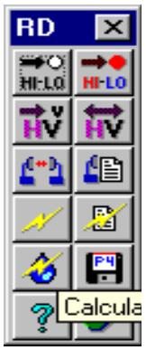

<details>
<summary>text_image</summary>

RD
HIL0
HI-LO
V
V
P4
? Calcula
</details>

Then click the set hi-lo button . The cursor will change to a indicate a hi-lo selection is in

progress. Select a site to be designated as high and click the left mouse button on this site legend. This will cancel the hi-lo selection mode. All other connected sites will be automatically assigned a high or low color identification. The choice of the high site is unimportant in this example.

# Set the Polarizations

Polarizations are indicated by the color of the link lines using black for vertical polarization and violet for horizontal. Click the reset polarization button to set all links to vertical polarization. In this example, the polarizations will be changed following the interference analysis.

# Transmission Design

Click the transmission design button to set the transmission parameters for all the links on the network display. This step carries out the following operations:

Assigns arbitrary call signs to all sites. This is required for an interference calculation.

• Calculate the required thermal fade margin for the path based on the availability, rain file and method specified in the rules file.   
n Starting with the low power option and low gain antennas, calculate the thermal fade margin. If necessary, an iterative procedure is used to increase the transmit power and antenna gains until the required thermal fade margin is met. If the “antenna priority” option is set, then the antennas will be changed before increasing the transmit power. If the required thermal fade margin cannot be met, an error message is logged.   
If the receive signal minus the ATPC range is greater than the maximum receive signal in the rules file, an error message will also be logged.

sd02 - sd03

Availability < 99.9990

Path Length = 10.15 km

sd10 - sd11

Availability < 99.9990

Two design problems are identified. The example does not attempt to correct these problems.

# Clear Air Interference Analysis

Cochannel interference is analyzed following the transmission design. Click the clear air interference button The report is automatically displayed upon completion. There are 6 interference cases which produce threshold degradations ranging from 2 to 12 dB.

The situation can be improved by changing the polarization on the sd02 to sd05 path. Click the set polarization button . The cursor will change to indicate a polarization setting operation is in progress. Click the left mouse button on the sd02 to sd05 link to change its polarization. To disable this polarization setting mode, click the right mouse button anywhere on the display.

In order to register this change, you must repeat the transmission design step. Click the button first and then repeat the interference calculations. Three residual cases from 1 to 3 dB remain.

Each interference report includes an outage report; however, under clear air conditions, it is unlikely that an outage will occur.

# Interference Under Rain Conditions

The true test of a high frequency network performance is the operation under a simulated rain cell. Click the interference - rain button to bring up the rain calculation dialog box. The analysis can be carried out for a single rain cell at a location set by the user or an automatic scan over the network.

To position the rain cell hold down the left mouse button on the network display and drag the rain cell to the desired location. This mode of operation is useful for analyzing a particular situation; however, a more meaningful test can be made with the automatic rain cell scan. Set this option and click the OK button.

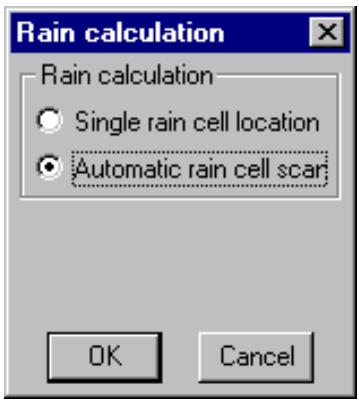

<details>
<summary>text_image</summary>

Rain calculation
Rain calculation
○ Single rain cell location
● Automatic rain cell scar
OK	Cancel
</details>

At each rain cell location, a complete interference calculation is carried out. The rain cell must intersect at least one path to calculate. Only the worse case threshold degradation and outages for each receiver are reported.

The outage results show that the hops sd10 to sd11 and sd02 to sd03 will experience outages. Note that these paths were identified as problems in the transmission design phase. Three other paths show marginal outages. An outage is reported when the flat fade margin is less than the outage tolerance specified in the rules files.

# Generate Pathloss Data Files

Click the P button to generate the pathloss data files for the network display. These will be saved in the example directory. The file data will use the values calculated in the transmission design step.

The file naming convention is based on the call signs. The network is updated with these file names. Individual design modules can be accessed by clicking on the associated link on the network display.

# Adaptive ATPC Example file

This example uses two 38 GHz rings at a common gateway station located in a heavy rainfall region.

Starting with this network drawing, the paths will be designed and analyzed for interference, outage under clear air and rain conditions and network stability.

The network stability is an important consideration with adaptive ATPC radios. These operate close to threshold and the transmit power control will respond to overcome threshold degradation. This can result in a runaway situation.

The basis of the design and analysis is the rules file “rules.r\_d”. The ASCII text file used in this example is listed below:

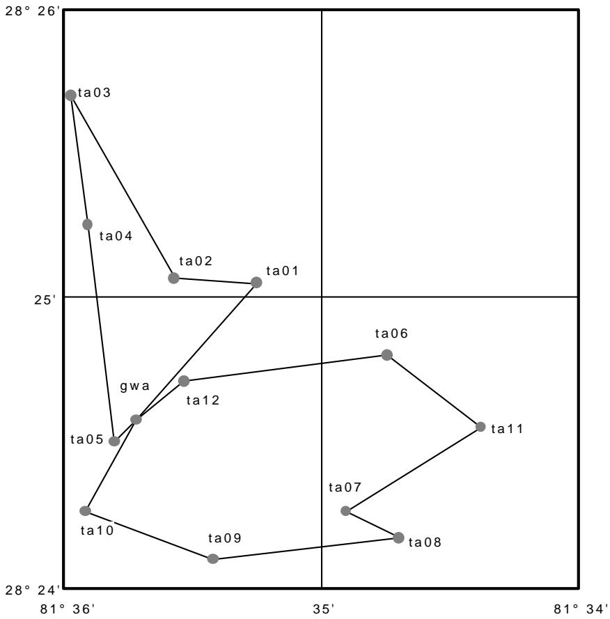

<details>
<summary>scatter</summary>

| Point | X Coordinate | Y Coordinate |
|---|---|---|
| ta03 | 36 | 28 |
| ta04 | 35.5 | 27 |
| ta02 | 34.5 | 26 |
| ta01 | 34 | 26 |
| gwa | 34.5 | 25 |
| ta05 | 34.5 | 24 |
| ta12 | 34.5 | 24 |
| ta06 | 35.5 | 24 |
| ta11 | 36 | 24 |
| ta07 | 35.5 | 23 |
| ta08 | 35.5 | 23 |
| ta09 | 34.5 | 23 |
| ta10 | 34.5 | 23 |
</details>

<table><tr><td colspan="2">PL40_RAPDEP_ADAPTIVE_ATPC</td></tr><tr><td>RX_THRESHOLD_DBM</td><td>-73.0</td></tr><tr><td>RX_THRESHOLD_CRIT</td><td> $10^{-3}$ </td></tr><tr><td>HI_POWER_DBM</td><td>27</td></tr><tr><td>LO_POWER_DBM</td><td>17</td></tr></table>

<table><tr><td>// denotes an adaptive ATPC radio</td></tr><tr><td>// receiver threshold level (dBm)</td></tr><tr><td>// receiver threshold criteria (text)</td></tr><tr><td>// transmitter high power option</td></tr><tr><td>// transmitter low power option</td></tr></table>

```lisp
ATPC_RANGE_DB 50. // automatic TX power control range
RADIO_CODE ADP_ATPC // radio code
ANTENNA_CODE1 HPLP1-38 // antenna code
DUAL_POLARIZED 1 // 1-dual polarized, 0-single polarized,
ANTENNA_PRIORITY 0 // 1-change antennas first, 0-change power first
TX_LOSS_DB // transmit side loss
RX_LOSS_DB // receive side loss
FREQUENCY_HI_MHZ 39300 // high transmit frequency (MHZ)
FREQUENCY_LO_MHZ 38600 // low transmit frequency (MHZ)
CHANNELID_HI 1AH // high channel identifier (text)
CHANNELID_LO 1AL // low channel identifier (text)
RAIN_FILE C:\Plw40\Rain\Crane_96\Cran96d3.rai // full path
RAIN_METHOD 1 // 1-Crane, 0-ITU 530
AVAILABILITY_METHOD 1 // 1-annual, 0-worst month
RAIN_AVAILABILITY 99.999 // availability (annual or worst month)
RNCELL_INRADIUS_KM 1.0 // rain cell inner radius (km)
RNCELL_OUTRADIUS_KM 1.5 // rain cell outer radius (km)
RNCELL_XYINC_KM 0.5 // rain cell scan increment (km)
RELIABILITY_METHOD 1 // 1-Vigants, 0-ITU 530-7
C_FACTOR 6. // C factor - Vigants only
GEOCLIM_FACTOR 2.5E-06 // geoclimatic factor - ITU 530-7 only
ACCUMULATE_THRDEG_DB 0.1 // minimum accumulate threshold degradation (dB)
REPORT_THRDEG_DB // minimum reporting threshold degradation
GENERATE_PROFILES 0 // 1-generate, 0-do not generate
DIST_INC_M 25. // profile distance increment (meters)
OUTAGE_TOLERANCE_DB 1.0 // flat fade margin < outage tolerance = outage
MAXDIST_KM 50. // maximum V-I distance (km)
CALL_SIGN_PREFIX OR // call sign prefix
CLRAIR_RXLEVEL_DBM -69.0 // clear air receive level (Adaptive ATPC only)
CRITICAL_THRDEG_DB 2.0 // critical threshold (Adaptive ATPC only) 
```

The file format uses a series of descriptive mnemonics followed by the value, which is separated by one or more spaces. A double forward slash “//” is used to comment the lines. Refer to the Rapid Deployment documentation for complete details of the file format.

Note that the RAIN\_FILE mnemonic requires the full path name of the rain file. The example assumes that the program was installed in the default directory. If any other directory has been used, you will have to edit the rules file.

Select Interference - Rapid Deployment to bring up the tool bar. All operations will use the buttons on this tool bar.

Set the High Low Frequency Plan

The site legend color is used to identify the high and low frequency sites using red for a high frequency and blue for a low frequency. This is a two step procedure. First click the reset hi-lo button . This will set all site legends to an unfilled black style.

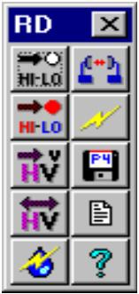

<details>
<summary>text_image</summary>

RD
HI-LO
HI-LO
V
P-4
V
V
?
?
</details>

Then click the set hi-lo button . The cursor will change to indicate a hi-lo selection operation is in progress.

Select a site to be designated as high and click the left mouse button on this site legend. This will cancel the hi-lo selection mode. All other connected sites will be automatically assigned a high or low color identification. The choice of the high site is unimportant in this example.

# Set the Polarizations

This example uses dual polarized antennas. The following convention is used:

vertical means transmit vertical on the high frequency and transmit horizontal on the low frequency   
" horizontal means transmit horizontal on the high frequency and transmit vertical on the low frequency Polarizations are indicated by the color of the link lines using black for vertical polarization and violet for horizontal. Click the reset polarization button to set all links to vertical polarization. In this example, all polarizations will be left at this setting.

# Transmission Design

Click the transmission design button to set the transmission parameters for all the links on the network display. This step carries out the following operations:

Assigns arbitrary call signs to all sites. This is required for an interference calculation.   
n Calculate the required thermal fade margin for the path based on the rain file, method and availability specified in the rules file. Note that on a dual polarized system, the performance is asymmetrical and the analysis must be carried out in both directions.   
The transmit power will be set to the exact value required to meet the thermal fade margin. As only one antenna is specified in the rules file, preference will be given to the low power option. If the fade margin cannot be met, an error message will be logged.   
The program then determines the power reduction required to set the receive signal to the clear air value specified in the rules file (-69 dBm in this example).   
" If the total power reduction from the maximum power level is greater than the ATPC range, an error message will also be logged.

There are no transmission design problems in the example.

# Clear Air Interference Analysis

Once the transmission design is complete, the cochannel interference can be analyzed. Click clear air interference button Several iterations of the interference calculation are required for adaptive ATPC radio systems. At the end of each run, the composite threshold of each receiver is checked to see if the critical threshold degradation has been exceeded. If it has, the associated transmitter power will be increased. The iterations terminate if there have been no changes to the transmit powers and the system is considered to be stable.

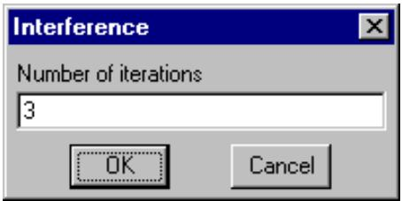

<details>
<summary>text_image</summary>

Interference
Number of iterations
3
OK Cancel
</details>

Eight interference cases in the range 0.1 to 3.5 dB are reported. These can be effectively eliminated by changing the polarization to horizontal on the short paths from gwa to ta05 and to ta12. Click the set polarization button . The cursor will change to indicate a polarization setting operation is in progress. Click the left mouse button on the gwa - ta05 link and on the gwa - ta12 link to change their polarization. To disable this polarization setting mode, click the right mouse button anywhere on the display.

In order to register this change, you must repeat the transmission design step. Click the transmission design button first and then repeat the interference calculations. Two residual cases less than 1 dB remain.

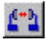

Each interference report includes an outage report; however, under clear air conditions, it is unlikely that an outage will occur.

# Interference Under Rain Conditions

The true test of a high frequency network performance is the operation under a simulated rain cell. Click the interference - rain button to bring up the rain calculation dialog box. The analysis can be carried out for a single rain cell at a location set by the user or an automatic scan over the network. Outage calculations are meaningless for adaptive ATPC radios if a single iteration is used. Multiple iterations are required to increment the transmit powers and to test for stability.

To position the rain cell hold down the left mouse button on the network display and drag the rain cell to the desired location. This mode of operation is useful for analyzing a particular situation; however, a more meaningful test can be made with the automatic rain cell scan. Set this option and click the OK button.

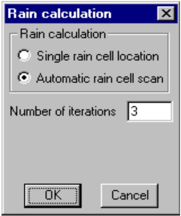

<details>
<summary>text_image</summary>

Rain calculation
Rain calculation
○ Single rain cell location
● Automatic rain cell scan
Number of iterations 3
OK Cancel
</details>

At each rain cell location, a complete interference calculation is carried out. The rain cell must intersect at least one path to calculate. Only the worse case threshold degradation and outages for each receiver are reported.

Although significant threshold degradations (up to 15 dB) occur, there are no outages under any conditions.

# Generate Pathloss Data Files

Click the Generate PL4 files E button to generate the pathloss data files for the network display. These will be saved in the example directory. The file data will use the values calculated in the transmission design step.

The file naming convention is based on the call signs. The network is updated with these file names and the individual design modules can be accessed by clicking on the associated link in the network display.